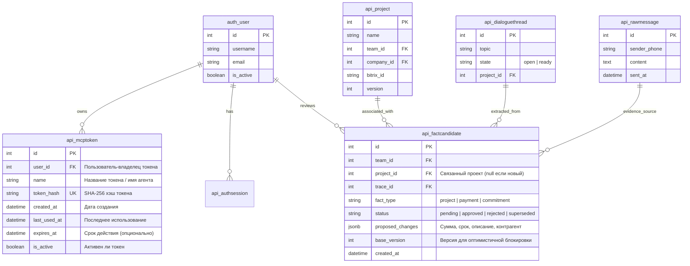
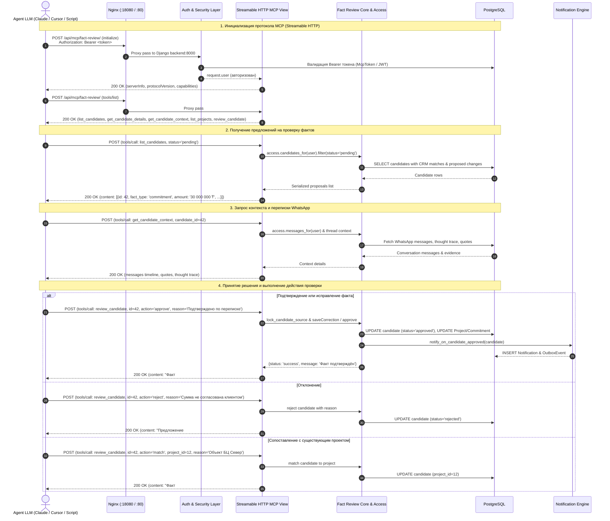

# Спецификация: Защищенный Streamable HTTP MCP сервер для проверки фактов агентской LLM

## Метаданные
- **Дата и время (MSK):** 2026-10-05 11:55:00 MSK (UTC+3)
- **Ветка:** `feature/mcp-fact-review`
- **Тип задачи:** `feature`
- **Целевая ветка:** `main`

---

## Mermaid ERD (Схема данных)

---

## Mermaid Sequence Diagram (Взаимодействие Agent LLM через Streamable HTTP MCP)

---

## 1. Постановка задачи
Пользователь запросил:
> *«мне нужен интерфейс, скорее всео это будет защищенное mcp с streamable http, доступное только авторизованному пользователю. это MCP должно реализовывать удаленный интерфейс для LLM для работы с Рабочий кабинет --> Проверка фактов. Проверять факты будет агентская LLM, получать сведения о проверке, переписку и контекст и тд и LLM сможет подтвердить факт или исправить значения или Отклонить и выбрать проект.»*

Необходимо реализовать стандартный удалённый протокол **Model Context Protocol (MCP)** с транспортом **Streamable HTTP** (`transport="streamable-http"`), предоставляющий агентским LLM полный интерфейс работы с разделом **«Рабочий кабинет → Проверка фактов»**.

---

## 2. Требования

### 2.1. Транспорт и безопасность (Streamable HTTP & Auth)
1. **Протокол:** Стандартный MCP протокол (версия спецификации `2024-11-05`), транспорт `streamable-http`.
2. **Эндпоинт:** `POST /api/mcp/fact-review/` (и `GET /api/mcp/fact-review/` для совместимости со streaming).
3. **Безопасность и аутентификация:**
   - Эндпоинт доступен **только авторизованным пользователям** (`IsAuthenticated`).
   - Поддерживаются два метода передачи авторизации:
     1. Стандартный SimpleJWT Bearer токен: `Authorization: Bearer <jwt_access_token>`.
     2. Долгоживущий агентский токен `McpToken`: `Authorization: Bearer <mcp_token>` или `X-API-Key: <mcp_token>`.
   - Неавторизованный запрос возвращает HTTP 401 Unauthorized с отказом в доступе.
4. **Изоляция данных и мультитенантность:**
   - Запросы к БД выполняются строго в контексте авторизованного пользователя через существующие механизмы контроля доступа `access.candidates_for(request.user)` и `access.projects_for(request.user)`.
   - Пользователь с ролью менеджера видит только свои факты; руководитель команды видит факты своей команды; финансист может утверждать финансовые изменения.
   - Проверки `access.require_review(request.user, candidate)` и блокировка версий гарантируют сохранность данных от коллизий.

### 2.2. Модель данных агентских токенов (`McpToken`)
1. Модель `McpToken`:
   - `user`: внешний ключ на `auth.User`.
   - `name`: название токена (например, "Fact Review Agent").
   - `token_hash`: sha256 хэш секретного ключа (сырой ключ генерируется как `secrets.token_urlsafe(32)` и отдается пользователю только один раз при создании).
   - `created_at`, `last_used_at`, `expires_at`, `is_active`.
2. Генерация токена:
   - Эндпоинты для управления токенами: `GET /api/mcp/tokens/` (список токенов пользователя) и `POST /api/mcp/tokens/` (создание нового токена с возвратом сырого ключа).
   - Регистрация в Django Admin (`McpTokenAdmin`).

### 2.3. Набор инструментов MCP (MCP Tools)
Сервер MCP предоставляет 5 специализированных инструментов:

1. **`list_candidates`**
   - **Назначение:** Получить список предложений (фактов) на проверку.
   - **Параметры:**
     - `status`: `"pending"` (по умолчанию), `"approved"`, `"rejected"`, `"all"`.
     - `fact_type`: опционально (`"project"`, `"payment"`, `"commitment"`).
     - `page`: номер страницы (по умолчанию 1).
   - **Результат:** Список кандидатов с краткой информацией: id, тип факта, статус, предложенные изменения (сумма, срок, контрагент, суть), уровень уверенности (confidence), статус CRM-сопоставления, проект, возможность подтверждения пользователем.

2. **`get_candidate_details`**
   - **Назначение:** Получить полные структурированные данные по конкретному предложению.
   - **Параметры:** `candidate_id: int`.
   - **Результат:** Полные поля кандидата: id, fact_type, status, base_version, proposed_changes, evidence_quotes, варианты сопоставления из CRM Bitrix (`crm_matches`), текущий проект, история и ограничения.

3. **`get_candidate_context`**
   - **Назначение:** Получить переписку из WhatsApp и контекст диалога вокруг найденного факта для анализа LLM-агентом.
   - **Параметры:** `candidate_id: int`.
   - **Результат:** Исходные сообщения WhatsApp, участники, хронологическая цепочка сообщений треда, цитаты-доказательства и мысли/обоснования модели-экстрактора (`thought_trace`).

4. **`list_projects`**
   - **Назначение:** Получить справочник доступных проектов / сделок для сопоставления и выбора проекта.
   - **Параметры:**
     - `search`: опциональная строка поиска по названию проекта или контрагента.
     - `page`: номер страницы (по умолчанию 1).
   - **Результат:** Список проектов: `id`, `name`, `company_name`, `version`, `bitrix_id`, `manager_name`.

5. **`review_candidate`**
   - **Назначение:** Принять решение по предложению: подтвердить, исправить, отклонить или связать с проектом.
   - **Параметры:**
     - `candidate_id: int` — идентификатор предложения.
     - `action: str` — действие: `"approve"`, `"reject"`, `"match"`, `"match_crm"`.
     - `reason: str` — обязательное обоснование решения.
     - `changes: dict` — опциональный словарь исправленных значений (при `action="approve"` с корректировкой, например `{"amount": "50000000.00", "deadline_at": "2026-10-15"}`).
     - `project_id: int` — идентификатор существующего проекта (при `action="match"`).
     - `crm_match_id: int` — вариант сделки Bitrix (при `action="match_crm"`).
   - **Результат:** Результат применения действия, обновленный статус, отправка системных уведомлений участникам.

---

## 3. План реализации
1. **Модель `McpToken` и аутентификатор:**
   - В `backend/api/models.py` добавить модель `McpToken`.
   - В `backend/api/authentication.py` реализовать проверку токена `McpTokenAuthentication` (с поддержкой как JWT, так и `McpToken`).
   - Создать и применить миграцию (`makemigrations`, `migrate`).
   - Зарегистрировать `McpToken` в админке `backend/api/admin.py`.
2. **Ядро MCP сервера (`backend/api/mcp_fact_review.py`):**
   - Реализовать построение сервера `create_fact_review_mcp(user)` на базе `FastMCP` (с `stateless_http=True` и `json_response=True`).
   - Реализовать 5 инструментов: `list_candidates`, `get_candidate_details`, `get_candidate_context`, `list_projects`, `review_candidate`.
   - Все инструменты проверяют права доступа вызывающего пользователя (`access.candidates_for`, `access.projects_for`, `access.require_review`) и используют транзакции и оптимистичные блокировки версий.
3. **Django View для Streamable HTTP MCP (`backend/api/mcp_views.py`):**
   - Создать `FactReviewMcpView(APIView)` с `permission_classes = [IsAuthenticated]`.
   - Реализовать выполнение JSON-RPC запросов Streamable HTTP протокола через экземпляр `FastMCP` с изоляцией сессий.
   - Зарегистрировать маршрут `path("mcp/fact-review/", FactReviewMcpView.as_view())` в `backend/api/urls.py`.
   - Добавить эндпоинты управления токенами: `path("mcp/tokens/", McpTokenView.as_view())`.
4. **Конфигурация Nginx:**
   - Убедиться, что `location /api/` в `nginx/default.conf` корректно проксирует запросы на бэкенд и поддерживает заголовки `Authorization` и streaming/отключение буферизации (`proxy_buffering off;`).
5. **Тестирование и валидация:**
   - Написать комплексные unit-тесты `backend/api/tests_mcp_fact_review.py`:
     - Тест инициализации и обнаружения инструментов (`tools/list`).
     - Тест чтения кандидатов и контекста (`list_candidates`, `get_candidate_details`, `get_candidate_context`).
     - Тест подтверждения факта с исправлениями (`review_candidate(action="approve")`).
     - Тест отклонения факта (`review_candidate(action="reject")`).
     - Тест сопоставления с проектом (`review_candidate(action="match")`).
     - Тест защиты от неавторизованного доступа (401 без токена или с невалидным токеном).
     - Тест разграничения прав пользователей (менеджер vs чужие данные).
   - Запустить `manage.py check`, `makemigrations --check`, `manage.py test api`.
   - Запустить E2E проверку `backend/e2e/run.py`.

---

## 4. Критерии готовности
- [ ] Модель `McpToken` создана, миграция применена, `makemigrations --check` завершается с кодом 0 (`No changes detected`).
- [ ] Эндпоинт `POST /api/mcp/fact-review/` отвечает по спецификации MCP Streamable HTTP.
- [ ] Неавторизованный запрос возвращает 401 Unauthorized.
- [ ] Доступ разрешен как по стандартному JWT Bearer токену, так и по долгоживущему `McpToken`.
- [ ] Все 5 инструментов (`list_candidates`, `get_candidate_details`, `get_candidate_context`, `list_projects`, `review_candidate`) функционируют корректно и изолированы в рамках прав доступа пользователя.
- [ ] Все unit и E2E тесты проходят успешно (100% зелёные).
- [ ] Изменения смержены в `main` и задеплоены на `remote-mazory`.
