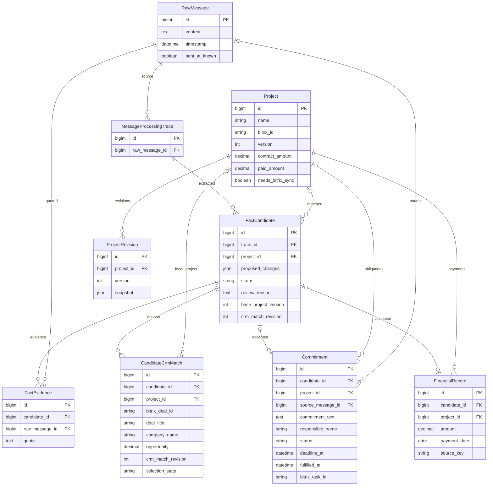
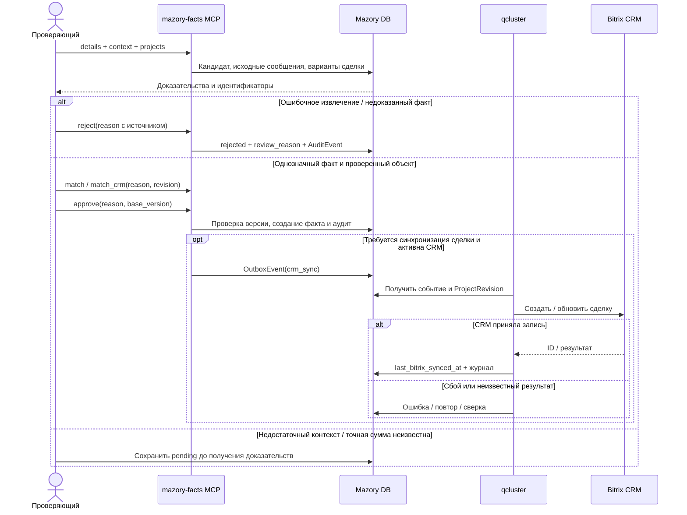

# Проверка фактов и восстановление просмотра CRM-сопоставлений в MCP

Дата: 2026-10-05 13:19:14 MSK. Задача: facts-mcp-review. Ветка: bugfix/facts-mcp-review.
Статус: согласовано пользователем сообщением «делай»; реализация исправления MCP.

ERD отражает существующие модели `backend/api/models.py`; изменений схемы БД не планируется.

## Постановка

Пользователь запросил проверить сбор фактов и сделки, загружать невыполненные обязательства, отклонять ошибочные записи и сохранять основания через mazory-facts MCP.
Полную проверку блокирует воспроизводимая ошибка `get_candidate_details(1239)`: `CandidateCrmMatch object has no attribute title`.
Обработчик читает `m.title` и `m.company_title`, тогда как модель содержит `deal_title` и `company_name`.

## Собранные факты

- Синхронизация `git pull origin main`: Already up to date.
- MCP выгрузил все 766 pending-кандидатов: 549 project, 209 commitment, 8 payment. Каталог содержит 623 проекта. Approved-кандидатов в доступном пользователю срезе: 0.
- Исходные CRM-состояния: 147 not_found, 92 ambiguous, 49 matched, 478 not_requested. Это состояния поиска, а не подтверждение успешной записи в CRM.
- Кандидаты 605 и 606 ошибочно превращают план 171,471 млн ₸ и незакрытый остаток 50,874 млн ₸ в полученные платежи. Источник: raw_message_id=2822, протокол 25.09.2026, раздел 4.5. Оба отклонены через MCP, сохранение причин проверено повторным чтением.
- Кандидаты 1, 28, 77, 427 отклонены с основаниями: неподтверждённые короткие реплики или идея использования планшетов вместо конкретного обязательства. Сохранение решений и причин проверено через MCP.
- Кандидат 3: общий итог портфеля 10 346 695 509,77 ₸, а не отдельная сделка. Источник raw_message_id=773. Отклонён через MCP; сохранение статуса и причины проверено. Итого отклонено 7 кандидатов, оставшаяся очередь по повторному чтению MCP — 759.
- Кандидаты 542, 1059, 1108, 1111 ссылаются на сообщения 23–24 сентября о «практически/почти 42 млн ₸» Top Build. Точные суммы, даты банковских операций и идентичность платежа не подтверждены банковскими документами; нельзя суммировать их как четыре независимые оплаты.
- Кандидат 1029: «порядка 12 млн» по Дивс Парус; точная сумма требует подтверждения. Кандидат 191: сообщение явно утверждает получение 117 млн ₸ 09.09, но банковская сверка и окончательная идентичность сделки ещё не проверены.
- Найдены две группы одинаковых предложенных значений: 1230/943 и 1105/1056. Равенство извлечённых значений само по себе не доказывает дубликат: нужно сравнить исходные события.
- В проверенных исходных сообщениях, импортированных из текстового экспорта, `sent_at` расходится с датой заголовка; `thread_messages` пуст. Для срока обязательства необходимо учитывать исходную дату, а отсутствие сообщения о выполнении нельзя приравнивать к доказанной невыполненности.
- `review()` сохраняет reason в FactCandidate и AuditEvent. Подтверждение обязательства создаёт Commitment; обработчик `sync_project()` отправляет поля сделки, но не переносит обязательство в задачу Bitrix и не отправляет review_reason. Это граница найденного механизма, а не подтверждённый результат живой интеграции.
- Из доступных шести MCP-инструментов нельзя прочитать фактические банковские операции, полноту импорта CRM, очередь Outbox, журнал успешной записи CRM или все уже созданные обязательства.
- Существующие 35 тестов MCP / fact review / contextual commitments и 37 тестов диалогов / каталога CRM прошли (всего 72). Django check: 0 ошибок. makemigrations --check --dry-run: код 0, No changes detected; проверка истории PostgreSQL ограничена недоступностью соединения 127.0.0.1:5434 в sandbox.
- Локальная команда docker compose недоступна: CLI не содержит compose; логи живых backend/qcluster/waha не проверены.
- Проверка типов Vue (`vue-tsc -b`) и production-сборка (`vite build`) прошли через комплектный Node.js. npm отсутствует в PATH; выполнены обе команды из npm build напрямую. Vite сообщил предупреждения об аннотациях зависимости zod и размере чанка, без ошибок сборки.

## Требования и планируемые изменения

1. Исправить только сериализацию существующих CRM-вариантов в get_candidate_details: отдавать публичные ключи title и company_title из deal_title и company_name соответственно. Сохранить идентификаторы, версии и разграничение доступа.
2. Добавить регрессионную проверку details с CandidateCrmMatch, где заполнены название сделки, компания, сумма и состояние выбора. Проверить вызов через MCP транспорт, а не только отсутствие исключения.
   Включить набор tests_mcp_fact_review в существующий workflow проверки PR, чтобы регрессия проверялась в CI.
   Если сквозная проверка читает кандидата до завершения обработки двух сообщений, дождаться завершения извлечения и CRM matching через operations-health перед чтением кандидата; проверку конфликтов версий приложения не ослаблять.
3. Проверить существующие тесты review, сопоставлений и обязательств, Django check и makemigrations --check. Проверить diff; после согласования реализации создать PR в main согласно AGENTS.md.
4. После доступности исправления на сервере повторить чтение CRM-вариантов через MCP и продолжить ручную доказательную проверку очереди. Подтверждать только факты с достаточным источником и однозначной идентичностью; для каждого решения сохранять источник и основание.
5. Для невыполненных обязательств сверять последующие сообщения, выполнение, отмену и замену поручения. Наличие статуса pending в извлечении не является достаточным доказательством.
6. При нехватке источников оставить запись pending. Не подменять точные денежные суммы округлёнными оценками и не отклонять полезный факт лишь из-за технического сбоя MCP.

## Границы и критерии готовности

- Кандидаты с CRM-вариантами доступны через get_candidate_details без AttributeError; названия и компании соответствуют модели.
- Новый регрессионный тест и существующие проверки проходят; расхождения моделей/миграций отсутствуют.
- Каждое принятое решение проверяется повторным чтением статуса и reason.
- Утверждение «сделка создана/обновлена в CRM» допустимо только после чтения итогового внешнего состояния и подтверждения обработки очереди; approve сам по себе этого не доказывает.
- Полный аудит 766 записей пока не завершён. Его завершение зависит от исправного MCP и доступа к последующим сообщениям, обязательствам и результатам интеграции.
- Эта спецификация не добавляет синхронизацию задач Bitrix или перенос причин во внешнюю CRM. Если пользователь ожидает именно такой результат, уточнить место назначения и согласовать дополнение к этой же спецификации.

Реализация исправления начинается после подтверждения этой спецификации пользователем — пункт 5 AGENTS.md.

## Реализация после согласования

- Исправлены источники title/company_title в get_candidate_details; публичные ключи сохранены.
- Регрессионный тест через MCP HTTP воспроизвёл AttributeError до исправления и прошёл после него. Набор tests_mcp_fact_review добавлен в CI.
- Прошли 73 профильных теста и весь набор 136 backend-тестов, перечисленный в CI. Django check чист; локально No changes detected с предупреждением о недоступном PostgreSQL.
- Удалённый Docker context доступен после разрешённого сетевого обращения. Работают backend, qcluster, qcluster-crm, outbox, history, delivery, PostgreSQL, Redis, Qdrant, WAHA. Текущий release — 2b70e36. Он ещё содержит старую ошибку MCP: повторный вызов details(1239) падает.
- Логи qcluster и qcluster-crm подтверждают запуск очередей. В логах WAHA есть повторы webhook с 403 («Источник не разрешён») и 400 (пустое payload.body). До сверки allowlist и типов событий это не доказательство потери разрешённых бизнес-сообщений, но успешность полного приёма WhatsApp не подтверждена.
- Живой Django check: 0 ошибок. Живой makemigrations --check --dry-run: No changes detected без предупреждения о доступе к PostgreSQL.
- Живой каталог команды 1: state=succeeded, generation=3, imported_count=623, error_code пуст; last_success_at=2026-10-04T17:38:26 UTC. Это подтверждает завершение текущей выгрузки, но не независимую сверку с актуальным внешним каталогом.
- Живая CRM-конфигурация: is_active=true, auto_import_deals=true, auto_create_deals=false. Создание новых сделок отключено; этот параметр не изменялся. needs_bitrix_sync=0. Обязательств команды 1 пока нет.
- CRM matching Outbox: 728 done, 4 failed с crm_match_request_limit (кандидаты 532, 652, 574, 579, по 3 попытки). Эти ошибки исторические; их устранение не проверено текущим MCP.
- В текущем live WebhookPayload поле body допускает пустой текст (allow_blank=true), поэтому старые 400 в логах нельзя автоматически приписывать текущему обработчику. Активен один разрешённый чат; 403 может быть штатной фильтрацией.
- PR: https://github.com/envOnion/kz-mazory/pull/41, целевая ветка main. CI запущен; обязательные проверки и review перед merge ещё проверяются.
- CI первого коммита прошёл все пять E2E-сценариев и остальные проверки. На следующем запуске E2E получил 409 при подтверждении обязательства после двух быстро отправленных сообщений: тест мог читать промежуточную ревизию кандидата. Добавлено ожидание фактического завершения Q2/CRM-обработки перед чтением кандидатов. Контракт optimistic locking в приложении сохранён.
- Из 690 сообщений команды 1: 191 needs_review, 424 no_facts, 20 no_text, 55 failed. Последние сообщения 2–3 октября не обработаны из-за provider_not_allowed. Следовательно, актуальная полнота фактов и проверка выполнения обязательств не подтверждены. В трёх сообщениях присутствует символ замены �; 676 сообщений не содержат sender_name и sender_phone (у текстового экспорта отправитель может быть в заголовке).
