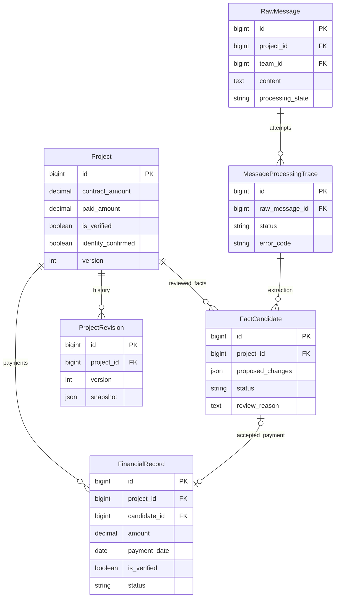

# Финансовые данные проектов в рабочем кабинете

Дата: 2026-10-05 14:25:09 MSK. Ветка: bugfix/project-financial-display.
Статус: согласовано пользователем сообщением «делай»; реализация и проверка.

Существующие модели проверены по models.py. Изменения схемы БД не планируются.

## Проблема и подтверждённые факты

Пользователь видит нули в полях «Договор», «Поступило», «Остаток» раздела «Проекты».
WhatsApp является единственным источником правды для финансовых фактов и выполнения обязательств; банковские документы и акты не требуются.

- Live-выборка доступных проверяющему проектов содержит 623 записи. API возвращает страницы по 50 с сортировкой по ID.
- WorkspaceView.vue берёт только results первой страницы /projects/ и игнорирует count/next; навигации проектов нет.
- Проект №870 «ЦТП 343 квартал» отсутствует на первой странице. По нему существует ровно одна подтверждённая оплата 117 000 000 KZT за 09.09.2026, FinancialRecord №5, кандидат №191. Основание — сообщения WhatsApp №979, №1032, №1107.
- project_row(870) на сервере правильно возвращает paid_amount=117000000.00. Поступление не потеряно и не зависит от синхронизации Bitrix.
- По команде 1 число проектов с contract_amount > 0 равно нулю. Сумма поступления не равна сумме договора и не должна подставляться вместо неё.
- При неизвестной сумме договора текущий project_row вычисляет due=-117000000.00 и overpayment=117000000.00. Такой расчёт не доказывает переплату: он выполнен от незаполненного договора.

## Требования и изменения

1. Разделить проекты на два отдельных списка: «С финансовыми данными» (основной по умолчанию) и «Без финансовых данных». Показать количество записей в каждом списке. Проект относится к первому, если зарегистрирована положительная сумма договора либо существует подтверждённая финансовая запись, в том числе при суммарном поступлении ноль после возврата. Один лишь импорт названия из CRM не является финансовыми данными. Частичные финансовые данные остаются в основном списке, с описанием недостающих полей.
2. Добавить серверные фильтры: поиск по названию проекта/компании, команда и ответственный в пределах прав пользователя, стадия, состояние данных («Все», «Полные», «Частичные», «Нет финансовых данных»). Полные данные для этой задачи означают известный договор и зарегистрированные сведения о поступлениях; отсутствие записи об оплате не доказывает отсутствие оплаты в реальности. Переключение списка/фильтра сбрасывает страницу на первую. Если фильтр отсутствующего поля противоречит выбранному списку, показывать пустую выборку с понятным объяснением.
3. При общей выборке «Все» сначала выдавать проекты с данными, затем без данных. Сортировку, фильтрацию и количества рассчитывать на сервере до пагинации всей доступной выборки, а не переставлять первую страницу в браузере. Внутри группы сортировать стабильно по названию и ID.
4. Добавить в оба списка навигацию по страницам с количеством доступных проектов; учитывать count, next, previous и сохранять страницу при повторной загрузке без изменения фильтров. Запрашивать API относительно VITE_API_URL, без загрузки всех 623 карточек за один запрос и без изменения доступа.
5. Показывать известные поступления из подтверждённых FinancialRecord независимо от заполненности договора. Если сведений о поступлениях нет, показывать «Нет зарегистрированных сведений», сохраняя отличие от зарегистрированного нулевого итога.
6. При отсутствии положительной зарегистрированной суммы договора показывать «Сумма не указана» и «Остаток не определён», а не трактовать технический ноль как известный договор или переплату. Отдельного признака подтверждённого бесплатного договора в текущей модели нет; не добавлять неподтверждённые выводы в карточку пользователя.
7. Каждой карточке без данных и с частичными данными дать описание отсутствующих полей и подтверждаемых причин. Допустимые формулировки: «Сумма договора не зарегистрирована», «Нет подтверждённых записей о поступлениях», «Связанные предложения ожидают проверки», «Связанный факт отклонён: [сохранённая причина]», «Обработка связанного сообщения завершилась ошибкой», «Остаток нельзя определить без суммы договора». Причины включать только по явно связанным с проектом сообщениям/кандидатам и после проверки доступа. Если конкретная причина не установлена, прямо показывать это; не писать «в WhatsApp не было суммы» лишь из-за пустой БД и не приписывать общую ошибку команды каждому объекту. По доступным источникам дать переход к проверке фактов; не требовать банковских документов или актов.
8. Добавить в DTO явные признаки наличия сведений о договоре/поступлениях, доступности расчёта остатка, состояние полноты данных и типизированные причины отсутствия данных. Не менять числовые поля и существующие потребители KPI/экспорта без отдельной проверки их контрактов. Избежать дополнительных запросов к БД для каждой причины каждой карточки.
9. Не заполнять договор суммой платежа, суммой КП или общим портфелем. Заполнение договоров из WhatsApp — отдельная проверка конкретных предложений в рамках продолжающегося аудита фактов, с основанием и защитой от дублей.

## Критерии готовности и проверки

- Из кабинета достижимы страницы после первой; смена страницы действительно загружает соответствующие проекты.
- Основной список первым показывает проекты с финансовыми данными, в том числе ЦТП 343. Остальные находятся в отдельном списке «Без финансовых данных» с причинами и описанием отсутствующих полей.
- Фильтры применяются ко всей доступной выборке до пагинации; количества, страницы и сортировка соответствуют фильтрам. Права доступа и разграничение команд сохранены.
- Причины соответствуют связанным доступным источникам; причины другого проекта и недоступные источники не раскрываются. При отсутствии доказанной причины отображается её неизвестность.
- Карточка ЦТП 343 показывает поступление 117 млн KZT и неизвестные договор/остаток; не утверждает переплату по неизвестному договору.
- При известном договоре и оплате остаток рассчитывается как прежде; подтверждённый нулевой остаток не скрывается.
- Тесты навигации/фильтров кабинета, сортировки всей выборки до пагинации, границ доступа, причин и расчёта карточки с известным/неизвестным договором и зарегистрированным нулевым итогом; frontend typecheck/build; Django check и makemigrations --check; Docker-сервисы и логи.
- PR в main, успешные обязательные проверки и review перед merge. После развёртывания проверить кабинет и API на существующем платеже, не создавая его повторно.

## Исправление справочника компаний при проверке живых данных

По дополнительному запросу пользователя штатная загрузка с sync_companies=True импортировала 522 компании и связала 433 проекта. Проверка имён выявила дефект upsert_company: стадия сделок не получает COMPANY_TITLE и заменяет уже импортированное имя заглушкой. Требуется сохранять существующее имя при пустом входящем названии; заглушку использовать только при создании компании без известного имени. Непустое достоверное название по-прежнему обновляет запись с проверкой уникальности. Регрессионные проверки: полная загрузка названия, последующая запись без названия, обновление телефона, замена первоначальной заглушки известным названием. После развёртывания backend и CRM-воркера повторить штатную загрузку справочника и проверить имена после окончания обеих фаз.

## Дополнительная диагностика пустых рабочих таблиц

По запросу пользователя проверены живые количества: Company=0, связанные с компаниями проекты=0, Commitment=0, FinancialRecord=1; на проверке 198 commitment, 548 project, 2 payment. Это снимок проверки, а не гарантия неизменности очереди.

Извлечение pipeline создаёт FactCandidate. Создание рабочих записей выполняется отдельно в facts.review после approve. Сам импорт каталогов CRM подтверждает идентичность, не финансы. В review при уже существующем проекте company_name не переносится в company, хотя при создании нового проекта Company создаётся; это отдельный найденный дефект, не исправляемый фильтрами кабинета.

Из 54 повторно поставленных сообщений на момент проверки 1 success, 1 error/fact_thread_missing, 52 warning без успешного результата. Исправление пагинации и представления отсутствующих данных не является восстановлением всего извлечения и не означает, что массовое подтверждение выполнено. Отдельно остаётся блокер записи CRM crm_stage_mapping_required.
