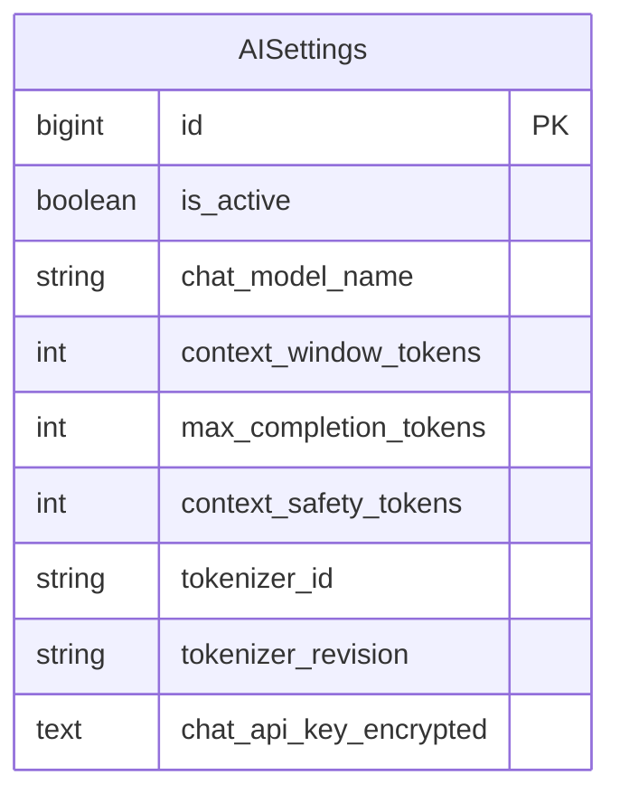
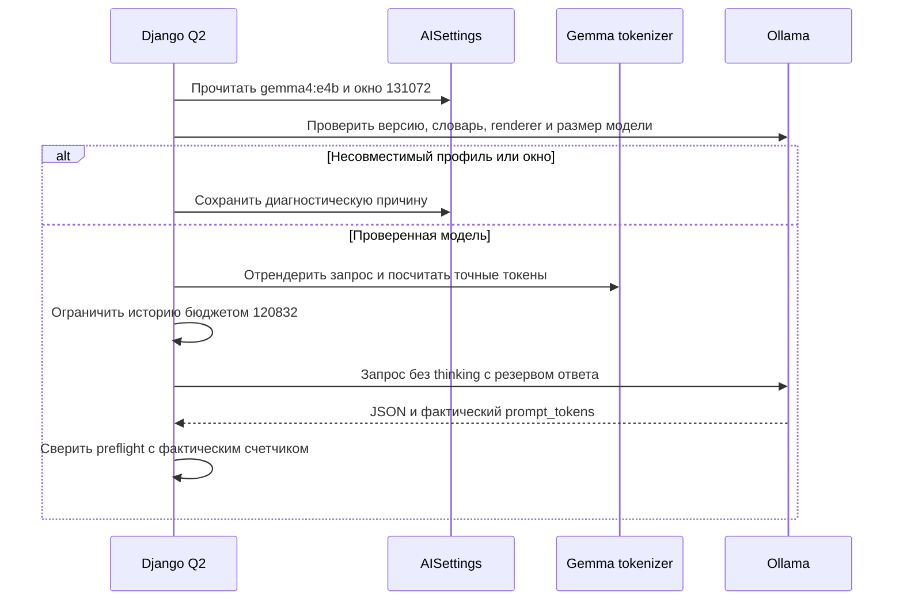

# Настройка рабочей модели gemma4:e4b

- Задача: `gemma4-settings`.
- Создано: 06.10.2026, 01:32:30 MSK.
- Основание: пользователь прямо указал модель, новое окно контекста и сохранение токена.
- Область: рабочая AISettings, без изменения схемы БД и без запуска массового учета.

## Требования и изменения

Рабочая конфигурация №1: заменить `qwen3.8` на `gemma4:e4b`, окно 262144 на 131072 токена (128K). Оставить API URL, протокол, существующий зашифрованный токен, embedding-модель и остальные настройки неизменными. Резерв ответа 8192 и технический запас 2048 оставляют 120832 токена входного контекста.

Изменять только два указанных поля транзакционно, проверить модельную валидацию и повторное чтение. Сохранность токена проверять сравнением в памяти; секрет не выводить. Проверить отсутствие миграционного дрейфа.

Текущий runtime поддерживает проверенные профили Qwen и Nemotron и явно отклоняет чужой токенизатор. Нельзя использовать Qwen-профиль для Gemma или отключать проверку размеров. Поддержка точного подсчета Gemma требует отдельного проверенного профиля; готовность настроек не означает готовность обработки новой моделью. Выявленный блокер и фактический результат проверки записать здесь.

## Критерии готовности

- Активная запись возвращает `gemma4:e4b` и 131072.
- Оба поля ключа и остальные настройки сохранены.
- Резервы помещаются в новое окно; входной бюджет равен 120832.
- Честно сообщен результат совместимости runtime; несовместимость не замаскирована успешной проверкой.

## Фактический результат

Рабочая конфигурация №1 изменена транзакционно: `gemma4:e4b`, 131072. Входной бюджет 120832. Сравнение всех остальных concrete-полей в памяти подтвердило неизменность, включая оба поля токена; секрет не выводился. Повторное чтение подтвердило значения. Вызов `context_runtime` завершился `context_tokenizer_unavailable`: оставшийся Qwen-профиль несовместим с Gemma, проверка не отключалась. Автоматический учет не включался, очередь и бизнес-записи не пересоздавались. Настройки изменены, работоспособность анализа новой моделью не подтверждена.

## Продолжение: поддержка Gemma

Пользователь подтвердил необходимую адаптацию командой «так сделай». Продолжение выполняется в `feature/gemma4-context`, в этой же спецификации.

План: добавить закрепленный официальный словарь Gemma и профиль установленного Ollama; поддержать текстовый extraction-шаблон с системным сообщением и без thinking/tools/images, не используя Qwen для подсчета. Проверять фактическое окно установленной модели и способ его настройки на сервере; несовместимые формы запросов отклонять с причиной. Сохранить остальные поддержанные профили. Проверить Unicode, спецсимволы, обрезку истории, недостаточное окно и несовпадение словаря; живой синтетический preflight выполнить фоновой задачей. После проверок доставить поддержку в рабочие backend/Q2 и заменить только tokenizer_id/revision у Gemma, сохранив API-ключ. Массовый учет и обработку старых кандидатов автоматически не включать.

### Уточнение транспорта и выпуска

Gemma `/api/show` подтвердил architecture `gemma4`, окно 131072, renderer `gemma4` и Ollama 0.34.0. В параметрах модели отсутствует `num_ctx`; OpenAI-compatible request этой версии его не принимает. Поэтому Gemma-запросы идут в native `/api/chat` с `options.num_ctx`, `options.num_predict`, `think=false`, `stream=false`. Для extraction добавлен точный renderer только текстовых system/user сообщений; для бизнес-ассистента с tools сохраняется прежняя консервативная оценка полного запроса, но фактическое окно также задается явно. Native counts преобразуются в стандартные usage; tool names и аргументы сохраняются через адаптер. Источник контракта: [Ollama 0.34.0 OpenAI adapter](https://github.com/ollama/ollama/blob/v0.34.0/openai/openai.go), [Gemma renderer](https://github.com/ollama/ollama/blob/v0.34.0/model/renderers/gemma4.go).

Официальный `google/gemma-4-E4B`, revision `411aa17b749aa952df1359d2dcea73917a544d9a`: все 262144 vocabulary IDs и 514906 merges совпали с установленной моделью. Файлы закреплены checksum; runtime проверяет словарь, renderer, версию и физическое окно перед использованием. Будущая несовместимая версия не считается проверенной автоматически.

Фоновая проба в изолированном ORM-брокере на копии БД прошла: 2300/2300, 2304/2304, 2308/2308 локальных/фактических prompt tokens, все finish_reason=stop. Только синтетические фразы, включая кириллицу, казахский текст, emoji, Chinese и accented Latin; рабочие сообщения не отправлялись. Измеренные payloads закреплены в fixtures, это не оценка precision/recall извлечения рабочих фактов.

Production остается на исходниках 53edbe8; их hashes сверены с работающим image. Для задачи готовится точечный backport только Gemma-изменений APIService/context_tokens, нового адаптера и публичного токенизатора поверх 53edbe8. Это позволяет установить согласованную поддержку Gemma в backend и воркеры без миграций автономного учета из PR #46. Backport проверяется отдельно на копии PostgreSQL; профиль переключается после успешной проверки. Репозиторный PR направлен в main.

Проверки: 220 backend-тестов полного локального набора прошли; отдельно 26 тестов Gemma/Qwen, 6 E2E-сценариев с реальным Q2. Django check чист, makemigrations --check: No changes detected. Неожиданная смена общего checkout другой задачей устранена восстановлением Gemma stash в отдельный управляемый worktree; чужие изменения не затрагивались.

### Установка и проверка рабочего окружения

Точечный backport поверх 53edbe8 прошел 26 Gemma/Qwen-тестов на копии PostgreSQL и `makemigrations --check`: No changes detected. Образ `mazory-backend:gemma4-20261006`, ID `sha256:e7a334515b176730e6f8aff2e7133a7c6dd37b6bc95571ad773c03603b6953d8`, установлен в backend, qcluster, qcluster_history, qcluster_delivery, qcluster_crm и outbox. Исходные image и release сохранены для отката. Рабочая схема БД не изменялась.

В AISettings №1 транзакционно заменены только tokenizer_id/revision: `google/gemma-4-E4B`, `411aa17b749aa952df1359d2dcea73917a544d9a`. Сравнение всех concrete-полей до/после в памяти подтвердило неизменность остальных настроек, включая оба поля API-ключа. Модель `gemma4:e4b`, окно 131072, резерв ответа 8192, технический запас 2048, входной бюджет 120832.

Через рабочий Redis-брокер `django_q:ai:q` выполнена существующая синтетическая задача `api.tasks.verify_ai_context`, ID `bae645cf61f8499dbee0820ad7ff23ae`. Результат: success=true, `gemma4_ollama_local_manifest`, expected/actual input tokens **1900/1900**, finish_reason=stop. Отличие от 2300 в изолированной копии обусловлено прежним worker prompt производственной версии 53edbe8; каждый запрос измерялся целиком своим фактическим шаблоном.

На рабочих сервисах Django check чист, drift-check: No changes detected. После пересоздания backend кратковременно получен 502 из-за сохраненного upstream-адреса в nginx; `nginx -t` и graceful reload прошли, повторный `/api/health/ready/` возвращает ready. Логи backend/Q2-ролей/outbox/WAHA проверены. Повторный массовый backfill не запускался; измерение precision/recall автономного учета остается отдельным этапом из PR #46.

PR #48: CI run 138 прошел целиком — 221 backend-тест, 34 frontend-теста, 6 E2E, TypeScript/Vite build, Django check и drift, production security check, dependency audit, Compose config и secret scan. Первоначальный secret scan выявил только две публичные SHA-256 в Gemma manifest; добавлены строго закрепленные исключения для этих двух строк, защита остальных значений сохранена. Замечаний review на проверенном head нет.

Отдельный прежний дефект входного канала: последние 50 строк WAHA содержат webhook HTTP 403 (2026-10-05 17:36 и 20:07–20:08 UTC), а также stream:error 503 (22:11–22:34 UTC). Эти события предшествуют установке Gemma (23:18 UTC), причина в этой задаче не устанавливалась. Поэтому успешный синтетический AI-preflight не подтверждает непрерывность поступления WhatsApp. Публичный readiness возвращает ready, проверка моделей/миграций и логи новых backend/Q2 ролей не содержат ошибок.
