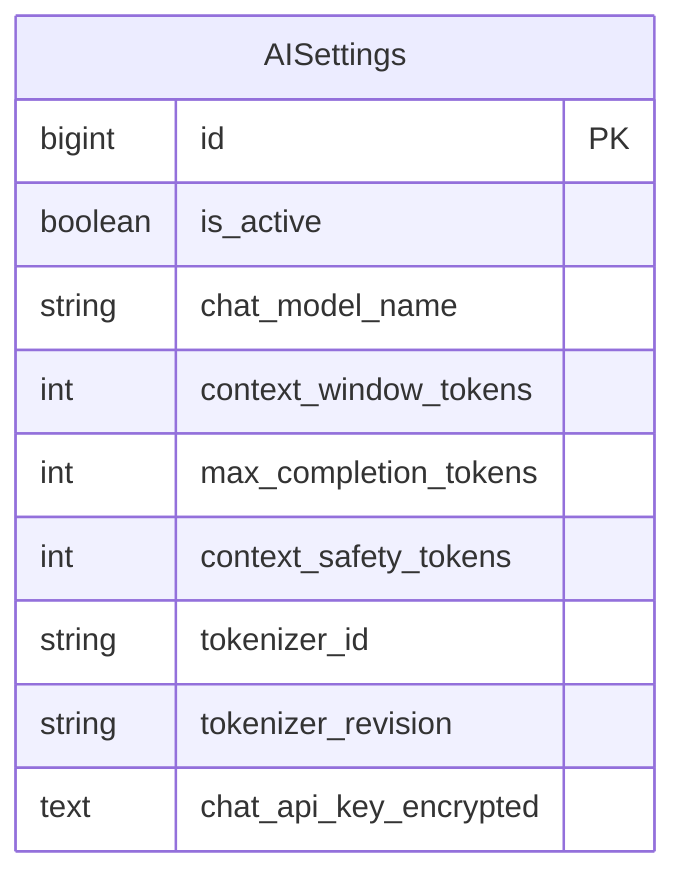

# Настройка рабочей модели gemma4:e4b

- Задача: `gemma4-settings`.
- Создано: 06.10.2026, 01:32:30 MSK.
- Основание: пользователь прямо указал модель, новое окно контекста и сохранение токена.
- Область: рабочая AISettings, без изменения схемы БД и без запуска массового учета.

## Требования и изменения

Рабочая конфигурация №1: заменить `qwen3.8` на `gemma4:e4b`, окно 262144 на 131072 токена (128K). Оставить API URL, протокол, существующий зашифрованный токен, embedding-модель и остальные настройки неизменными. Резерв ответа 8192 и технический запас 2048 оставляют 120832 токена входного контекста.

Изменять только два указанных поля транзакционно, проверить модельную валидацию и повторное чтение. Сохранность токена проверять сравнением в памяти; секрет не выводить. Проверить отсутствие миграционного дрейфа.

Текущий runtime поддерживает проверенные профили Qwen и Nemotron и явно отклоняет чужой токенизатор. Нельзя использовать Qwen-профиль для Gemma или отключать проверку размеров. Поддержка точного подсчета Gemma требует отдельного проверенного профиля; готовность настроек не означает готовность обработки новой моделью. Выявленный блокер и фактический результат проверки записать здесь.

## Критерии готовности

- Активная запись возвращает `gemma4:e4b` и 131072.
- Оба поля ключа и остальные настройки сохранены.
- Резервы помещаются в новое окно; входной бюджет равен 120832.
- Честно сообщен результат совместимости runtime; несовместимость не замаскирована успешной проверкой.

## Фактический результат

Рабочая конфигурация №1 изменена транзакционно: `gemma4:e4b`, 131072. Входной бюджет 120832. Сравнение всех остальных concrete-полей в памяти подтвердило неизменность, включая оба поля токена; секрет не выводился. Повторное чтение подтвердило значения. Вызов `context_runtime` завершился `context_tokenizer_unavailable`: оставшийся Qwen-профиль несовместим с Gemma, проверка не отключалась. Автоматический учет не включался, очередь и бизнес-записи не пересоздавались. Настройки изменены, работоспособность анализа новой моделью не подтверждена.
