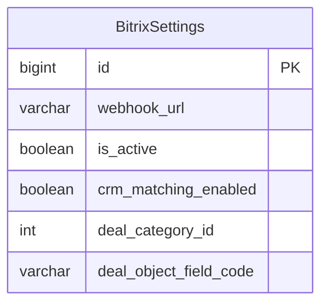

# Исходящие запросы без списка доменов и webhook Bitrix24 только из БД

Дата: 2026-10-06 02:39:01 MSK. Ветка: `refactor/remove-provider-host-allowlist`.
Запрос пользователя: не использовать `PROVIDER_ALLOWED_HOSTS`; разрешённые домены для исходящих запросов не нужны.

Дополнение и подтверждение реализации: «только из бд нужно, убери» — удалить fallback `BITRIX_WEBHOOK_URL` из окружения.

Показана существующая таблица настроек интеграции; схема и связи не меняются.

## Постановка

Сейчас `checked_url()` проверяет принадлежность домена к `settings.PROVIDER_ALLOWED_HOSTS`. Это ограничивает Bitrix24, загрузку вложений и сервисы OCR/transcription. Удалить проверку доменного списка полностью. `effective_webhook_url()` также подставляет `BITRIX_WEBHOOK_URL`, когда значение в БД пусто: удалить эту подстановку. Задача меняет валидацию URL и выбор настройки; модели и схема БД не изменяются.

## Требования

- Любой домен проходит `checked_url()`, если URL соответствует существующим требованиям к формату: HTTPS, порт 443 или не указан, hostname существует, отсутствуют логин и пароль в URL.
- `PROVIDER_ALLOWED_HOSTS` не читается и не передаётся приложению из Compose. Значение этой переменной в окружении не влияет на исходящие запросы.
- Удалить переменную из Django settings, Compose, `.env.example`, E2E-настроек и старых тестовых overrides; исправить подсказку админки Bitrix24.
- Проверку полного REST Webhook URL Bitrix24, маршруты, ключи, обработку ошибок и запрет автоматических redirect сохранить.
- `ALLOWED_HOSTS` Django для входящих запросов не изменять.
- Webhook Bitrix24 брать исключительно из `BitrixSettings.webhook_url`. Пустое значение не заменять адресом из окружения; внешний запрос не выполнять, возвращать существующую причину отсутствия/отключения интеграции.
- Удалить `BITRIX_WEBHOOK_URL` из settings, Compose и `.env.example`; убрать указание «Из окружения сервера» из админки.

## План изменений

1. В `providers.py` оставить `checked_url()` совместимой обёрткой проверки формата URL без сравнения домена со списком. Удалить неиспользуемый import настроек.
2. Удалить конфигурацию списка и ссылки на него в действующем коде, примере окружения, Compose и тестах. В E2E сохранить независимую изоляцию сетевого транспорта тестов.
   В `bitrix_config.py` возвращать только сохранённый адрес; проверить fallback при заполненном legacy-окружении и пустом адресе БД, а также использование заполненного адреса БД.
3. Заменить тест запрета чужого домена проверкой принятия разных доменов; подтвердить, что некорректные scheme/port/userinfo по-прежнему отклоняются и прежнее значение переменной больше не влияет на результат.
4. Проверить соответствующие backend-тесты, Django check, makemigrations --check, Compose config, diff. Выполнить обязательные CI-проверки и просмотреть Docker-логи.
5. Создать PR в main и объединить после успешных проверок. Во время проверки обнаружено, что пользователь удалил рабочие контейнеры и тома через `down -v`; production повторно не запускать в рамках изменения настроек. Статус установки и ограничение проверки записать здесь. При будущем запуске webhook должен быть задан в восстановленной/новой БД.

## Критерии готовности

- Исходящие домены не ограничиваются списком; старое значение переменной не применяется.
- Формат URL и Bitrix Webhook валидируются, остальные ограничения запроса сохраняются.
- Настройки и подсказки не предлагают заполнять `PROVIDER_ALLOWED_HOSTS`.
- `BITRIX_WEBHOOK_URL` не влияет на интеграцию; при пустом адресе БД запрос не отправляется.
- Проверки проходят, миграционный дрейф отсутствует, изменение доступно в main; состояние рабочего окружения записано в эту же спецификацию.

## Согласование

Пользователь после review продолжил задачу командой «только из бд нужно, убери». Подтверждена реализация удаления fallback вместе с ранее запрошенным удалением списка исходящих доменов.

## Результат реализации и проверок

Оба legacy-параметра удалены из работающего кода settings, Compose и `.env.example`, а также из локального ignored `.env` без вывода секретов. `effective_webhook_url()` использует только `BitrixSettings.webhook_url`; при пустом адресе outbound call возвращает `crm_disabled`, read-config — `crm_not_configured`, HTTP-запрос не выполняется. `checked_url()` принимает любой домен и сохраняет прежнюю проверку формата URL. Подсказки админки и E2E-настройки обновлены.

Связанный набор: 114 backend-тестов прошли; отдельно 25 тестов URL/настроек и админки прошли. Django check чист, makemigrations --check: No changes detected; локальная проверка истории PostgreSQL недоступна (127.0.0.1:5434), миграционный дрейф проверяется также в CI. Compose config --quiet и diff --check прошли.

Полный backend-набор CI выполнен локально: 224 теста прошли. Regression-тесты подтверждают, что заполненная legacy-настройка `BITRIX_WEBHOOK_URL` не заменяет пустой адрес в БД и не отправляет запрос; сохранённый адрес БД используется напрямую. Старый пустой `PROVIDER_ALLOWED_HOSTS` не ограничивает домены. Имена legacy-настроек остаются только в этих regression-тестах и исторических спецификациях.

Проверка Docker на сервере: контейнеров проекта `mazory` нет, тома `mazory_postgres_data`, `mazory_redis_data`, `mazory_qdrant_data` отсутствуют. Production-проверки логов/БД и установка в существующий runtime невозможны после выполненного пользователем удаления. Сторонние проекты и staging не затрагивались; рабочие сервисы этой задачей повторно не запускались.
