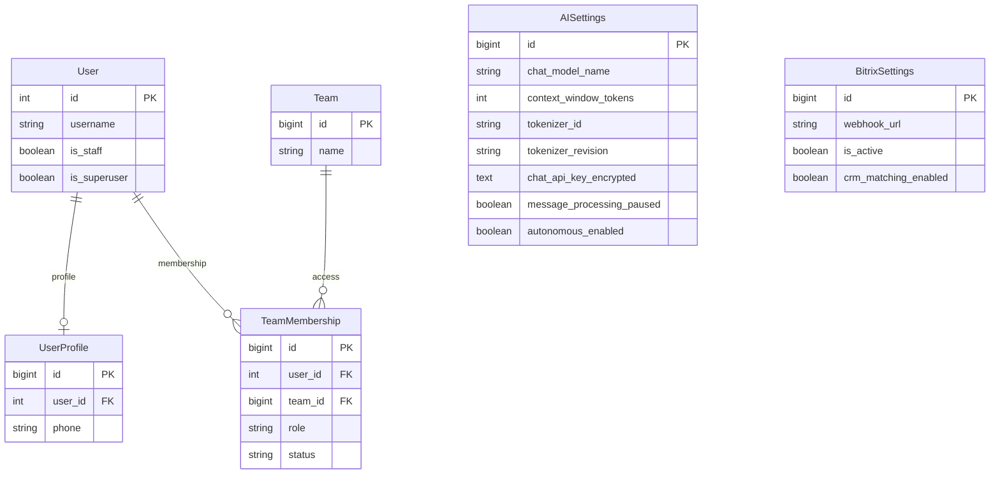

# Запуск и настройка Mazory без нового сканирования WhatsApp

Дата: 2026-10-06 03:01:27 MSK. Ветка: `chore/startup-without-whatsapp`.
Основание: прямой запрос пользователя поднять все контейнеры и создать чистую БД; сканирование WhatsApp пока не выполнять. Код приложения не меняется.



Показаны существующие модели, используемые для проверки доступа и конфигурации. Новые модели не добавляются; применяются уже включённые в main миграции.

```mermaid
sequenceDiagram
    participant C as Codex
    participant B as Backup
    participant D as Docker
    participant DB as PostgreSQL
    participant Q as Q2
    C->>B: Проверить копию и возможность восстановления
    C->>D: Собрать текущий main без секретов в image
    C->>D: Запустить PostgreSQL/Redis/Qdrant
    Note over C,B: Пользователь выбрал чистую БД; backup остаётся нетронутым
    C->>DB: Применить миграции и настроить доступ
    C->>DB: Проверить настройки AI/CRM, отключить массовую обработку
    C->>D: Запустить backend/nginx и Q2 роли
    C->>Q: Только ограниченные диагностические задачи
    Q-->>C: Результаты проверки модели/CRM
    Note over C,D: QR-код не сканируется, исходящие бизнес-сообщения не отправляются
```

## Требования и план

- Развернуть проверенный текущий main на 79.108.164.63, из отдельного release; не изменять сторонние проекты.
- Поднять все 11 сервисов с чистой БД по прямому указанию пользователя. Ранее найденную резервную копию не восстанавливать и не изменять.
- Секреты использовать из защищённого существующего `.env`; не выводить ключи/пароли. Не включать `.env`, приватные файлы и зависимости в исходный архив/image.
- Проверить PostgreSQL, Redis, Qdrant, миграции, staticfiles, nginx и публичный HTTPS; настроить аналитическую SELECT-роль.
- Сохранить доступ пользователей при восстановлении. При чистой БД создавать административный доступ без публикации пароля в логах.
- Настроить Gemma `gemma4:e4b`, окно 131072 и закреплённый tokenizer; существующие ключи сохранить, при отсутствии ключа честно зафиксировать блокер.
- Bitrix24 использует только webhook в БД. Разрешены диагностические/read-only проверки подключения; импорт бизнес-данных и изменения CRM не запускать автоматически.
- До подключения источника и модели держать обработку сообщений на паузе; автономный массовый учёт, backfill и доставки не запускать без отдельной проверки готовности. WhatsApp не требует нового сканирования в этой задаче.
- Проверить Django check, makemigrations --check, сервисы/очереди и логи; описать реальный результат и оставшиеся ограничения в этом же файле.
- Создать PR только в main и объединить после проверок документации/CI.

## Критерии готовности

Сайт и админка доступны по HTTPS, readiness проходит, сервисы стабильны, актуальные миграции применены. Создана чистая БД без выдуманных бизнес-данных; конфигурация проверена без раскрытия секретов. Работа модели/CRM подтверждена ограниченной диагностикой либо приведена конкретная причина недоступности. WhatsApp-сканирование остаётся отдельным этапом.

## Ход выполнения

Исходники синхронизированы с main `8ba8f92`. Собраны `mazory-backend:startup-8ba8f92` (sha256:d9c320c97dc962e8b13992e99430e3347db09f095cf941d1c102eb2601434d25) и `mazory-nginx:startup-8ba8f92` (sha256:02dac31d05d8bb5f2111863dacddb1ef4d3af858d10b1f969038921ad485aec2). Release: `/home/a_belianskii/mazory-releases/startup-20261006`, `.env` chmod 600; исходный архив создан git archive без ignored-секретов.

Пользователь явно выбрал все контейнеры и чистую БД. Созданы новые тома Mazory и сеть; в основной `mazory_db` применены актуальные миграции, включая api.0039. Изолированная проверочная БД удалена после проверки. Собраны и подключены staticfiles. В release `.env` закреплены `APP_TAG=startup-8ba8f92` и новый каталог WAHA sessions.

Работают все 11 сервисов: nginx, backend, qcluster (AI), qcluster_history, qcluster_delivery, qcluster_crm, outbox, postgres, redis, qdrant, waha. На момент проверки у каждого 0 перезапусков. Последние 50 строк логов проверены: ошибок приложения нет; единственный старый PostgreSQL FATAL относится к первоначальной проверке до создания БД и не повторяется. Остальные проекты сервера не изменялись.

Созданы администратор `admin`, команда AquaKip и активное членство руководителя. Случайный пароль находится исключительно в защищённых приватных файлах, отсутствует в этой спецификации и Git. Отключены WhatsApp-уведомления профиля. Настроена отдельная аналитическая SELECT-роль; ключи сохранены зашифрованными штатными методами модели.

Из прежнего конкретного `.env` этого же проекта перенесены webhook Bitrix24 в БД и ключ OpenRouter для embeddings. Через CRM-воркер выполнена только диагностическая `crm.company.list` с выбором ID: задача успешна, API сообщает 522 компании. Импорт, создание сделок/задач, hourly sync и публикация комментариев отключены; бизнес-таблицы Mazory остаются пустыми.

Подготовлена конфигурация `gemma4:e4b`: 131072 токена, резерв ответа 8192, технический запас 2048, tokenizer `google/gemma-4-E4B`, revision `411aa17b749aa952df1359d2dcea73917a544d9a`. Конфигурация неактивна: адрес и ключ Chat API находились в удалённой БД и отсутствуют в доступной проектной конфигурации. URL не угадывался, ключ OpenRouter не отправлялся постороннему провайдеру. Анализ сообщений на паузе, автономный учёт и изменения CRM выключены до настройки и проверки модели/источника.

WAHA API отвечает 200, список сессий пуст. Создана выключенная конфигурация WhatsApp со статусом STOPPED; QR и мониторинг не запускались. WhatsApp остаётся единственным источником новых бизнес-фактов.

Проверки production:

- `https://ai.mazory.best/`: HTTP 200 с сервера и компьютера пользователя; прежняя 502 устранена.
- `/api/health/ready/`: HTTP 200, `status=ready`, PostgreSQL и Redis доступны.
- Настоящий HTTPS-вход администратора: HTTP 200 с переходом в `/admin/`.
- Аутентифицированные `/api/projects/`, `/api/commitments/`, `/api/finance/`, `/api/directory/`, `/api/operations-health/`: HTTP 200. Временная диагностическая JWT-сессия отозвана после проверки.
- Неаутентифицированный `/api/projects/`: HTTP 401.
- Company, Project, Commitment, FinancialRecord, RawMessage: по 0 записей, как требуется для чистой БД.
- Django check: `System check identified no issues`. `makemigrations --check`: `No changes detected`.
- TypeScript-проверка и production-сборка frontend прошли при сборке nginx image.

Ранее обнаруженный backup `/srv/backups/2026-10-05_23-30-03/mazory` сохранён без изменений; контрольные суммы пяти файлов совпали. Подходящего age identity не было; отклонённый автоматической проверкой широкий поиск ключей прекращён. После выбора чистой БД восстановление и поиск ключа не требуются.

Исправлено размещение ранее добавленного локального SSH-блока: глобальные Include возвращены в прежнюю область действия. GitHub синхронизация работает, таймаут 120 секунд и multiplexing для сервера Mazory сохранены.
