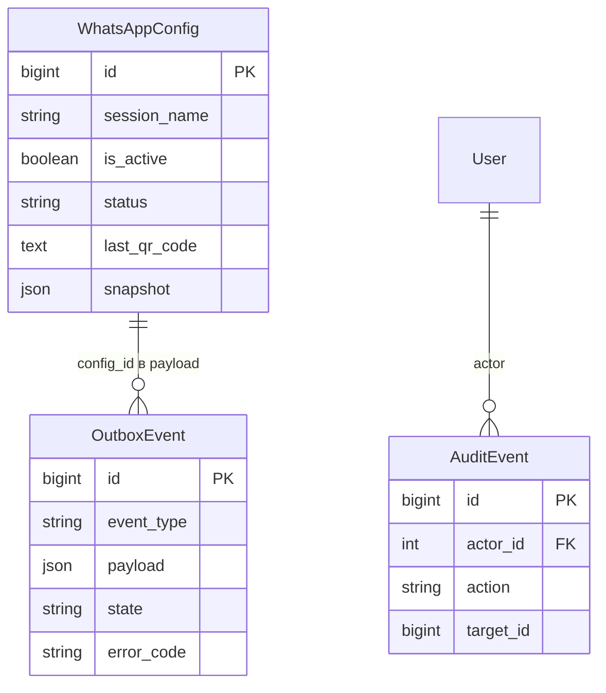

# Восстановление получения QR WhatsApp после чистого запуска

Ветка: `chore/waha-session-qr`. Основание: пользователь не может получить QR в Django Admin, ошибка waha_http_404. Операционная настройка, без изменения кода приложения и схемы БД.

## Требования и план

Проверить фактическую сессию в WAHA и её имя в БД. При отсутствии создать `default`, подготовить NOWEB store для последующего чтения истории и запустить сессию для QR. Все внешние WAHA-вызовы выполняются существующими функциями tasks.py через Q2; HTTP-обработчики не меняются. Проверить получение QR штатным outbox-процессом и его отображение в HTTPS-админке. QR не сканировать, сообщения не отправлять; анализ AI остаётся на паузе.

## Критерии готовности

WAHA содержит ожидаемую сессию, штатная команда QR успешна, сохранён корректный QR и админка его отображает. Django check и makemigrations --check чистые, логи проверены. Пароли, ключи и QR не включаются в спецификацию или Git.

## Результаты

Первичная проверка: в Mazory конфигурация id=1 активна, session_name=default, status=STOPPED. Удаление сессий при предыдущем чистом запуске согласовано пользователем. Команды панели используют существующую сессию и не создают её автоматически; 404 требует первоначального создания сессии WAHA.

Проверка через delivery Q2 подтвердила пустой список сессий WAHA. Через `api.tasks.waha_request` в delivery создана `default` (start=false), NOWEB store.enabled=true и fullSync=true подготовлены до сканирования. Затем через настоящий HTTPS-вход администратора отправлены штатные POST-кнопки start и qr; команды выполнены через outbox/delivery.

Результат: конфигурация SCAN_QR_CODE, QR сохранён, последняя команда done без error_code. HTML `/admin/waha-dashboard/?config_id=1` отвечает 200 и содержит QR-изображение SVG. QR и учётные данные не выведены в логи проверки. Пользователю предоставлена ссылка для сканирования. AI message_processing_paused остаётся true, группы не выбирались, импорт/отправки не запускались.

Django check без ошибок; makemigrations --check — No changes detected. Просмотрены последние 50 строк backend, qcluster, qcluster-delivery и WAHA: строк ошибок нет. Изменений приложения, зависимостей и миграций нет, проверен diff. Известный блокер CI из предыдущей задачи (аудит существующих frontend-зависимостей main) в этой операционной настройке не изменялся.
