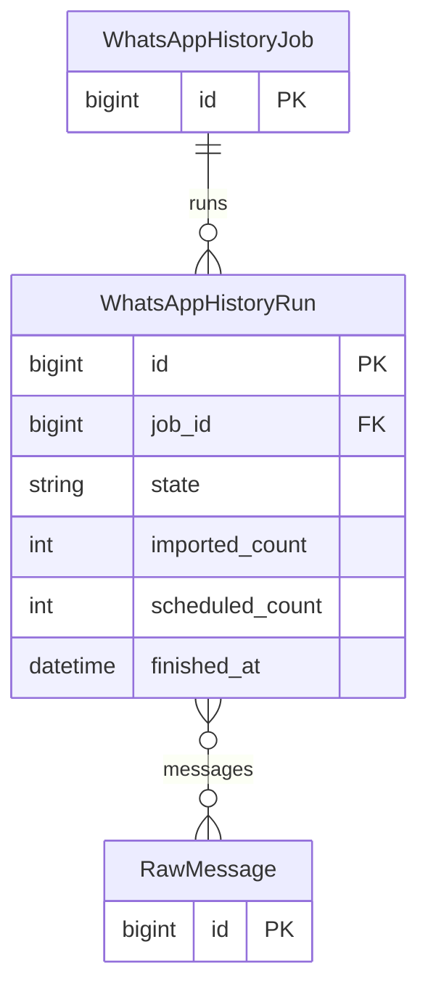
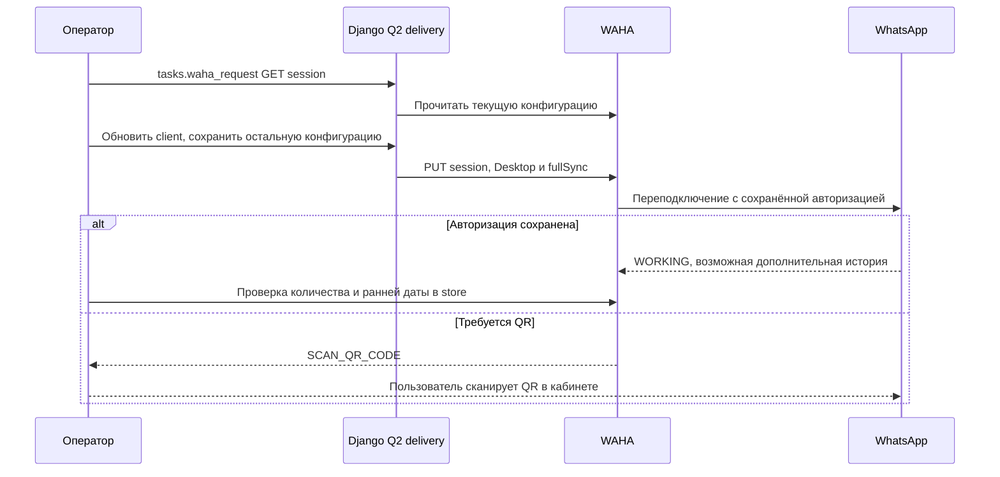

# WAHA: профиль Desktop для расширенной истории

Дата: 2026-10-06 15:01:55 MSK. Задача: `waha-desktop-profile`.
Авторизация: пользователь подтвердил «делай» после объяснения смены профиля и возможного повторного QR.

Текущие модели, проверенные по `backend/api/models.py`. Схема не меняется; данные запуска читаются только для проверки сохранности.

## Постановка и требования

В выбранной группе сохранено 211 сообщений, самое раннее — 2026-09-20 12:09:57 UTC. В телефоне есть более ранняя история. Сейчас NOWEB использует Chrome, хотя для расширенной истории Baileys рекомендует Desktop с syncFullHistory.

Изменить только `default.config.client` на `deviceName: MacOS`, `browserName: Desktop`; сохранить `noweb.store.enabled=true`, `fullSync=true` и все существующие настройки. Вызовы WAHA выполнять через существующую фоновую функцию `api.tasks.waha_request`, очередь delivery. Не удалять сессию, авторизацию или store, не сбрасывать БД и не менять паузу AI.

## План и критерии готовности

1. Проверить API установленной версии и состояние запуска №1.
2. Сохранить резервную копию SQLite через backup API и защищённую копию конфигурации на сервере.
3. Применить профиль и проверить статус, сохранность сообщений и новые границы истории.
4. Отдельно сообщить, достигнута ли загрузка более ранних сообщений. WORKING с Desktop сам по себе не доказывает полноту истории.
5. Проверить отсутствие миграций и diff, создать PR в main. Если нужен QR, указать пользователю страницу подключения; не выдавать ожидание сканирования за успешную синхронизацию.

Код приложения не меняется. Повторная регистрация устройства и очистка хранилища не входят в этот шаг.

## Результат

- Проверены установленный SessionUpdateRequest, PUT `/api/sessions/default` и SessionService.updateSession: PUT останавливает и запускает сессию с сохранением авторизации.
- Исходная конфигурация сохранена с правами 0600 в `/home/a_belianskii/mazory-releases/desktop-profile-20261006/config-before.json`. SQLite backup API сохранил `store-before-desktop.sqlite3`; integrity_check = ok, 44 214 сообщений всего, 211 в целевой группе. Секреты и сообщения не включены в Git.
- Через `api.tasks.waha_request` в delivery применён `client={deviceName:MacOS,browserName:Desktop}`, enabled/fullSync сохранены. PUT успешен, но соединение осталось STARTING и перешло в FAILED. Лог WAHA: `Session stuck in STARTING status, force stopping the session`.
- Выполнена одна штатная попытка restart с Desktop; подключения не получено. Точная причина отсутствия подключения не доказана, это не свидетельство универсальной несовместимости Desktop.
- Для восстановления сервиса через ту же очередь возвращена исходная конфигурация: статус подтверждён WORKING, client=null, enabled/fullSync=true.
- Более ранняя история не появилась: 211 сообщений, от 2026-09-20 12:09:57 UTC до 2026-10-05 17:51:58 UTC. Загрузка полной истории не достигнута.
- Запуск №1 сохранил 211 сообщений, состояние analyzing, импортировано 211, направлено на анализ 182, error_code пуст. Пауза AI не менялась.
- Для проверки Desktop при первичной регистрации требуется отдельное переподключение с QR на телефоне пользователя. Logout/удаление авторизации не выполнялись.
- Django check: 0 issues. makemigrations --check: No changes detected. Код и схема приложения не изменены; сборка frontend не требуется.
