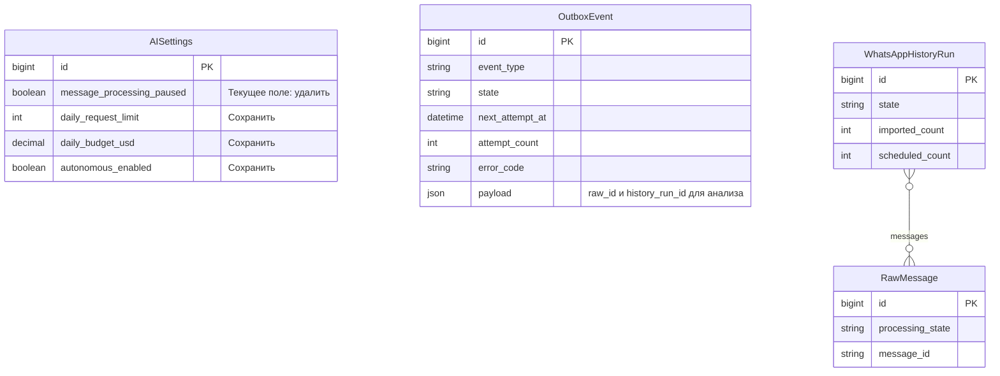
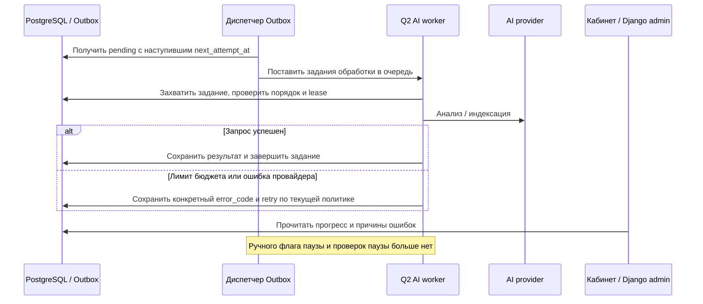

# Полное удаление паузы обработки сообщений AI

Дата: 2026-10-06 19:36:58 MSK. Задача: `remove-ai-processing-pause`.
Ветка: `bugfix/remove-ai-processing-pause`. Статус: согласовано пользователем («lfdfq», то есть «давай»).

Текущее состояние проверено по `backend/api/models.py`, миграции 0021 и актуальным миграциям до 0039. Между AISettings и OutboxEvent нет FK: диспетчер читает активную конфигурацию. Планируемое изменение схемы — только удаление `AISettings.message_processing_paused`.

## Постановка

После настройки модели импорт №1 остаётся analyzing: 211 сообщений сохранено, 182 текстовых задания ожидают обработки из-за `message_processing_paused=True`. Пользователь требует удалить сам механизм паузы и возможность его включить, а не спрятать переключатель или выставить False.

## Требования и изменения

1. Удалить поле из AISettings новой миграцией RemoveField; старые миграции не переписывать. Не оставлять замену в env, кэше, API или другом скрытом флаге.
2. Удалить фильтрацию extract_message/index_message/whatsapp_artifact из dispatch_outbox и возврат extract_message/index_message в ожидание из run_outbox по этому флагу.
3. Удалить поле из AISettingsAdmin и ветку save_model, связанную со снятием паузы. Блок оставшихся лимитов назвать «Бюджет AI». Удалить текст о ручной паузе и неиспользуемый импорт AISettings из job_admin.
4. Обновить e2e seed и существующие тесты, использующие удаляемое поле. Проверить поведение очереди с ожидающими заданиями, включая обработку артефактов; внешние AI-запросы в тестах подменять.
5. Сохранить бюджет, лимит запросов, ограничения параллельности, порядок сообщений, дедупликацию, lease и retry. Не включать autonomous_enabled/autonomous_crm_enabled и не менять настройки импорта. Ошибки и ограничения должны оставаться видимыми с конкретной причиной.
6. Существующие pending-задания продолжат выполняться штатным диспетчером. Не создавать повторные задания, не сбрасывать attempt_count, не запускать массовый повтор уже завершённых сообщений. Не снимать задержки ошибок провайдера или бюджета без причины.

## Развёртывание

Перед выкладкой прочитать актуальные состояния очередей и проверить настройки модели без вывода секретов. Собрать новый backend image. Согласованно заменить Django-процессы, которые читают AISettings: HTTP backend, outbox и все Q2-кластеры. Старые процессы не должны работать с удалённым столбцом; перед миграцией остановить их штатно с достаточным временем на завершение текущих заданий. Сохранить очередь, PostgreSQL, Redis, WAHA и его paired session/store; не сбрасывать БД и не перепривязывать WhatsApp. Применить миграцию и запустить новые Django-процессы. Незавершённые задания восстанавливаются по существующей политике lease; не повторять вручную действия с неизвестным внешним результатом.

## Критерии готовности и проверки

- В актуальном коде, форме админки и схеме AISettings нет message_processing_paused; упоминание допустимо только в исторических миграциях и спецификациях.
- Django check проходит; миграция применяется; повторный makemigrations --check: No changes detected.
- Регрессионные тесты очереди, повторного анализа истории, бюджета и админки проходят. Проверка подтверждает выполнение ранее ожидающего задания без ручного снятия паузы и сохранение причин реальных ошибок.
- В Docker новые воркеры и диспетчер работают без ошибок схемы/AttributeError. Проверить логи backend, qcluster и WAHA, реальную форму настроек AI и страницу запуска №1.
- После выкладки ожидающие задания начинают обрабатываться либо показывают конкретную ошибку провайдера/бюджета. Изменение queued/enqueued само по себе не считается успешным AI-анализом; проверить успешную трассу или явную причину ошибки.
- frontend не изменяется, его сборка не требуется. Создать PR в main; объединить только после обязательных успешных проверок и review.

## Согласование

Пользователь подтвердил спецификацию. Реализация и выкладка разрешены.

## Реализация и проверка

- Удалены поле модели, переключатель админки, две проверки в задачах, ветка снятия паузы в save_model и сообщение о паузе в админке импорта. Seed и существующие тесты обновлены; добавлены регрессии диспетчеризации всех трёх видов работы и выполнения ожидающего сообщения.
- Добавлена и применена миграция `0040_remove_aisettings_message_processing_paused`. В production information_schema подтвердил отсутствие столбца.
- 96 тестов истории, админки, провайдеров/бюджетов и автономной очереди прошли в изолированном Docker без сети и production-БД. Django check: 0 issues. makemigrations --check до и после выкладки: No changes detected.
- Production release: `/home/a_belianskii/mazory-releases/remove-ai-pause-20261006`, image `mazory-backend:remove-ai-pause-20261006`, digest `b01b7c8b2c9cb426d497ba4facf42a4e83c05f26ab20adf7ccaf5d874ef05dd3`. При сборке сохранено ранее выложенное изменение меню из PR №52 (settings.py из ai-settings-nav-20261006); эта задача его не откатывает.
- Перед миграцией сохранён защищённый pg_dump (703 225 байт, mode 0600); pg_restore --list успешно прочитал 774 записи. Секреты/данные БД в Git не включены.
- HTTP backend, outbox и четыре Q2-кластера штатно остановлены перед миграцией и запущены с новым образом. WAHA, PostgreSQL, Redis и история не пересоздавались. nginx -t и reload успешны.
- Реальная HTTPS-админка: вход успешен, форма AI 200 и без переключателя паузы, страница запуска №1 200, readiness 200 ready.
- После запуска очередь №1 перешла от 182 pending к enqueued/processing; ошибок схемы, AttributeError, Traceback и outbox_failure в проверенных 127 строках логов не найдено. Подтверждение результата AI-анализа добавляется ниже отдельно от факта диспетчеризации.
- Локальная защищённая .env обновлена только по APP_TAG на текущий образ.
- Проверен реальный запрос chat к gemma4:e4b: HTTP-запрос успешен, но первая попытка анализа получила `invalid_extraction_schema`. Задание осталось pending с этим error_code по существующей политике автоматических повторов. Наличие вызова провайдера подтверждено ProviderUsage; успешного извлечения фактов на момент этой проверки ещё нет. Это отдельная ошибка валидации ответа модели, механизм паузы удалён.
- PR: https://github.com/envOnion/kz-mazory/pull/54. Объединение зависит от обязательных проверок CI и review.
