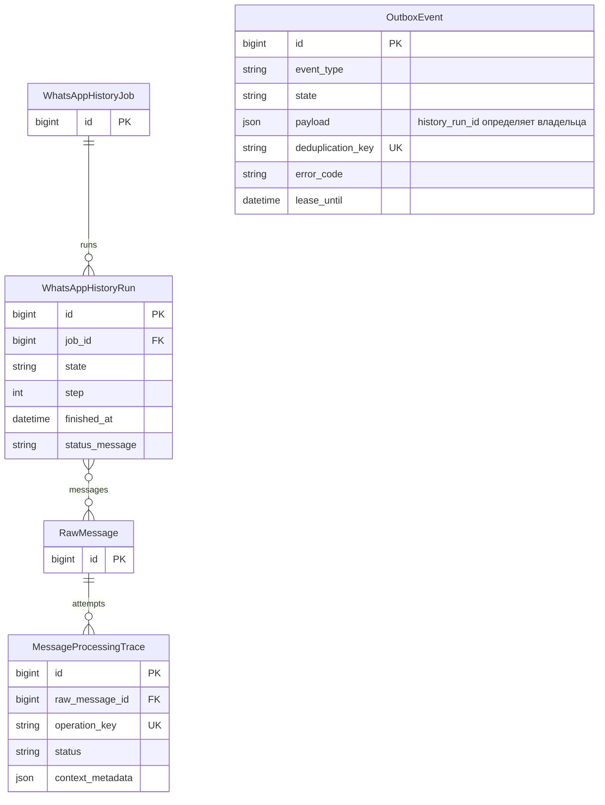
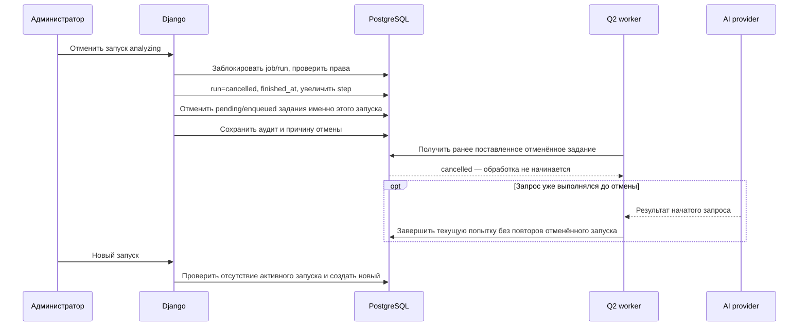

# Отмена запуска на этапе анализа и освобождение нового запуска

Дата: 2026-10-06 21:48:24 MSK. Задача: `history-analysis-cancellation`.
Ветка: `bugfix/history-analysis-cancellation`, включает согласованное удаление паузы из PR №54. Статус: подтверждено пользователем («делай»).

Существующая схема проверена по models.py и history_jobs.py. Связь OutboxEvent с запуском хранится в payload.history_run_id, с трассой — через operation_key/deduplication_key. Миграции не планируются.

## Диагноз

На 18:47 UTC запуск №1 находится в analyzing, step=614 и продолжает обновляться. Из 211 сообщений 29 без текста, 5 текстовых завершились ошибкой invalid_extraction_schema после пяти попыток, 177 ждут. Успешное извлечение фактов не подтверждено. Диспетчер и монитор работают; длительное ожидание обусловлено ошибками ответов модели и последовательной обработкой с повторами.

Одновременно есть конкретный дефект управления: `control_run(cancel)` допускает только IMPORT_STATES/paused, но исключает analyzing. Django admin и history_run.js также скрывают отмену при analyzing. Ошибка управления ссылается на уже удалённую глобальную паузу. Пока запуск active, start_job и ограничение БД корректно запрещают второй запуск той же группы.

## Требования и изменения

1. Разрешить отмену analyzing через существующий защищённый POST control endpoint. Не возвращать глобальную паузу AI и не удалять ограничение одного активного запуска.
2. Показать «Отменить запуск» на этапе анализа в серверном шаблоне и после обновления через JS; одинаковая доступность во всех трёх слоях. Удалить совет о настройках паузы из сообщения об ошибке.
3. При отмене атомарно перевести запуск в cancelled, выставить finished_at, увеличить step и отменить ожидающие шаги монитора. Для полного reprocess_all отменить pending/enqueued extract_message, принадлежащие именно этому history_run_id. Не затрагивать live-задания, другие запуски и завершённые результаты.
4. Сохранить импортированные сообщения, существующие факты и историю ошибок/попыток. Отмена записывается в аудит с понятной причиной; её нельзя показывать как успешный анализ.
5. Уже начатый внешний запрос нельзя гарантированно отозвать: сохранить результат текущей попытки по обычным правилам, но не назначать следующие повторы после отмены его запуска. Проверить гонку отмены с захватом задания и возвратом ответа провайдера, порядок блокировок и состояние lease.
6. После отмены новый запуск должен быть доступен. Не обнулять данные и не обходить блокировку созданием параллельных импортов.
7. Применить исправление на сервере, отменить проблемный запуск №1 штатным исправленным механизмом и проверить доступность нового запуска. Фактический новый импорт не запускать автоматически: сначала показать восстановленное управление, чтобы не повторять массово известные ошибки модели.
8. Ошибка invalid_extraction_schema остаётся отдельной причиной неуспеха анализа: новый запуск сам по себе её не исправляет. В рамках этой задачи не ослаблять валидацию фактов, не создавать записи из непроверенного ответа и не объявлять факты успешно извлечёнными.

## Проверки и критерии готовности

- Регрессии отмены analyzing, снятия блокировки нового запуска, ограничения одного active run, сохранности сообщений/готовых результатов и незатронутых live-заданий.
- Проверка queued cancelled задание не вызывает AI; уже processing попытка после отмены не назначает повтор и не возвращает запуск в active.
- Проверка admin HTML и JS: отмена видна во время анализа и исчезает в terminal; права и CSRF сохраняются.
- Django check, makemigrations --check (No changes detected), тесты истории/очереди, Docker logs, collectstatic для обновлённого admin JS, nginx/readiness.
- На сервере запуск №1 cancelled с finished_at, сохранёнными сообщениями и записанной причиной; форма нового запуска не блокируется этим запуском.
- PR в main; merge только после успешных обязательных проверок и review. Существующий blocker Dependency audit из PR №54 не обходить.

## Согласование

Пользователь подтвердил реализацию и отмену запуска №1. Уже processing-задание сохраняет claim до возврата ответа (чтобы новый запуск не обрабатывал тот же источник одновременно); payload.history_cancelled запрещает его дальнейшие повторы. При потере воркера dispatcher завершает такой claim как cancelled после истечения lease.

## Результаты

- Отмена analyzing доступна в control_run, серверной форме и JS polling. Кнопка переименована в «Отменить запуск»; версия script URL обновлена для сброса браузерного кеша. Ссылка на удалённую паузу убрана из ошибки управления.
- Pending/enqueued extract_message отменяются только по payload.history_run_id. Processing получает history_cancelled и удерживает claim до возврата запроса. Повторы с ошибками провайдера/бюджета и общими исключениями не возрождают отменённые задания. Обработка отсутствующего JSON-ключа проверена отдельно: обычные задания продолжают назначать повторы.
- Трассы сохраняют историю предыдущих ошибок; отмена получает понятное описание и следующий повтор не назначается. Готовые результаты и live-задания не затрагиваются.
- 102 локальных теста истории/админки/провайдеров/автономной очереди прошли; повторные 25 проверок истории после изменения script URL также прошли. В изолированном Docker PostgreSQL прошли 25 тестов истории/админки. Тестовые контейнеры и сеть удалены штатным cleanup. Шесть состояний JavaScript проверены выполнением настоящего скрипта в Node VM.
- Django check: 0 issues. makemigrations --check с production-конфигурацией: No changes detected. Новая миграция не требуется.
- Production release: `/home/a_belianskii/mazory-releases/history-cancel-20261006`, image `mazory-backend:history-cancel-20261006`, digest `f54a5e59fe64d34c977fa7f0445b4bd9f4a3d9bfa00b6027ff85590ea9af0cad`. Сохранено ранее выложенное меню настроек AI из PR №52 и удаление паузы из PR №54.
- Все Django-процессы обновлены после штатной остановки; collectstatic, nginx -t/reload выполнены. WAHA, PostgreSQL и Redis не пересоздавались. В 127 проверенных строках логов нет ошибок схемы, AttributeError, Traceback и deadlock.
- Настоящий HTTPS POST Django admin с CSRF отменил №1 в 2026-10-06 19:12:08 UTC; state=cancelled, finished_at записан, AuditEvent history_cancel создан. 211 сообщений сохранены. 176 ожидавших extract_message отменены, 6 ранее завершённых ошибок сохранены (5 invalid_extraction_schema, 1 invalid_schema); ожидающий шаг монитора отменён.
- Форма нового запуска HTTP 200 с кнопкой «Запустить сейчас». start_job(1) успешно проверен в транзакции с полным откатом: новых запусков/заданий не осталось, активных запусков группы 0. Повторный реальный импорт не запускался.
- Readiness HTTP 200 ready. Локальная защищённая .env обновлена только по APP_TAG.
- PR №55: https://github.com/envOnion/kz-mazory/pull/55, целевая ветка main. CI №150 прошёл сборку/типы, backend и проверки миграций; e2e завершился ошибкой тестового опроса overview после HTTP 429 (value.totals отсутствует в ответе ограничения частоты). Повтор проверок запущен новым commit с результатами; красные проверки не обходятся.
- Повтор CI №151 воспроизвёл e2e-сбой. Найдена причина: имитация AI в e2e брала payment_date из серверного localdate (UTC+5), хотя источник e2e задан UTC+3. После 19:00 UTC день сервера расходится с «сегодня» источника, автономная валидация правильно отклоняет fixture. Исправлен только тестовый provider: дата каждого платежа берётся из timestamp соответствующего сообщения, включая контекст. Добавлена регрессия двух платежей по разные стороны полуночи при другом серверном дне; её и тесты админки включили в обязательный CI. Production-временные правила не изменялись, рабочие процессы повторно не обновляются ради тестовой имитации.
