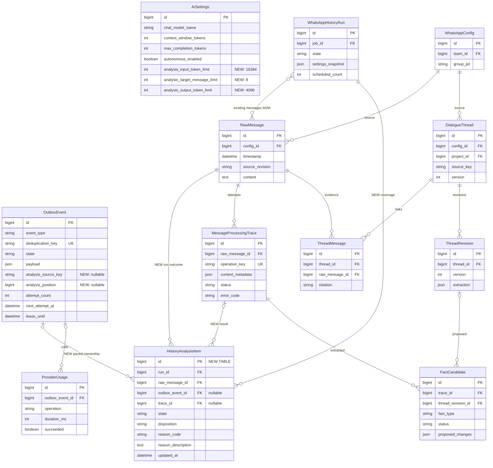

# Исправление скорости и достоверности анализа истории WhatsApp

- Идентификатор: `history-analysis-throughput`.
- Ветка: `bugfix/history-analysis-throughput`.
- Создано: 2026-10-06 23:48:52 MSK (UTC+3).
- Статус: подтверждена пользователем («делай»); реализация и проверка production в работе.
- Основание: диагностика production запуска №4, запрос пользователя на спецификацию фикса.
- База: текущая ветка с исправлениями отмены запуска и удаления глобальной паузы; `git pull origin main` выполнен. Эти исправления ещё не объединены в main. Сохранить также уже развёрнутую единственную навигацию настроек AI; перед реализацией и выпуском проверить состояние PR #52, #54, #55.



Поля без пометки NEW и связи проверены по текущему `backend/api/models.py`. ERD показывает только затронутую часть схемы. Новые элементы — план, миграций пока нет. `HistoryAnalysisItem` имеет уникальность `(run_id, raw_message_id)`; это результат сообщения в конкретном запуске, а не замена общему `RawMessage.processed` или существующему `SourceWorkItem`.

```mermaid
sequenceDiagram
    actor User as Бизнес / администратор
    participant Admin as Django admin
    participant DB as PostgreSQL / outbox
    participant History as Q2 history
    participant WAHA as WAHA
    participant Dispatch as Диспетчер
    participant AI as Q2 AI
    participant Model as gemma4:e4b / Ollama
    User->>Admin: Запустить или переанализировать историю
    Admin->>DB: Создать запуск и фоновое задание
    History->>WAHA: Прочитать страницы до пустой страницы
    History->>DB: Сохранить сообщения и уникальное покрытие запуска
    History->>DB: Сформировать ограниченные пакеты целей
    Dispatch->>DB: Выбрать готовый пакет свободного источника
    Dispatch->>AI: Отправить только выбранную работу
    AI->>DB: Проверить claim, собрать оригиналы и связанные темы
    AI->>Model: Ограниченный контекст + JSON Schema + deadline
    alt Корректный ответ со всеми целевыми ID и цитатами
        AI->>DB: Атомарно сохранить темы, кандидаты и результаты целей
        Note over AI,DB: Применение бизнес-фактов через существующий валидатор и настройки автономности
    else Обрезанный или несоответствующий ответ
        AI->>DB: Зафиксировать причину, разделить пакет / создать ограниченную исправленную попытку
    else Временная ошибка провайдера
        AI->>DB: Назначить ограниченный повтор, освободить claim источника
    else Исчерпан лимит или данных недостаточно
        AI->>DB: Сохранить ошибку / отсутствие данных и пробел покрытия
        Note over Dispatch,AI: Остальные готовые пакеты продолжаются; зависимые решения остаются отложенными
    end
    User->>Admin: Посмотреть прогресс
    Admin->>DB: Прочитать результаты сообщений, стадию, ошибки и время ожидания
    DB-->>User: Успехи / без фактов / нет данных / повторы / ошибки
```

## Постановка и подтверждённые причины

Запуск №4 сохранил 219 сообщений: 29 без текста и 190 предназначенных для анализа. На 2026-10-06 23:46 MSK ни одного успешного анализа текстового сообщения не было. Первая задача №1152 достигла четвёртой попытки; следующая назначена на 23:51:50 MSK.

1. При `autonomous_enabled=False` контекст строится практически до предела модели. Для первого приветствия включено 187 сообщений, фактический вход — 120582 токена. Это подтверждено трассировкой и ProviderUsage; максимальные 128к ошибочно становятся обычным рабочим объёмом.
2. После двух тайм-аутов получения метаданных вызовы модели состоялись. Один занял 75100 мс и исчерпал 8192 выходных токена; другой занял 4883 мс и завершился `invalid_extraction_schema`. Код этого исключения объединяет невалидный JSON, неверный верхний тип и отсутствие массива facts. Сырой ответ в доступной диагностике не сохранён; конкретную причину последнего ответа пока установить нельзя.
3. Запрос задаёт Ollama `format="json"`, но не структуру ответа. Валидный JSON сам по себе не означает соответствие контракту threads/facts.
4. Диспетчер ставит множество зависимых задач в Redis. Воркер уже после получения проверяет порядок чата и откладывает задачу на 10 секунд. За пять минут зарегистрировано 251 выполнение `run_outbox` при нуле успешных анализов запуска. Это создаёт холостую нагрузку и задержки.
5. Повторы первой задачи удерживают весь источник; экспоненциальная задержка после четвёртой попытки составляет около восьми минут. Ошибки структуры повторяются с прежним запросом, если пакет содержит одну цель.
6. `AI_REQUEST_TIMEOUT=1800`, timeout воркера 1980, lease 2040 секунд. Большой предел допускает долгое зависание, но не объясняет уже полученные неверные ответы.
7. Прогресс прибавляет сообщения без текста к «обработано», а временные ошибки не показывает как ошибки запуска. Интерфейс выглядит исправным, хотя содержательного результата нет.

## Цель и границы

Исправить сквозной анализ доступной истории: ограничить запросы, обрабатывать небольшие пакеты, обеспечить индивидуальный результат каждого сообщения, устранить холостые задания, ограничить повторы и показывать действительную причину ожидания.

- Использовать существующие Django, PostgreSQL, Redis, Django Q2, WAHA, Ollama и встроенный токенизатор. Не вводить новую модель, платный сервис, отдельный брокер или обязательную зависимость от embeddings/Qdrant для нахождения источников.
- Модель остаётся `gemma4:e4b`, максимальный контекст — 131072 токена. Токен и адрес провайдера сохраняются. Максимальный контекст не является размером обычного запроса.
- WhatsApp — единственный источник доказательств бизнес-фактов. Банковские подтверждения и документы выполнения не требуются. CRM — справочник идентичностей и существующих объектов, а не замена цитат переписки.
- Не менять схему чтения страниц WAHA, не сбрасывать WhatsApp-сессию и базу, не удалять исходные сообщения, результаты, решения или аудит.
- Не вводить глобальную ручную паузу. Сохранить возможность видимой отмены конкретного запуска и защиту от двух активных запусков задания.
- Не включать автоматически `autonomous_enabled` или `autonomous_crm_enabled`. Пакетный анализ должен работать независимо от них; фиксация/отправка фактов следует существующим настройкам. UI различает «кандидат извлечён», «факт принят» и «CRM обновлена».
- Не менять бизнес-валидаторы ради ускорения и не считать уверенность модели доказательством. Спецификация не обещает восстановить отсутствующую в WAHA историю.

## Планируемая реализация

### 1. Пакеты и покрытие сообщений

Добавить три настройки AI с безопасными начальными значениями: `analysis_input_token_limit=16384`, `analysis_target_message_limit=8`, `analysis_output_token_limit=4096`. Сохранять значения и версию политики в snapshot запуска/попытки. Проверять положительные значения, лимит целей 1..30, выход не больше `max_completion_tokens`, сумму входа, выхода и safety не больше окна модели. Старые неизменяемые попытки не переписывать.

Импорт создаёт по одной `HistoryAnalysisItem` для каждого уникального сообщения запуска. Пакеты содержат до восьми целевых сообщений в хронологическом порядке исходной отправки с ID как вторичным ключом; при неизвестной дате использовать received_at с явной отметкой. Каждая цель имеет числовой ID, оригинальную дату, автора и источник. Пакеты ограничивать также токенами, поэтому длинные сообщения уменьшают число целей.

Новый пакет — один OutboxEvent и один запрос, с собственными trace/результатами целей и указанием общего идентификатора попытки в метаданных. Кандидат относится к сообщению своего доказательства, а не произвольно к первой цели. Обновить существующий участок pipeline, который сейчас отмечает покрытые batch-сообщения только в автономном режиме.

В одном запуске сообщение принадлежит только одному текущему пакету; разделение пакета атомарно передаёт владение дочерним событиям. Успешный пакет засчитывает только те цели, которые полностью классифицированы и прошли проверки. Пропущенные моделью цели не считаются обработанными. Переанализ учитывается в собственных результатах запуска и не наследует успехи старого запуска.

### 2. Релевантный контекст с сохранением доказательств

Лимит 16384 включает system prompt, все цели, историю, темы и данные проектов; его проверяет существующий локальный токенизатор перед отправкой. Начальный лимит соседства — до 12 ближайших реплик до/после пакета, далее выбираются связанные оригиналы: reply/цитата, исходное обещание, срок, перенос, отмена, выполнение, точные обозначения объекта и участника. Поиск ведётся по всему snapshot источника с соблюдением команды, чата, редакций и доступа, а не только по соседним сообщениям.

Приоритет обязательных доказательств выше соседства. Сводки тем помогают найти сообщения, но не подтверждают факт. Подбор, подсчёт токенов и загрузка tokenizer кэшируются только при неизменных checksum/revision; кэш контекста должен учитывать snapshot и версии тем.

Нельзя автоматически отбрасывать приветствие, короткую реплику или «да/сделал/получил» только по словарю: она может закрывать обязательство. Без текста — отдельный результат `no_text`; техническую ошибку или недоступное вложение нельзя записывать как отсутствие бизнес-фактов.

Если целевой текст сам не помещается, разделять его по абзацам/границам записей отчёта с сохранением ID оригинала, диапазонов символов, пересечения на границах и общего покрытия. Сегменты не становятся новыми RawMessage. Внутри одного источника действуют те же ограничения параллельности. Объединять факты после проверки покрытия; неполный разбор явно отмечать. Цитата проверяется по полному оригиналу. Если корректное разделение невозможно или исчерпан лимит уточнений, сохранить `insufficient_context` с причиной и продолжить другие цели, не угадывать.

При отсутствии обязательного источника разрешить до двух дополнительных ограниченных запросов за контекстом на цель. Ответ о выполнении через неделю должен найти первоначальное обещание независимо от того, был ли первоначальный пакет успешно обработан. Найденные оригиналы включаются в проверяемую попытку. Отсутствие факта допускается только после законченного анализа, а не из-за переполнения контекста.

### 3. Структурированный ответ и содержательная проверка

В native Ollama передавать JSON Schema через format вместо одного `"json"`. Схема покрывает обязательные threads/facts, enum, строгие числовые ID и варианты project/payment/commitment. Согласовать её с ThemeSchema, FactSchema и правилами нормализации Decimal/дат; предусмотреть reported_promise. Отключение thinking сохраняется. До включения проверить поддержку схемы на установленном провайдере из фонового задания; неподдерживаемый режим показывать как конкретную ошибку конфигурации, не молча ослаблять контракт.

Структурная схема не заменяет серверную валидацию. Проверять покрытие всех целевых сообщений, ссылки на доступные оригиналы и темы, точные непрерывные цитаты, смысл оплаты/обещания, исполнителя, относительные даты и версии существующих обязательств. Недоступное/противоречивое основание — отложенный или отклонённый факт с причиной. Информационное сообщение даёт успешную классификацию без фактов.

Разделить диагностические причины: JSON parse, top-level type, missing facts, wrong facts type, отсутствующие цели, путь ошибки схемы, обрезанный выход и нарушение доказательств. В трассировке хранить finish_reason, число токенов, безопасный путь/код ошибки и число пропущенных целей. Полный ответ, если сохраняется для аудита, доступен только в защищённой трассировке с ограничением размера; в обычные логи не выводить переписку, токены доступа или заголовки.

При неверном/обрезанном ответе многопредметный пакет делить пополам, фиксируя связь попыток. Для единственной цели допускается один новый исправленный запрос с уменьшенным контекстом/сегментом и конкретным структурным замечанием. Не повторять тот же ошибочный запрос пять раз. Старый snapshot и ответ не менять.

### 4. Диспетчер без холостого перебора

Добавить индексированные nullable `analysis_source_key` и `analysis_position` в OutboxEvent. Ключ соответствует существующим границам source_scope; позиция задаёт устойчивый порядок пакетов источника. Backfill только событий анализа, из валидных RawMessage; несогласованные события остаются видимыми ошибками, а не получают произвольный источник. Предусмотреть индекс для поиска по источнику, state, next_attempt_at и позиции.

Проверять готовность и занятость источника до отправки в Q2. Не ставить сразу 190 зависимых задач в Redis. В транзакции выбирать не более одного готового пакета свободного источника; повторная проверка claim в воркере защищает от гонок. Заблокированные задачи остаются в PostgreSQL, без периодических запусков воркера каждые 10 секунд. Q2 содержит ограниченный объём действительно готовой работы.

Начальный предел — два активных AI-задания всего и одно на источник; учитывать историю, live-анализ и другие дорогие операции, независимо от флага автономного принятия фактов. Выбирать источники справедливо, приоритет live не должен навсегда вытеснять историю. Транзакционные блокировки держать только при claim/публикации; HTTP-запросы и подсчёт большого контекста выполняются вне транзакций с source-lock.

На отложенном повторе освобождать источник: следующий готовый пакет может анализироваться, даже если ранний ждёт Retry-After. Сохранять пробел покрытия; не повышать complete_through за незакрытый пробел. Отложенные пакеты используют свежие версии тем в новой попытке; проверка версий и дедупликация запрещают позднему ответу затереть новое решение. Чужие чаты и очереди доставки/CRM продолжают работать.

### 5. Ограниченные ожидания и повторы

Для обычного extraction установить HTTP connect timeout 10 секунд, read timeout 180 секунд и общий deadline попытки 240 секунд, включающий подготовку и дополнительные обращения. Согласовать timeout воркера 300, lease 360 и Q2 retry не меньше 420 секунд; не менять OTP/WAHA/CRM timeout. Истёкший lease не разрешает новую параллельную обработку, пока текущий worker claim не инвалидирован или не подтверждено его завершение. Для нестримингового HTTP сам read timeout не считать абсолютным deadline: вводить общий контроль elapsed time и явное состояние неизвестного исхода/просрочки. Нельзя считать отменённым внешний запрос, если провайдер продолжает вычисление.

Транспортные ошибки: не более трёх попыток, задержки 15 и 45 секунд с jitter; Retry-After соблюдать. Большой Retry-After хранится как ожидание с точным временем и не блокирует источник. Ошибки авторизации/конфигурации терминальны. Структурные ошибки используют разделение/одну исправленную попытку из раздела 3. Верхняя граница — 16 вызовов генерации на исходный пакет, включая разделения, исправления и уточнения; запросы служебных метаданных учитываются отдельно. На исчерпании сохранить результаты уже полностью обработанных целей, остальные обозначить явной ошибкой. Существующие лимиты бюджета сохраняются.

Получение метаданных кэшировать по провайдеру, модели, credential fingerprint и manifest; не получать заново для каждого пакета без истечения TTL. Метаданные и основной запрос имеют разные стадии/ошибки. Без корректных метаданных модель не запускается с выдуманным бюджетом.

### 6. Честный прогресс и причины отсутствия данных

Результаты HistoryAnalysisItem: состояния queued/processing/retry_wait/succeeded/failed/cancelled; disposition для терминального результата — facts/no_facts/no_text/insufficient_data. reason_code и русское объяснение обязательны для no_facts, no_text, insufficient_data, failed и cancelled. Успешный no_facts означает законченный разбор, failed не увеличивает успешный счётчик.

На странице запуска показывать раздельно: найдено, текстовых целей, без текста, успешно проанализировано, с кандидатами, без бизнес-фактов, недостаточно данных, в работе, в очереди, ждут повтор, ошибок и отменено. Пакеты/запросы не подменяют число сообщений. Показать текущую стадию, длительность, последнее полезное действие, последний ответ модели, последнюю ошибку и next_attempt_at.

Список целей с результатами показывать первым; цели с недостатком данных/ошибками — в отдельном фильтруемом списке с причиной, описанием отсутствующего источника и ссылкой на трассировку. Показать отдельно число принятых фактов и состояние CRM; нулевой финансовый итог нельзя объяснять как отсутствие финансов без полного покрытия анализа.

Финальный статус: completed при полном терминальном покрытии без технических ошибок; completed_with_errors при failed/insufficient_data, с отдельными счётчиками; cancelled при отмене. Успешно классифицированный некоммерческий текст — нормальный исход. Нет вечного analyzing после терминального завершения всех целей.

## План изменений и выпуск

1. Добавить настройки, таблицу покрытия и поля очереди, миграции и backfill; сделать однозначную серверную модель счётчиков.
2. Ввести пакетизацию независимо от автономного режима, ограниченный контекст и адаптацию покрытия/trace в pipeline.
3. Согласовать JSON Schema, диагностику, границы тайм-аутов и разные политики повторов.
4. Перенести отбор свободного источника в dispatcher, проверить конкурентные claim, recovery и версии тем.
5. Обновить admin страницу, polling и фильтры, сохранив одну страницу настроек AI и отсутствие глобальной паузы.
6. Проверить на воспроизводимых фикстурах и изолированном PostgreSQL, затем фоновой проверкой установленного Ollama. Проверка реального провайдера создаёт только защищённую диагностическую трассировку, без бизнес-записей из тестовых данных.
7. Перед production-выпуском сохранить защищённую резервную копию БД и метаданные активного запуска. Отменить старые задания выбранного источника штатным механизмом, удалить только их подтверждённые копии Q2 и запустить новый анализ уже сохранённых сообщений без повторного ожидания синхронизации WAHA. Не смешивать старые 120к snapshots с новой политикой. Отмена/перепланирование остаются в аудите.
8. Создать PR только в main с результатами проверок. Не обходить известный красный dependency audit. Перед объединением выполнить обязательное review и добиться зелёных проверок; несвязанные изменения зависимостей не маскировать как этот фикс.

## Проверки и критерии готовности

- Django check, `makemigrations --check` с `No changes detected`, применение миграций и повторный check; frontend `npm run build` при изменениях frontend. Проверить изменённый admin JS и реальные состояния polling, Docker-сервисы и логи backend/qcluster/WAHA.
- В PostgreSQL тест двух диспетчеров/двух воркеров доказывает одно активное задание на источник, общий предел два, отсутствие холостого enqueue заблокированных целей, recovery Redis/worker и освобождение источника после retry/ошибки. При искусственной ошибке первого пакета второй готовый пакет стартует не позднее двух циклов диспетчера; зависимые факты не применяются без источников.
- 219 уникальных сообщений создают ровно 219 записей покрытия: 29 no_text и 190 текстовых целей. Каждая цель имеет собственный исход, нет пропуска при разделении/отмене/повторе. Статус старого запуска не переоткрывается.
- Ни один обычный запрос не превышает 16384 входных токена и 4096 выходного резерва; 131072 остаётся пределом модели. Длинный отчёт не теряет последнюю строку/сумму; сегменты сохраняют точные цитаты и покрытие. Бюджет не превышается из-за дополнительных источников или исправляющего prompt.
- Фикстуры: приветствие; короткий ответ о выполнении; обещание и выполнение через неделю; перенос/отмена срока; сообщённое обещание третьего лица; фактическое поступление против будущей оплаты; накопительный итог против нового платежа; расход поставщику; неоднозначная компания/проект; две темы вперемешку; относительные даты через полночь; повреждённый/недоступный источник. Основания и причины проверяются, старое обязательство обновляется без дубля, выполненное не попадает в невыполненные.
- Валидный JSON без facts, неправильный тип, missing target ID, неверная цитата и обрезанный ответ имеют разные причины; не создают CRM-записи; политика разделения/исправления ограничена. Новые факты не пропадают из-за ошибки соседнего пакета.
- Метрики разделяют prepare/queue/provider/validate/persist/retry, сохраняют input/output tokens, количество целей, полезные и холостые выполнения. После прогрева цель: p95 обычного provider-вызова <=60 секунд, p95 подготовки пакета <=5 секунд, первое содержательное состояние цели <=90 секунд при свободном источнике и исправном провайдере. Это критерий замера, не гарантия скорости внешнего сервера; измерить на минимум 30 вызовах, указать аппаратные условия и реальные значения. Если не достигнут, причину установить до заявления об успешном ускорении.
- Контрольный анализ сохранённых 219 сообщений без загрузки WAHA: целевой срок <=10 минут при исправном провайдере; если большие отчёты требуют сегментов или провайдер медленнее, показать число дополнительных вызовов и отдельное время. Обязательные критерии независимо от скорости: отсутствие зависшего analyzing, ограниченность работы и полное объяснимое покрытие всех сообщений.
- Админка не показывает no_text как успешный AI-анализ, показывает временные ошибки и время повтора, различает отсутствие фактов и отсутствие данных. Ошибка первой цели не выглядит как «всё хорошо, ошибок 0».
- Перезапуск/отмена сохраняют исходные данные и готовые факты, не создают двойных оплат/обязательств/сделок, не сбрасывают WhatsApp. Секреты и тексты переписки не попадают в Git/обычные логи.

## Риски и практические ограничения

Уменьшение контекста может потерять связь с далёким обещанием; защита — поиск оригиналов по всей истории, тематические связи, тесты поздних ответов и явный insufficient_data. Параллельная публикация запрещена внутри источника; более поздний повтор проверяет версии тем. JSON Schema улучшает форму, но не гарантирует истинность ответа. Быстродействие gemma4:e4b и фактический объём доступной WhatsApp-истории определяются также внешними серверами; выпуск не должен скрывать эти ограничения.

## Результаты

Реализованы настройки входа/выхода/пакета, миграция 0041 с backfill источников очереди, покрытие HistoryAnalysisItem, ограниченный контекст новых попыток, пакеты, JSON Schema Ollama, разделение и ограниченные исправления, сегменты длинных оригиналов, защита публикации через поколение claim, выбор свободного источника в диспетчере, переанализ сохранённых сообщений и отдельный список причин в admin. Идентификаторы целей/трасс передаются массивом типизированных числовых пар; JSON-ключи не превращаются в смешанные типы ID. Режим автоматического принятия/CRM не включался.

Проверки до выпуска:

- 268 backend-тестов пройдены локально; PostgreSQL-only concurrency test пропущен на SQLite и отдельно выполнен на PostgreSQL.
- 38 тестов истории, admin и новых пакетов пройдены на изолированном PostgreSQL в Docker (232.495 секунды). Два диспетчера одновременно сохраняют предел два и выбирают разные источники. Тестовая сеть/контейнеры удалены.
- Проверка реального JS polling в Node: шесть состояний страницы пройдены, счётчик no_text отделён, ошибка/повтор показаны.
- Django check и whitespace — чистые; локальный `makemigrations --check`: код 0, No changes detected (локальное соединение с PostgreSQL запрещено sandbox; production проверяется отдельно).
- Резервная копия production: `/home/a_belianskii/mazory-releases/history-packets-20261007/db-before-history-packets.dump`, 2554648 байт, mode 600, pg_restore --list прочитан (774 строки).
- Миграция 0041 применена на production; дальнейшие проверки, фактические замеры, итоговый image digest, контрольный запуск и PR будут записаны здесь после завершения выпуска.
