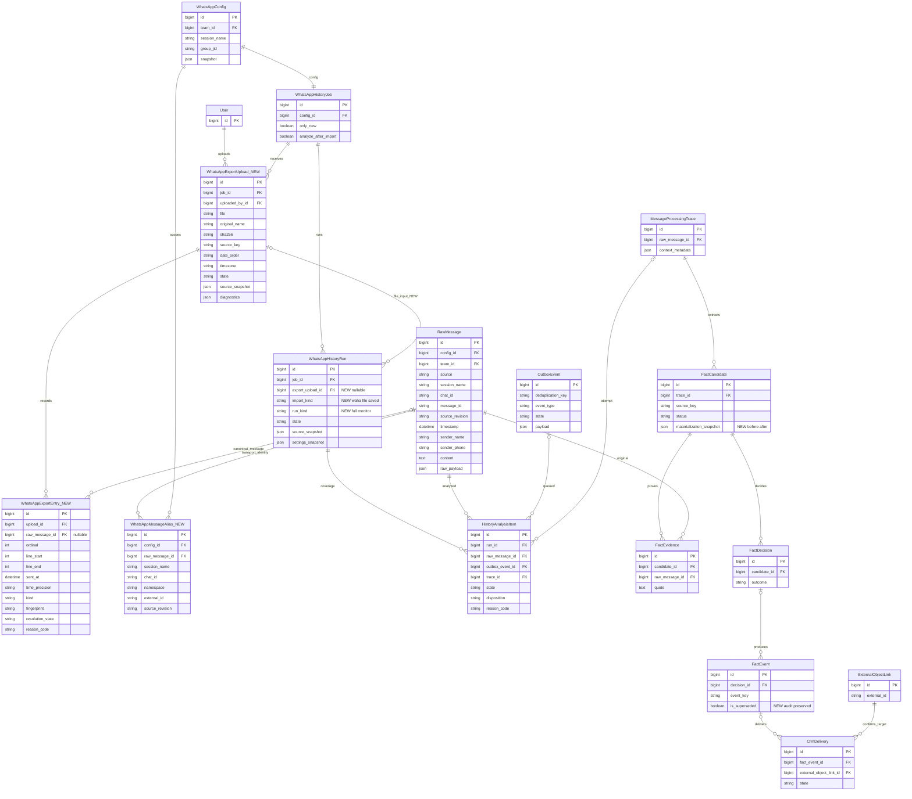

# Импорт экспорта WhatsApp и полный анализ в задании истории

- Задача: whatsapp-export-import.
- Ветка: feature/whatsapp-export-import; основа включает исправления анализа истории из PR #56.
- Дата: 2026-10-07_04-26-04_MSK (MSK, UTC+3).
- Статус: утверждена пользователем («делай»); реализована и выпущена; PR и CI проверяются.
- Основание: возможность загружать TXT-экспорт WhatsApp на странице задания истории и распределять содержащиеся сведения тем же конвейером.



NEW — планируемые модели/поля. Остальные связи проверены по актуальным models.py и миграциям 0041/0042. PrivateAttachment не переиспользуется: существующая модель требует заранее выбранный проект, а экспорт содержит несколько объектов. У Upload уникальность по заданию, snapshot источника, SHA файла и часовому поясу; у Entry — (upload, ordinal); у Alias — (config, session, chat, namespace, external_id, source_revision). Числовые PK/FK остаются int. Перезапуск использует тот же Upload, но отдельный Run.

```mermaid
sequenceDiagram
    actor Admin as Пользователь
    participant UI as Admin задания
    participant DB as Django и PostgreSQL
    participant Files as Закрытое хранилище
    participant Q as Outbox и Django Q2
    participant Parse as Разбор экспорта
    participant AI as Общий анализ WhatsApp
    participant CRM as Существующая доставка CRM
    Admin->>UI: Выбрать TXT и часовой пояс
    UI->>DB: POST импорт файла, CSRF и права задания
    DB->>Files: Сохранить ограниченный файл и SHA
    DB->>DB: Upload + Run + устойчивое событие
    DB-->>UI: Ссылка на прогресс
    Q->>Parse: Проверить весь экспорт и разобрать сообщения
    alt Ошибка файла или формата
        Parse->>DB: Ошибка с номером строки; AI не запускается
    else Файл проверен
        Parse->>DB: Найти канонические сообщения и транспортные aliases
        alt Неоднозначное совпадение
            Parse->>DB: Отдельный исход и основание, блокировка публикации
        else Новое или однозначно совпавшее сообщение
            Parse->>DB: RawMessage или ссылка на существующее, provenance
        end
        Parse->>DB: Зафиксировать полный снимок чата и покрытие
        Q->>AI: Пакеты из сохранённых оригиналов, без WAHA
        alt Факт уже доставлен в CRM
            AI->>DB: skipped_crm_delivered, без нового запроса
        else Анализ разрешён
            AI->>DB: Проверенный результат, замена неотправленного набора
            alt Неполные данные или ошибка
                AI->>DB: Основание/ошибка, прежний набор сохранён
            else Данные достаточны
                AI->>CRM: Текущая политика принятия и доставки
            end
        end
    end
    UI->>DB: Прогресс импорта и анализа
    DB-->>UI: Полные счётчики и списки причин
```

## Постановка

Сейчас кнопка «Запустить сейчас» создаёт WAHA history_import, проверяет подключение, ждёт синхронизацию и собирает страницы. Формы загрузки экспорта нет. Контекст и ключ очереди разделены по RawMessage.source; добавление отдельного файлового транспорта без адаптации разорвёт историю одного чата. У TXT нет внутренних WhatsApp message_id, поэтому дедупликация только по SHA файла или тексту не защищает от повторных платежей.

Предоставленный файл проверен локально без отправки переписки AI-провайдеру: UTF-8, 588571 байт, 6493 строки, 586 строк заголовков в формате «DD.MM.YYYY, HH:MM - …». Диапазон заголовков — 19.08.2026–20.09.2026. Есть продолжения сообщений и обозначения пропущенных медиа. Число заголовков не является числом коммерческих фактов. Настоящие тексты, имена авторов и сам файл в Git не включаются.

## Пользовательский сценарий

1. На странице существующего задания добавить блок «Экспорт WhatsApp»: TXT-файл, видимый часовой пояс экспорта, кнопка «Импортировать и выполнить полный анализ». Выбор файла принимает только .txt.
2. Загружаемый файл относится к выбранному чату и команде задания; показать их рядом с кнопкой. Имя файла не выбирает чат автоматически. TXT не доказывает ID группы: привязка задаётся пользователем выбором задания.
3. Старый запуск из WAHA и расписание сохраняют свою функцию. Файловый импорт — отдельный разовый источник входа, независимо от переключателя «Только новые». Не меняет настройки задания, live checkpoint, QR/сессию и расписание. Полная файловая проверка всегда включает анализ.
4. После загрузки сразу открыть отдельный запуск с этапами «Проверка файла», «Разбор сообщений», «Сопоставление», «Анализ», итогом и причинами. HTTP сохраняет файл/операцию, но не разбирает весь чат и не вызывает AI.
5. Если уже есть активный полный запуск, показать его ссылку и понятную причину, не отменять его автоматически. Активный монитор новых сообщений не должен делать загрузку невозможной: допускается отдельный файловый Run, но общий диспетчер сохраняет одно выполняемое AI-задание на логический чат. Текущую уникальность одного active Run на job заменить ограничениями, различающими монитор и конечный прогон; миграция не создаёт второй существующий монитор.
6. Кнопка отмены отменяет задания именно этого конечного прогона. Глобальную или скрытую паузу не добавлять.

## Файл и разбор

- Поддержать TXT, включая предоставленный Android-формат, iOS «[дата, время] Автор: текст», UTF-8 с/без BOM и UTF-16 с BOM. Дата поддерживает точки/слеши, двух-/четырёхзначный год; для неоднозначного порядка даты требуется явный выбранный формат, а не догадка. Двухзначный год — 2000–2099 с проверкой допустимого диапазона. Поддержать 12-часовое время с AM/PM и 24-часовое, секунды при наличии.
- Принимать только TXT с проверкой расширения, кодировки и фактического текстового содержимого. Упомянутые в тексте вложения учитывать как недоступные этому импорту; распознавание аудио/фото сюда не добавлять.
- Лимит TXT-файла 20 МиБ и не более 100000 заголовков сообщений. Ограничить чтение фактических байтов. Ограничения отображаются до загрузки; nginx/админская загрузка согласованы с лимитом.
- Сообщение начинается только валидным экспортным заголовком; последующие строки принадлежат ему, включая пустые строки, списки и отчёты. Нормализовать CRLF в LF, убрать BOM/служебные bidi-символы только в структурной части. Не обрезать/перефразировать текст сообщения и не сливать весь экспорт в одну RawMessage. Сохранить диапазон строк исходного файла.
- Разделить системные события, пользовательские сообщения и медиа без доступного содержания. Заголовок без автора не назначать следующему автору. Медиа-заглушка не является выполнением/платежом. Если есть подпись к медиа, анализировать реальную подпись и явно указать отсутствие вложения.
- Проверить весь файл до создания задач AI. Неверная дата, нераспознанный заголовок, содержимое перед первым заголовком, неоднозначная граница, повреждённая кодировка имеют отдельные причины и строки; нельзя молча потерять участок. При ошибке не показывать успешный полный импорт. Безопасно распознанные стандартные служебные строки учитываются отдельной категорией.
- Использовать автора из заголовка; телефон сохраняется только если явно присутствует. Не придумывать номера или identity автора по совпадению display name. Часовой пояс указывается на форме (значение из настройки чата, иначе TIME_ZONE), фиксируется в Upload и Run; точность времени minute/second сохраняется. Не использовать время загрузки для «сегодня/завтра» в старом сообщении. Настройки даты других сообщений чата не менять.

## Канонические сообщения и защита от дублей

- Сохранить закрытый оригинал, SHA, автора загрузки, source snapshot и Entry с порядком/строками/основанием сопоставления. Файлы недоступны через публичный media URL; доступ только через проверку прав интеграции/задания. Текст не попадает в обычные логи, Git и диагностику провайдера.
- Повторный POST того же файла идемпотентен: не создаёт вторую копию оригинала и параллельный запуск. После терминального результата можно явно создать новый полный Run того же Upload; это отдельный аудит, без повторного создания RawMessage.
- Новое сообщение файла имеет source=whatsapp_export и стабильную импортную identity; реальные WAHA ID не подделываются. Namespace alias отличает реальные WhatsApp ID от IDs экспорта. Обновление WAHA-сообщения не меняет старый неизменяемый оригинал.
- Сопоставление с WAHA детерминированное, без LLM: один чат/команда, точный текст (только EOL), подтверждённая identity автора, время с учётом точности экспорта и последовательность соседей. Для minute-заголовка учитывается интервал минуты, а не выдуманные секунды. Только доказанное однозначное соответствие связывает Entry/Alias с существующей RawMessage. Повторения одинаковых реплик в одной минуте не схлопываются по тексту; порядок и количество учитываются.
- Неоднозначные авторы/совпадения, изменённый экспорт без стабильного WhatsApp ID и возможное пересечение не приводят к автоматическому повторному финансовому событию: состояние deduplication_ambiguous, описание отсутствующего доказательства, отдельный список. Не считать эти сообщения обработанными без фактов. Когда существующий alias однозначен, повторное сопоставление не угадывает его заново.
- Общий resolver применяется как к file import, так и к последующему WAHA history/live ingestion: иначе сообщения файла продублируются при очередной синхронизации. Для разных чатов/команд одинаковый текст не объединяется. Alias уникальность и исходные ревизии проверяются под блокировкой источника.
- Объединить контекст и очередность waha/whatsapp_export только внутри одной конфигурации, команды, сессии и chat_id. Ключ существующего waha-источника сохранить, нормализовав семейство WhatsApp. Старые traces/revisions неизменяемы; ожидающие события получают общий ключ через миграцию. Manual/другие источники не смешивать с этим чатом.

## Полный анализ и распределение

- Файловый Run после успешного импорта фиксирует объединённый снимок канонических сообщений выбранного чата: сохранённые раньше плюс экспорт. WAHA API не вызывается; отсутствие активной WAHA-сессии не блокирует файл. Позднейшие поступления не меняют снимок этого запуска.
- Использовать существующие пакеты, лимиты, JSON Schema, резервирование токенов, bounded проверку выполнения обещаний и отдельное покрытие каждого сообщения. Экспорт не идёт в один огромный запрос; модель остаётся gemma4:e4b с контекстом 131072. Настройки и ключ провайдера не менять.
- Полный анализ повторяет неотправленные текстовые сообщения; RawMessage и факты не дублируются. После валидированного успеха атомарно заменить активный неотправленный набор сообщения (включая успешный facts=[]), сохранив аудит/историю. Ошибка оставляет старый набор. Общая тема не даёт права затереть результаты соседних сообщений. Это правило соответствует дополнению в specs/task_2026-10-06_23-48-52_MSK.md; подтверждение настоящей спецификации согласует его для файлового конечного прогона.
- Сообщения, доказательства которых уже породили подтверждённую доставку CrmDelivery.state=delivered и внешний ID, получают skipped_crm_delivered без повторного AI. Проверять и непосредственный источник кандидата, и FactEvidence. In-flight/unknown delivery блокирует замену отдельной причиной. Само наличие bitrix_id проекта не доказывает отправку данного факта.
- Для approved, но неотправленных результатов, замена включает версии/проекции и отмену старой pending-доставки: исправление платежа меняет итог, не прибавляет его повторно. Нельзя удалить ledger/event audit или ручные данные. Публикация повторно проверяет поколение claim, версии и доставку под блокировкой; гонка с CRM не теряет отправленный результат.
- Дальше используется действующая политика проектов/компаний/платежей/обязательств: буквальные основания из WhatsApp, различение поступления/обещания/накопительного итога, закрытие подтверждённых выполнений. Недостаточные данные, некоммерческое сообщение и отклонённый факт имеют разные основания. Сам факт загрузки не включает autonomous_enabled или autonomous_crm_enabled.

## Прогресс и результаты

Импорт: все записи файла = пользовательские текстовые + медиа без содержания + служебные. Неоднозначные сопоставления являются подмножеством текстовых записей. Невалидный файл отклоняется целиком до публикации сообщений. Для каждого исключения сохраняются код, описание и строки; счётчики не смешивают записи файла с каноническими сообщениями общего снимка. Отдельно показывать новые, сопоставленные существующие и повторные записи.

Анализ снимка: всего = проанализировано + без текста + пропущено из-за подтверждённой CRM-доставки + заблокировано неоднозначностью/доставкой + ошибки + отменено + осталось. Проанализировано = с фактами + без фактов + недостаточно данных. Неразобранные участки/ошибки не получают статус успешного полного прохода.

Страница запуска показывает источник «Файл экспорта», имя, диапазон дат, timezone, импортные счётчики и обычные результаты анализа. Списки: с данными первыми; без фактов/недостаточно данных/исключения — отдельные фильтры с основаниями. Возобновление после рестарта использует Entry/Alias/Outbox и не начинает весь импорт заново.

## План изменений

1. Миграция моделей Upload/Entry/Alias, полей Run и ограничений конечного прогона/монитора; indexes для resolver и backfill действующих WAHA aliases без изменения RawMessage/CRM-фактов.
2. Чистый parser TXT-экспорта и проверка кодировок/содержимого, закрытое хранение и форма/POST на admin задания. Оригинал не требует предварительного выбора проекта.
3. Устойчивый обработчик file import в tasks.py/Outbox, детерминированное сопоставление, общий WhatsApp source scope и resolver WAHA history/live.
4. Снимок объединённой истории, правила полной замены/CRM-защиты и атомарных проекций, coverage и причины. Точки принятия/доставки не включаются автоматически.
5. Прогресс admin, фильтры и meaningful regression/concurrency tests. В тот же документ внести фактические результаты проверок и ограничения.
6. Выпуск с резервной копией и без прерывания активного конечного прогона; проверки Django/migrations, фронтенда, Docker/логов и CI; PR только в main, объединение после зелёных проверок/review. Предыдущий PR #56 остаётся отдельной зависимостью.

## Критерии готовности

- На синтетических Android/iOS TXT корректны границы, многострочные отчёты, авторы, даты/precision, Unicode, служебные строки и медиа-заглушки. Повреждение даёт точную причину без запуска AI. Запись, похожая на заголовок внутри текста, не теряется молча.
- Предоставленный TXT проверен локальным parser полностью, без копирования его содержания в тесты/Git/логи. Все 586 распознанных заголовков распределены по категориям, многострочные тела сохранены. Различие с предварительной диагностикой объяснено по строкам. Разбор файла сам по себе не отправляет переписку провайдеру.
- Файл другого формата, бинарное содержимое под расширением .txt и превышение лимита отклоняются с понятной причиной; на ошибке не создаются публичные файлы, RawMessage или задания AI.
- Повтор того же файла, другой экспорт с пересечением и WAHA до/после файла не дублируют канонические сообщения и финансовые/CRM-события. Два одинаковых реальных сообщения остаются двумя; недоказанное совпадение получает причину, не второй платёж.
- Полный прогон twice, facts=[], ошибка, уже доставленный факт, гонка доставки, approved-unsent и correction суммы проверяются на PostgreSQL. Нет дублей платежей/обязательств/сделок, потерянных manual-данных или повторных доставок.
- File import работает при отключённой WAHA-сессии и при активном мониторе; не меняет checkpoint и не запускает параллельный AI одного чата. Рестарт/Redis retry/отмена сохраняют исходник и идемпотентный прогресс. Нет скрытой паузы.
- Admin POST требует CSRF, integration/change permission и корректную область задания. Чужой файл/чат недоступен; originals download не публичный. Размеры и все ошибки видны пользователю.
- Все счётчики сходятся; «завершено» не скрывает ошибки/неоднозначности. Выходные кандидаты имеют буквальные причины/основания и тот же путь распределения, что сообщения WAHA.

## Практические ограничения

TXT доказывает только включённую в него переписку: он не доказывает полноту всей истории телефона, неизменность авторства или наличие пропущенных вложений. Без WhatsApp ID некоторые пересечения нельзя разрешить автоматически; система должна объяснить неопределённость и остановить повторную публикацию факта. Парсер и дедупликация не требуют новой модели/embeddings; качество извлечения проверяется отдельно от успешного импорта. Контроль с настоящими сообщениями запускается только в согласованном объёме; прежнее разрешение на три диагностических запроса уже использовано.

## Уточнения реализации

- `run_kind` отделяет постоянный монитор от конечного полного прогона; уникальность активного запуска действует на `(job, run_kind)`. Файл импортируется в очереди `history_import` порциями по 100 записей. До завершения импорта новые оригиналы имеют `export_staged`; восстановление автономной очереди не анализирует их.
- Подтверждённые локальные проекции сохраняют `FactCandidate.materialization_snapshot`. Замена создаёт компенсацию финансового движения с сохранением оригинала и аудита; старые события имеют `FactEvent.is_superseded`. Новое извлечение и замена выполняются в одной транзакции после валидации ответа. Ошибка/rollback сохраняют прежние данные.
- Ручная корректировка оплаты, изменение обязательства/затронутого поля проекта или отсутствие снимка старого принятого проекта дают блокировку с причиной. Это необходимо для сохранения изменений, которые не принадлежат заменяемому факту. Отправленная/неопределённая legacy-доставка также блокирует замену при отсутствии доказательства точной связи доставки с фактом.
- Если автор и время совпали с существующей записью, но текст отличается, TXT не доказывает отдельную реплику: запись получает `deduplication_ambiguous`. Устойчивый ID WAHA связывает редакции оригинала, сохраняя предыдущие версии для аудита. Имя автора TXT само по себе не связывается с учетной записью пользователя.
- Повторный POST с прежним request key возвращает тот же запуск, повторная загрузка файла после завершения создаёт новый полный анализ без новых RawMessage. Счётчики этого запуска различают действительно новые и ранее сохранённые записи.
- Закрытая загрузка ограничена 20 МиБ, `/admin/` в nginx — 21 МиБ для multipart. Исходник доступен только через admin download с проверкой разрешений и `private, no-store`.

## Фактические проверки

- Локальный parser предоставленного TXT: 586 записей = 482 текстовых + 78 медиа-заглушек + 26 служебных. 182 многострочных сообщения; строки 1–6493. Исходник проверен локально, содержание не копировалось в Git/тесты и не отправлялось провайдеру.
- 320 backend-тестов на SQLite: успешно, три проверки блокировок пропущены на SQLite. Новый набор включает повторные загрузки, aliases WAHA до/после, неоднозначные редакции, chunk retry/отмену, права/CSRF, контрольную сумму, `facts=[]`, ошибку провайдера/публикации, три полных прогона одной оплаты с уточнением суммы и сохранение ручных изменений.
- Django check: без ошибок. `makemigrations --check`: `No changes detected`; на PostgreSQL проверены миграция 0042 → 0043, перенос активного монитора и транспортных aliases; check и makemigrations --check прошли.
- Шесть состояний обновления прогресса admin проверены. 31 проверка нового импорта и замены прошла на PostgreSQL, включая конкурентную двойную отправку, повторное выполнение шага и гонку с доставкой CRM. Выявленные различия PostgreSQL исправлены: блокируется основная таблица конфигурации без nullable JOIN; JSON-поиск project_id использует список числовых ID вместо bigint-подзапроса.

Строку тела, полностью совпадающую с заголовком сообщения WhatsApp, невозможно надёжно отличить от настоящего заголовка средствами TXT: parser сохраняет все строки и их границы в записях, но оригинал экспорта остаётся необходимым для проверки такого случая. Неоднозначные или повреждённые даты дают номер строки и отклонение файла.

- Дополнительная проверка ограничения запроса выявила общий middleware-лимит 1 МиБ. Для POST multipart на единственный маршрут admin TXT-импорта разрешено 20 МиБ + 64 КиБ обрамления. Проверено, что TXT более 2 МиБ проходит, а остальные admin-формы сохраняют прежний лимит.
- Пакетная запись истории WAHA сохранена: 100 новых сообщений требуют не более десяти SQL-запросов для RawMessage/Alias; уже известные WAHA aliases в чате с TXT загружаются одной выборкой. Отдельное сопоставление используется для ещё не известных сообщений.
- Для обязательной проверки зависимостей обновлён `source-map-js` в lockfile с 1.2.1 до 1.2.2, исправляющей [GHSA-68fv-2mgg-jv7q](https://github.com/advisories/GHSA-68fv-2mgg-jv7q). Дополнительные исключения audit не вводились.

- Для цепочки Tailwind 3 зафиксирован override `postcss-selector-parser` 7.1.6, исправляющий [GHSA-rj75-hqrm-r3gf](https://github.com/advisories/GHSA-rj75-hqrm-r3gf). Это устраняет вторую уязвимую ветвь без смены major Tailwind и без расширения исключений audit. Новый набор импорта добавлен в обязательный GitHub CI.

- Docker nginx собран с итоговым lockfile; `vue-tsc -b` и Vite успешно завершены. Backend image проверен на PostgreSQL. Перед выпуском нет активных проходов; текущие autonomous_enabled и autonomous_crm_enabled выключены и не меняются загрузкой.

- 34 теста интерфейса прошли с итоговым lockfile; строгий audit прошёл с ранее проверенной ограниченной mitigation braces, без новых исключений. Завершение или ошибка файлового запуска не сдвигают next_run_at задания; это отдельно проверено.

- Выпуск: сервер 79.108.164.63, release whatsapp-export-20261007-r8. Создан закрытый pg_dump перед миграцией; 0043 применена, check и makemigrations --check успешны. Backend, четыре qcluster, outbox и nginx работают, restarts=0; WAHA/Redis/PostgreSQL не пересоздавались. Обновлён лимит host nginx 21 МиБ.
- Проверка через HTTPS: главная и admin задания 1 возвращают 200; форма TXT, часовой пояс, multipart и кнопка присутствуют. Синтетический multipart более 2 МиБ прошёл до валидации; ZIP отклонён понятным сообщением, Upload/Run не созданы. На сервере 219 aliases старых оригиналов; autonomous_enabled/autonomous_crm_enabled остаются выключены. Предоставленный реальный TXT на сервер не загружался и не анализировался.
