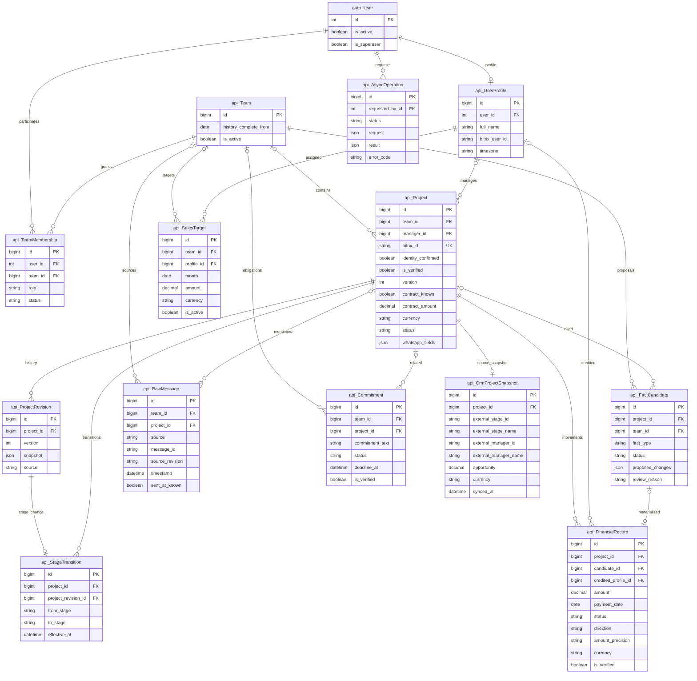
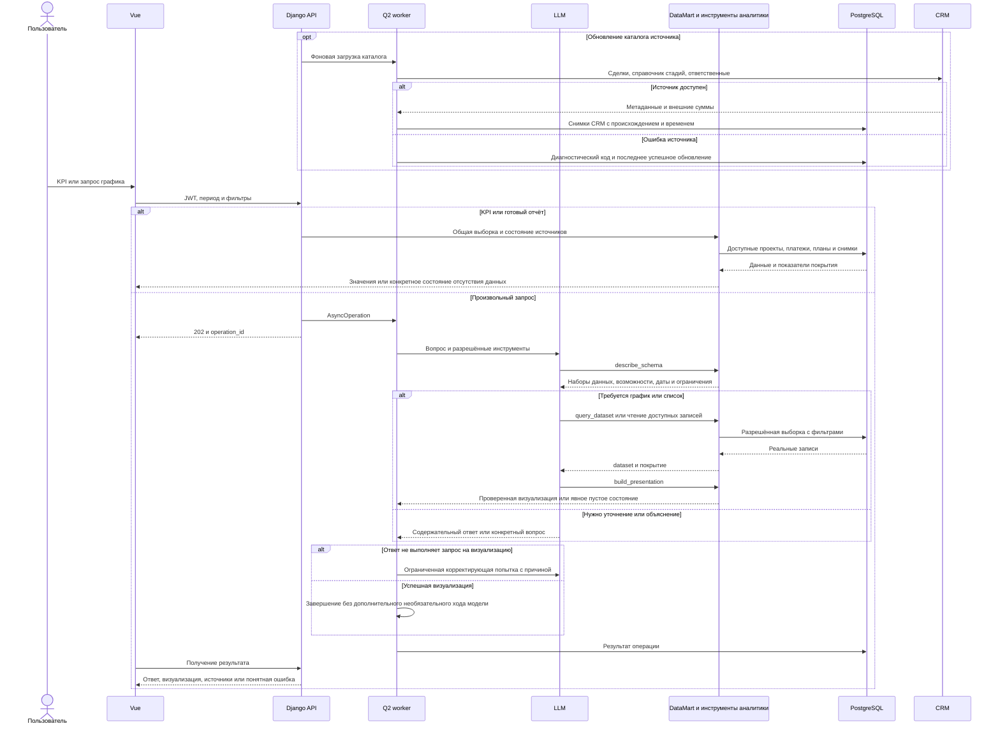

# Исправление пустых KPI, воронки проектов и ответов аналитического чата

- Задача: `kpi-chat-data` — прямой запрос пользователя, без GitHub Issue.
- Ветка: `bugfix/kpi-chat-data`; база: `origin/main`, коммит `de3d800`.
- Создано: 2026-10-07 18:36:59 MSK (UTC+3).
- Статус: спецификация согласована пользователем сообщением «делай»; реализация проверена и установлена, PR #63 направлен в main.
- Основание: пустые KPI и график поступлений, неверная воронка, одинаковая заглушка на произвольные вопросы в чате; три приложенных скриншота.
- Проверено: актуальные `models.py`, миграции 0012–0044, `datamart.py`, `analytics/{host,data,mcp,presentation}.py`, `operations.py`, `crm_catalog.py`, `facts.py`, `project_workspace.py`, Vue-компоненты и рабочая PostgreSQL через Docker context `mazory-remote`. Запросы аудита выполнены в транзакциях READ ONLY.

Сущности `api_*` существуют; `api_CrmProjectSnapshot` — отдельный снимок каталога CRM, добавленный миграцией 0045 в этой задаче. Его nullable-сумма и внешние стадия/ответственный описывают сведения CRM с датой загрузки, а не подтверждение поступления или договора WhatsApp. Внутренние PK/FK — int/number; внешние Bitrix ID — string. Снимок не изменяет роли и права пользователей. Подтверждённость локальной стадии определяется существующими field assertions, принятыми изменениями и историей, а не значением по умолчанию.

## Постановка и подтверждённые причины

1. В рабочей базе 641 проект: 623 из каталога CRM и 18 из переписки. У всех `status=qualification`, у всех отсутствует локальный менеджер. Девять проектов имеют известный договор; суммарно 4 255 274 000 KZT. Это сумма договоров, а не поступления.
2. Таблица `FinancialRecord` пуста. `SalesTarget` пуста. Есть два активных участника с ролью `team_lead`, участников с ролью `manager` нет. Для текущего месяца, прошлого месяца и года `source_count=0`, `managers=[]`, `chartData.labels=[]`. Полнота истории команды не установлена.
3. `get_sales_chart_dataset` возвращает график сравнения менеджеров. Пустой список менеджеров создаёт пустые оси; даже будущий платёж без персональной атрибуции не получит столбец. Основной запрос «график поступлений» должен показывать динамику поступлений по датам.
4. `crm_catalog._sync_deals_page` читает `OPPORTUNITY`, но не сохраняет его; `STAGE_ID` даже не запрашивается. Для новых карточек действует модельный default `qualification`. `BITRIX_STAGE_MAP={}`. Поэтому текущая воронка распределяет каталог по техническому default, а не по стадиям источника.
5. `project_row` отдаёт технический ноль как сумму неизвестного договора, оплаты и остатка. Таблица воронки выбирает первые 500 карточек по ID, вследствие чего строки с известными финансовыми данными теряются среди первых пустых карточек. В рабочем кабинете уже есть признаки полноты и объяснения; воронка ими не пользуется.
6. `analytics.host.run` заменяет любой финальный текст с любой цифрой фиксированной фразой. Даты, ID, количество доступных наборов и нумерация уточнений тоже запускают замену. В рабочем журнале этим ответом завершены «а какие есть наборы данных», «построй график частоты сообщений», «какие последние просроченные обещания».
7. Произвольная аналитика и готовые отчёты используют разные ограничения: динамическая аналитика требует `Project.is_verified=True, version>0`, а DataMart допускает подтверждённую идентичность и проекты с подтверждённым платежом. Динамическая выборка платежей также не ограничивает direction/amount_precision так же, как KPI.
8. В schema доступны только projects/payments/commitments/targets. Частота сообщений действительно не поддерживается, хотя исходные сообщения существуют. Запросы списка последних обязательств требуют инструмента чтения записей, а не только группировки их количества.
9. Четыре pending-кандидата платежа не связаны с проектом. Среди них приблизительная сумма, запись без суммы/даты и конфликтующие интерпретации одного поступления как income/expense. Их наличие не означает, что они могут быть проведены автоматически. В сохранённом решении по приблизительной сумме отмечено, что точные данные пользователю неизвестны.

## Требования

### KPI и поступления

- Основной график поступлений строить по датам платежей, независимо от списка менеджеров и наличия планов. Сравнение по менеджерам показывать отдельным графиком; неатрибутированные платежи учитывать в явной группе «Без назначенного менеджера».
- Единый контракт точных поступлений: доступный проект, verified received, direction=income, amount_precision=exact, валюта и дата платежа в выбранном периоде. Менеджер платежа — credited_profile; не подменять его текущим ответственным проекта.
- Сохранить точные Decimal-значения; агрегаты дашборда, чата, детализации и экспорта должны совпадать.
- Возвращать структурированное состояние доступности данных: есть ли операции в выбранном периоде/вообще, известен ли план, доступна ли персональная атрибуция, подтверждено ли покрытие.
- При отсутствии записей показывать конкретное объяснение и полезное действие: выбрать период с реальными операциями, открыть связанные источники или решения системы. Если платежей вообще нет, прямо сообщать об отсутствии зарегистрированных поступлений.
- В условиях неполной истории различать «не зарегистрировано» и подтверждённый ноль. Отсутствие менеджеров/плана не скрывает доступные проектные показатели. Не требовать настройки менеджеров для просмотра общего факта поступлений.

### Воронка и источники

- Сохранять внешний снимок CRM: сумму сделки с валютой, ID/название стадии, ID/отображаемое имя ответственного и время загрузки. Запрашивать справочник стадий выбранной категории; внешние вызовы выполнять через Q2.
- Отображать стадии CRM с их настоящими названиями. Без однозначной карты не преобразовывать внешнюю стадию в локальную по догадке. Локальную стадию без основания обозначать как неизвестную; default qualification не считать доказанным бизнес-состоянием.
- Различать локально известный договор, сумму сделки CRM, факт оплаты и отсутствие каждого показателя. У каждой суммы указывать её источник; неизвестный остаток не вычислять как ноль. Подтверждённость идентичности не приравнивать к подтверждённости всех финансовых полей.
- Показать показатели покрытия воронки: сколько объектов имеют договор, платежи, подтверждённую локальную стадию/снимок CRM; причины пробелов брать из общего слоя объяснений рабочего кабинета.
- В списке сначала показывать проекты с финансовыми данными; обеспечить доступ к остальным проектам через существующую пагинацию/фильтры. Счётчики стадий считать по всей доступной выборке.
- Историю стадий и конверсию считать по подтверждённым локальным событиям. Снимок текущей стадии CRM не создаёт задним числом время перехода и историю конверсии.
- После реализации разрешённое чтение каталога повторить через штатную очередь и проверить реальные стадии. Исходящие изменения CRM и создание прав доступа в эту задачу не входят.

### Чат и произвольные графики

- Убрать безусловную замену текста по наличию цифры. Сохранять содержательные уточнения с датами, ID и нумерацией, ответы о возможностях системы и обычные текстовые ответы.
- Финансовые показатели и графики формировать из проверенных datasets. При отсутствии данных возвращать объяснение фактической причины, а не универсальную фразу. Если модель пытается сообщить неподтверждённые финансовые значения, запрашивать ограниченную коррекцию с конкретной причиной.
- На запрос «какие есть наборы данных» перечислять настоящие возможности schema. На неподдержанный запрос объяснять конкретное ограничение и доступные варианты.
- Добавить dataset частоты сообщений: число доступных оригинальных сообщений по дням/неделям/месяцам и разрешённым чатам/командам. Исключать дубли экспорт/native, повторные версии и сообщения с неизвестной исходной датой; явно показывать покрытие. Фильтр валюты к сообщениям не применять.
- Для вопросов о последних просроченных обещаниях предоставить безопасное чтение доступных обязательств с текстом, сроком и источником, сортировкой и лимитом. Поддержать этот сценарий вне точного совпадения с текстом готовой кнопки.
- Выравнять доступность проектов и точность финансов между DataMart и dynamic analytics. Снимки CRM доступны как отдельные показатели с явным происхождением.
- После успешного build_presentation завершать операцию с проверенным результатом. Предусмотреть ограниченную коррекцию для запросов, где модель завершилась без требуемой выборки/визуализации.
- Сохранить JWT, разграничение команд/источников, SELECT-доступ analytics_readonly, квоты, таймауты, отмену и повторную проверку прав.
- Дать чату ограниченный контекст текущего диалога, чтобы ответ на уточняющий вопрос продолжал исходный запрос. Контекст валидировать по длине и ролям; сбрасывать при смене сессии; не принимать от клиента system/tool-сообщения и результаты datasets как доверенные.

### Разбор непроведённых платежей

- Через существующие источники и решения установить причину блокировки каждого из четырёх pending платежей: объект, точность суммы, дата, направление, дубли и актуальная версия.
- Показать результаты в существующем интерфейсе источников/решений и в этой спецификации. Дополнительные отчёты не создавать.
- Восстанавливать учёт только при достаточном основании через штатную процедуру решения с аудитом и дедупликацией. При отсутствии данных сохранять конкретную причину; не смешивать стоимость договора, приблизительную сумму или остаток с точным поступлением.

## Планируемые изменения

1. Общий слой выборок и полноты в datamart/project_workspace: согласовать доступные проекты, платежи и признаки известности; добавить состояния пустых выборок и показатели покрытия.
2. Модель CrmProjectSnapshot и миграция; crm_catalog: загрузка метаданных стадии/ответственного и суммы, сохранение снимка без перезаписи подтверждённых фактов. Расширить список разрешённых SELECT-таблиц analytics_readonly для нового снимка.
3. Исправить готовый отчёт поступлений, менеджерское распределение, воронку и сериализацию неизвестных значений. Переиспользовать объяснения полноты вместо отдельной логики.
4. Analytics host/schema/tools: содержательные финальные ответы, datasets сообщений/CRM, чтение обязательств, корректирующий ход и завершение после успешной визуализации.
5. DTO в frontend/src/types, графики и таблица воронки: пустые состояния, происхождение сумм/стадий, группировка без менеджера, доступ к остальным проектам. useChat и ChatInput: ограниченный контекст диалога.
6. Регрессионные тесты основных причин; проверки Django, миграций, TypeScript и сборки; браузерные сценарии с реальным Q2 на изолированных фикстурах.
7. Проверить реальные операции/покрытие и четыре pending платежа; выполнить фоновой read-only refresh каталога после выпуска. Записать фактические результаты здесь.
8. Создать PR только в main, дождаться обязательных CI/review и объединить по AGENTS.md.

## Критерии готовности

- Платёж без назначенного менеджера попадает в общий факт и график по дате; суммы детализации, экспорта и динамической аналитики совпадают. Расходы и приблизительные поступления не попадают в точный доход.
- На пустой рабочей выборке отображается «нет зарегистрированных поступлений» с причиной и доступными источниками; пустые оси 0–1 без объяснения отсутствуют. Известные суммы договоров доступны даже при отсутствии платежей/менеджеров.
- Воронка не относит все непроверенные стадии к qualification; после refresh показывает фактические стадии CRM либо явное отсутствие стадии. Неизвестные договор/оплата/остаток отображаются как неизвестные; проекты с данными видимы первыми.
- Ответы с датой, ID или нумерацией не заменяются заглушкой. Запрос возможностей перечисляет реальные datasets.
- Произвольные формулировки запросов поступлений и последних просроченных обещаний возвращают график/список или конкретную причину отсутствия данных.
- Запрос «построй график частоты сообщений» строит визуализацию по доступным оригинальным сообщениям; дубли и неизвестные даты не увеличивают показатели. Проверяется смена периода и границы доступа.
- Ответ на уточнение продолжает контекст вопроса; клиентский контекст не расширяет права и не подделывает результаты инструментов.
- После build_presentation результат сохраняется без обязательного дополнительного обращения к модели. Ошибки провайдера/инструментов отображаются отдельно от пустых данных.
- Четыре pending платежа имеют проверенные причины состояния; повторный разбор не создаёт дубли и не снимает ранее сохранённую неопределённость без новых оснований.
- Django check, makemigrations --check с No changes detected, необходимые тесты, frontend build и обязательные CI проходят. При изменении модели миграция создана и применена.
- Сервисы Docker работают; логи backend/qcluster/waha просмотрены. Основные сценарии подтверждены в браузере; реальные записи проверены чтением с сохранением прав.

## Проверки до реализации

- git pull origin main: Already up to date; рабочая ветка создана от origin/main.
- Аудит PostgreSQL выполнен без записей и без вызовов внешних интеграций.
- docker compose exec -T backend python manage.py makemigrations --check: код 0, No changes detected.
- Код приложения и рабочие данные на этапе подготовки спецификации не изменены.

## Выполненные проверки и разбор данных

- Реализованы снимки CRM без изменения подтверждённых финансов; общий ledger точных доходов; график по датам; отдельные состояния неизвестных сумм, покрытия и стадий; пагинация всей воронки.
- Чат получает настоящую schema заранее, поддерживает datasets сообщений и CRM, чтение последних обязательств и ограниченный контекст диалога. Даты/ID/нумерация больше не заменяются заглушкой; финансовые показатели проходят проверенный renderer.
- Backend: 363 теста проходят (3 проверки PostgreSQL пропускаются SQLite-раннером). Django check чист; makemigrations --check: No changes detected. Миграция 0045 создана и применена на изолированной PostgreSQL.
- Frontend: npm run build проходит, 40 тестов проходят. Семь браузерных E2E с настоящими API/Q2 и изолированными внешними HTTP-фикстурами проходят.
- Изолированная PostgreSQL: реальные SELECT-запросы сообщений, CRM, платежей, обязательств и фильтров стадий проходят. Проверены дедупликация редакций, исключение неизвестных дат, независимость сообщений от валюты, границы доступа, отзыв прав и отсутствие изменений бизнес-данных. Роль не может выполнять DML/DDL или читать пароли/AISettings. MCP-операция возвращает проверенную диаграмму.
- Docker images backend/nginx kpi-chat-20261007-r8 установлены вместе со всеми Q2 workers и outbox. Миграция 0045 применена; SELECT-роль перепровижена. Защищённые переменные окружения сохранены; backup базы сохранён в release-каталоге на сервере. Gateway preflight и публичный /api/health/ready/ проходят.

### Исходные четыре pending платежа

Автономный режим рабочей конфигурации выключен. Стандартный preview решения выполнен отдельно для каждого кандидата, с rollback; все четыре имеют outcome=deferred. Другие новые кандидаты в этот разбор не включены.

| Кандидат | Основание | Проверенная причина |
|---|---|---|
| 105 | Сообщение 86: Дивс / «Парус», «примерно на 12 млн», деньги поступили | Приблизительная сумма; точных копеек нет. Объект не связан с учётом, ранее сохранялась неоднозначность CRM 714/1318. Извлечение также ошибочно пометило расход. Нельзя превращать это в точное поступление. Preview: ambiguous_project. |
| 150 | Evidence сообщения 895: 117 млн «с копейками», оплата ожидается завтра | Обещание будущей оплаты, не факт поступления; точная сумма и объект не установлены. Основное сообщение trace 897 само не содержит этого платежа. Preview: ambiguous_project. |
| 151 | Сообщение 918: «Top build оплатили» | Нет суммы, даты и однозначно выбранного договора. Извлечённый 0.00 не является известным нулём. Возможен повтор сообщения о ранее полученной оплате; нельзя создать новый платёж. Preview: ambiguous_project. |
| 153 | Сообщение 948: отчёт Top Build за 09.09.2026, получено 117 млн | Источник говорит о поступлении, но кандидат ошибочно имеет payment_kind=reversal без исходного платежа. Конкретный договор не выбран; требуется сопоставление с источником и проверка повторности. Preview: reversal_unproven. |

Проводки по этим кандидатам не созданы. Существующая неопределённость не снята. Конкретные причины сохраняются как deferred-решения с аудитом в штатном интерфейсе решений, без включения автономного режима и без подтверждения финансовых данных.

### Рабочая среда и реальная модель

- Фоновое обновление CrmCatalogSync generation=4 завершилось succeeded без ошибки: 641 снимок CRM, 11 стадий. Договоры: 9 локально известных; суммы CRM показаны отдельно. Воронка распределяет реальные стадии (133 «В работе», 130 «Сделка провалена», 73 «КП отправлено клиенту», 71 «Оплата по счетам» и др.), без модельного default qualification.
- В рабочем PostgreSQL проверено: первые девять строк таблицы после обновления сортировки имеют известные договоры. Вся выборка доступна через пагинацию 50 строк; количество стадий считается по 641 проекту.
- Реальный Q2 и gemma4:e4b: операция 9 перечисляет шесть настоящих datasets с нумерацией; операция 11 возвращает три последних доступных просроченных обязательства с текстом/сроком/ответственным; операция 13 содержательно объясняет возможности чата.
- Операция 20 успешно построила line-представление частоты сообщений по неделям за 2026 год: настоящий dataset messages, 8 недель, 706 доступных оригиналов. Нормализованный период [2026-01-01,2027-01-01), currency=null, coverage=partial. Числа не подставлялись вручную. Полнота истории по-прежнему не подтверждена.
- Операция 16 успешно вернула произвольный недельный график поступлений; готовая операция 14 объясняет отсутствие зарегистрированных поступлений. В FinancialRecord по-прежнему 0 строк: исправление UI и CRM refresh не создают вымышленные проводки.
- Проверка действующей модели выявила дополнительный дефект: нативный Ollama генерирует одинаковые hash-ID для одинаковых вызовов в разных ходах. Host теперь различает такие вызовы по ходу, сохраняя квоты и общий лимит вызовов. Добавлены regression-проверки. Структурные ошибки инструмента возвращаются модели с точной причиной и максимум двумя корректирующими попытками; дан рабочий пример build_presentation.
- MCP TaskGroup оборачивал доменные ошибки в ExceptionGroup и скрывал их под operation_failed. Теперь известный код сохраняется; неожиданные ошибки имеют stack trace в стандартном logging. Новые проверки проходят.
- В Safari на https://ai.mazory.best проверены реальные KPI и воронка: понятные пустые состояния без пустых осей, девять договоров, все стадии/покрытие CRM, неизвестные оплата и остаток, имена ответственных CRM, кнопка «Загрузить ещё».
- Deferred-решения по исходным четырём кандидатам записаны с policy kpi-chat-data-audit-v1 и AuditEvent, без финансовых проводок и включения автономного режима. Повторный запуск идемпотентен.
- Django check и makemigrations --check проходят в рабочем контейнере. Логи backend, qcluster, qcluster_crm и waha просмотрены: новая сборка и workers запущены. У WAHA есть ранее существовавшие отказы для событий без чата/текста; их валидация и настройки не изменялись.
- PR: https://github.com/envOnion/kz-mazory/pull/63, target main. GitHub Platform verification первого коммита завершилась success; окончательные проверки повторяются на последнем коммите.

- Повторный сценарий Safari с историей диалога выявил несовпадение осей: native Gemma передаёт x/y для line, хотя renderer ожидает category/value. Сборщик теперь нормализует явные x/y для bar/line/area; конфликтующие ссылки, неизвестные поля и нечисловые значения по-прежнему отклоняются. Причины семантических ошибок возвращаются модели с точным контрактом. Пустой ответ после получения данных имеет одну ограниченную корректирующую попытку. Добавлены regression-проверки с реальными MCP sessions. Полный backend: 363 теста, OK, 3 SQLite skips.
