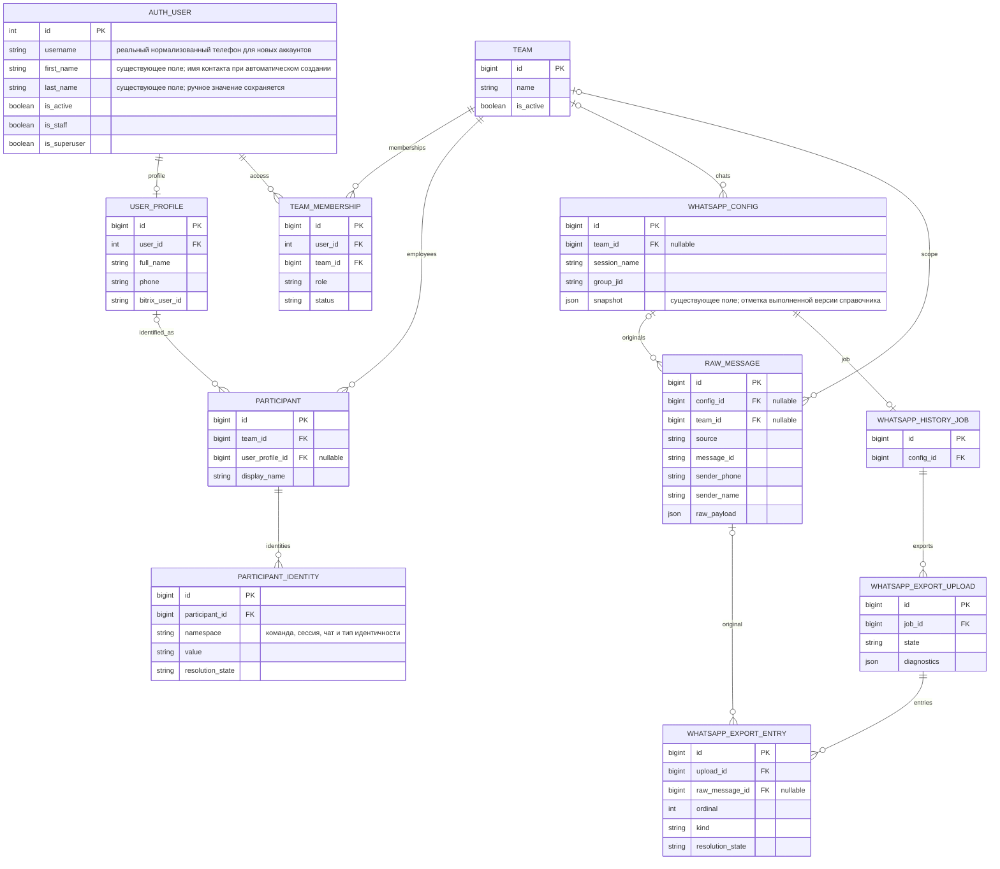

# Восстановление сотрудников и пользователей из WhatsApp

- Задача: `whatsapp-participants`, прямое обращение пользователя, без GitHub Issue.
- Ветка: `bugfix/whatsapp-participants`, от актуальной `origin/main` после `git pull origin main`.
- Создано: 2026-10-07 20:31:34 MSK (UTC+3).
- Статус: спецификация подтверждена пользователем («делай»); первоначальная реализация развернута, [PR #64](https://github.com/envOnion/kz-mazory/pull/64) объединён в main. Продолжение по уточнению пользователя — автоматическое заполнение имён учётных записей и периодическое обнаружение участников.



ERD показывает существующие модели и связи, проверенные по `models.py` и миграциям `0012`, `0034`, `0043`. Отдельной модели Employee в проекте нет: бизнес-участник представлен Participant, профиль сотрудника — UserProfile, учётная запись — auth.User, права — TeamMembership. Планируется заполнение и использование существующих таблиц; изменение схемы БД не предполагается. Уникальность ParticipantIdentity задана парой namespace/value; профиль связан с одним User. Внутренние идентификаторы остаются int/number, телефоны и WhatsApp JID — string.

```mermaid
sequenceDiagram
    actor U as Руководитель
    participant UI as Интерфейс
    participant API as Django API
    participant DB as PostgreSQL
    participant Q as Outbox и Django Q2
    participant W as WAHA Noweb
    U->>UI: Импорт TXT / восстановление участников
    UI->>API: Запрос в области доступного чата
    API->>DB: Сохранить источник и фоновое задание
    API-->>UI: Идентификатор и состояние операции
    Q->>DB: Прочитать авторов TXT и исходные WAHA payload
    Q->>DB: Сохранить участников и именные/LID идентичности
    Q->>W: Прочитать участников группы и доступные связи LID с телефоном
    alt WAHA недоступен или телефон не раскрыт
        Q->>DB: Сохранить участников и явную причину отсутствия телефона
    else WAHA вернул подтверждённые идентичности
        W-->>Q: JID, реальные телефоны, доступные имена
        Q->>DB: Проверить неизменную область источника
        alt Телефон и соответствие однозначны
            Q->>DB: Переиспользовать или создать User и UserProfile
            Q->>DB: Связать Participant с профилем и идентичностями
        else Противоречивое соответствие
            Q->>DB: Сохранить конфликт без объединения разных людей
        end
    end
    Note over Q,DB: Создание записи сотрудника не выдаёт доступ к кабинету автоматически
    UI->>API: Получить справочник и состояние восстановления
    API->>DB: Прочитать доступных участников, профили и диагностику
    API-->>UI: Имена, телефоны, статусы идентификации и доступа
    W->>API: Подписанный webhook нового сообщения
    API->>DB: Сохранить исходную идентичность и фоновое задание
    Note over API,Q: Импорт файла, истории и webhook автоматически запускают регистрацию; отдельная кнопка не обязательна
    Q->>DB: Идемпотентно обновить справочник участников
    loop При запуске новой версии и раз в 15 минут
        Q->>DB: Проверить активные чаты и отсутствие открытого задания
        Q->>Q: Создать фоновое задание синхронизации без ручного запроса
        Q->>W: Прочитать подтверждённые идентичности группы
        Q->>DB: Создать или дополнить User, UserProfile и Participant
    end
```

## Постановка и подтверждённая причина

Пользователь сообщил, что из файла и WhatsApp-чата не созданы сотрудники и пользователи. Требуется исправить обработку новых импортов и восстановить записи по уже сохранённой истории.

Диагностика текущего локального выпуска:

- В приложенном TXT 586 записей: 482 текстовых сообщения, 78 записей без медиа и 26 служебных событий. Найдено 10 различных имён авторов; телефонов в заголовках этого файла нет. Разные имена могут принадлежать одному человеку, поэтому это не доказательство десяти различных сотрудников.
- Этот файл уже импортирован: upload №1, state=ready, blocked=0. В чате №1 команды №1 сохранены 482 TXT-оригинала и 225 WAHA-оригиналов.
- В БД всего 2 User, 2 UserProfile, 2 TeamMembership; Participant и ParticipantIdentity отсутствуют.
- У 211 из 225 WAHA-оригиналов поля автора пусты. У 199 оригиналов автор присутствует в `raw_payload.payload._data.participant`, но `history_jobs.persist_items` читает только верхний `participant` и `_data.key.participant`.
- Шесть различных идентичностей авторов представлены JID с суффиксом `@lid`. В 14 сообщениях такой JID записан в `sender_phone` после отсечения суффикса; LID является внутренним идентификатором, а не подтверждённым телефоном.
- Импорт TXT и WAHA не создаёт User/UserProfile. `autonomous._participant` вызывается при публикации отдельных фактов и способен только связать участника с уже существующим активным профилем. Это не импорт списка сотрудников.
- Список групп WAHA запрашивается с `exclude=participants`; отдельного процесса синхронизации сотрудников группы нет.

Содержание переписки используется как данные для идентификации и диагностики. Указания внутри сообщения или файла не являются инструкциями для выполнения этой задачи.

## Требования

1. Создавать и обновлять Participant для авторов TXT, авторов сообщений WAHA и участников настроенной группы, в том числе не писавших текстовых сообщений. Имена авторов записей без доступного медиа тоже учитывать. Служебный текст не превращать в сотрудника произвольным разбором перечислений.
2. Сохранять идентичности отдельно: имя в области исходного чата, WhatsApp LID/JID, подтверждённый телефон. Читать поддерживаемые поля реального Noweb payload, включая `_data.participant`. Не записывать LID или group JID в поле телефона.
3. Реальный телефон получать из подтверждённого PN JID/поля телефона либо явного соответствия LID→PN, доступного в текущем WAHA. Уточнить конкретные поддерживаемые маршруты и формы ответа по установленному выпуску WAHA перед реализацией. Недоступный телефон показывать как неизвестный с причиной.
4. Для подтверждённого телефона использовать существующий `normalize_phone`; создавать или переиспользовать User с нормализованным телефоном в username и UserProfile, связывать с Participant. Создание нового пользователя выполняется с непригодным паролем, без staff/superuser и без автоматической выдачи TeamMembership/ChatAccess. Права и существующие профили сохранять.
5. Автор из TXT без доказанного телефона должен быть виден как участник со статусом «телефон не установлен». Не выдумывать номер и не объединять одноимённых людей. Привязка TXT-имени к WAHA допускается только при однозначных проверяемых транспортных данных/источниках; противоречия оставлять для проверки.
6. Идемпотентность обязательна для повторного импорта, синхронизации, webhook и одновременных заданий. Один нормализованный телефон соответствует одной учётной записи; LID хранится в области сессии/команды. Имя само по себе не является глобальным ключом человека.
7. Все обращения к WAHA выполнять из `tasks.py` через settings.WAHA_API_URL/WAHA_API_KEY и Django Q2. HTTP обработчики только сохраняют оригинал/задание. Для восстановления участников не запускать LLM и повторный анализ бизнес-фактов, не отправлять приглашения или сообщения.
8. Сохранить исходные raw_payload и тексты сообщений. При исправлении производных полей sender_phone/sender_name не создавать новые оригиналы и бизнес-факты. Технический JID сохранять как идентичность; сомнительные прежние «телефоны» исправлять только по исходному типу JID.
9. В справочнике и админке показывать обнаруженных участников, связанные профили, подтверждённый телефон и состояние идентификации/доступа. Существующие фильтры авторизации сохранять; обнаружение в группе само по себе не предоставляет доступ к чужим проектам и чатам.
10. После выпуска выполнить ограниченное восстановление для существующего чата №1 команды №1 по сохранённому TXT, WAHA payload и доступному составу группы; сверить результат чтением БД и API. Точный итог уникальных людей определять по подтверждённым идентичностям, не задавать заранее по числу имён TXT.

## Планируемые изменения

- Общий разбор и разрешение авторов WhatsApp для history/webhook/TXT с явным различением PN, LID и именного источника.
- Идемпотентная служба создания Participant/ParticipantIdentity и привязки User/UserProfile; транзакции и защита от гонок при нормализации одного телефона.
- Фоновое задание синхронизации участников WAHA, обработка ошибок, проверка области источника до сохранения, объединение повторных заданий.
- Подключение к завершению импорта, обработке новых сообщений и явному восстановлению сохранённой истории. Регистрация участников не зависит от наличия извлечённого бизнес-факта.
- Обновление типизированного ответа справочника и интерфейса, чтобы отличать установленный профиль от участника с неизвестным телефоном; числовые ID, без `any`.
- Восстановление связи бизнес-участника с существующим/новым профилем по доказанным идентичностям; не переназначать автоматически проекты и утверждённые поручения только по совпадению имени.
- Регрессионные тесты реальных форм Noweb payload, LID→PN, повторов/конкуренции, отсутствия телефона, конфликтов имён, недоступности WAHA, сохранности существующих прав и границ команды.

## Критерии готовности и проверки

- Все 10 имён авторов приложенного TXT представлены в участниках/именных идентичностях либо имеют явное доказанное объединение; нет молчаливой потери автора.
- Шесть наблюдаемых LID сохранены как WhatsApp идентичности; ни один LID не используется как телефон для аккаунта/OTP.
- Для каждого доступного подтверждённого телефона создаётся или переиспользуется User/UserProfile, связь видна в справочнике. Для недоступного номера указана конкретная причина.
- Повтор восстановления не меняет число уникальных аккаунтов и участников, не создаёт новые RawMessage, бизнес-факты или уведомления.
- Существующие пользователи, роли, доступы, проекты, решения review и данные текущего выпуска сохраняются.
- Тесты покрывают реальную вложенность `_data.participant`, PN и LID, участников без сообщений, имена без телефонов, повторы, гонки и отказ выдачи доступа по факту обнаружения в группе.
- Выполнены Django check, `makemigrations --check` с `No changes detected`, релевантные backend/frontend тесты и `npm run build` (vue-tsc + Vite).
- Выполнен запуск/обновление нужных Docker сервисов, просмотр логов backend/qcluster/waha, проверка фактических записей и ответа API после восстановления.
- Создан PR в main с описанием и проверками; слияние после обязательных проверок/review. Спецификация остаётся единственным текстовым артефактом задачи.

## Проверки этапа диагностики

- `git pull origin main`: Already up to date; рабочая ветка создана от origin/main, main не изменялась.
- TXT разобран существующим парсером без ошибок; сопоставлены категории и авторы с импортированными данными.
- Выполнено только чтение БД для проверки количества записей и структуры исходных payload.
- `docker compose exec -T backend python manage.py makemigrations --check`: `No changes detected`.
- Изменён только этот файл спецификации. Код приложения и пользовательские данные до согласования не изменяются.

## Реализация и уточнения после согласования

- Установленный WAHA Noweb поддерживает `GET /api/{session}/groups/{id}/participants/v2`: возвращает явные пары id=@lid и pn=@c.us. Состав выбранной группы содержит 11 участников с подтверждёнными PN. Дополнительные маршруты: `GET /api/{session}/lids/{lid}`, `GET /api/contacts?session=...&contactId=...`, чтение собственной идентичности через `GET /api/sessions/{session}`. Формы ответа проверены по исходникам установленного контейнера и реальными задачами Django Q2. Семантика LID/PN сверена с [официальной документацией WAHA](https://waha.devlike.pro/docs/how-to/contacts/).
- В ветку включён текущий код работающего выпуска KPI/chat из `bugfix/kpi-chat-data` (PR #63, commit 0020645), чтобы выпуск участников сохранял уже исправленную аналитику. Это зависимость от существующей задачи; изменения справочника сотрудников описаны только в данной спецификации.
- Добавлен единый разбор авторов и служба Participant/ParticipantIdentity/User/UserProfile без изменения схемы. WAHA синхронизируется через новый идемпотентный outbox тип `whatsapp_participants` в history worker; источник и права инициатора проверяются повторно.
- TXT-имена связываются с технической идентичностью при минимум двух уникальных совпадениях текста и минуты, если нет сообщений, указывающих на другого автора. Уже доказанный транспортный alias одного оригинала позволяет связать автора непосредственно; исходный WAHA payload такого сообщения сохраняется в приватном outbox, даже когда канонический RawMessage происходит из TXT.
- Добавлены endpoint `POST /api/directory/participants-sync/`, scoped списки участников и состояния синхронизации, раздел «Сотрудники» и читаемый список Participant в админке. Аккаунты не получают членство/доступ автоматически.
- Регрессии исходящего fromMe и проверки «импорт без AI» исправлены: исходящий PN берётся из from или своей идентичности сессии; отсутствие AI-заданий проверяется отдельно от синхронизации справочника.
- Добавлены backend тесты идентичности/повторов/конфликтов/прав/сохранности источников/конкуренции, frontend проверки отображения и новый браузерный сценарий настоящего API/outbox/Q2 с участником, не писавшим сообщений. Новые backend тесты включены в CI.
- После слияния PR #63 ветка дополнительно синхронизирована с актуальной main (d7dd6d6); текущий PR содержит только исправление участников.
- Проверки: полный api — 379 тестов, 4 пропуска для отдельной PostgreSQL проверки; на отдельной `test_mazory_participants_checks` — 63 теста успешно, включая конкурентное создание одного аккаунта в двух командах, импорт и транспортные alias. Начальная PostgreSQL проверка выявила nullable JOIN при блокировке конфигурации; добавлено `select_for_update(of=("self",))`, повторная проверка прошла.
- Frontend: 42 теста успешно, `npm run build` локально и в Docker успешно; восемь браузерных/API/outbox/Q2 сценариев успешно. Тестовые номера синтетические; реальные телефоны контактов в Git не сохраняются.
- Django check без ошибок, локальная проверка миграций — No changes detected; diff проверен. Подготовлен выпуск `participants-20261007-r2`, приватная конфигурация и резервная копия БД находятся в защищённом release-каталоге сервера. При обновлении используется существующая Docker сеть и серверный Compose override; БД/Redis/WAHA не пересоздаются.
- На работающем приложении восстановление вызвано через `POST /api/directory/participants-sync/` от существующего руководителя. Outbox №7894 завершился `done`, попытка 1, без ошибки; повтор №7920 также завершился `done` без изменения числа записей.
- Итог: 11 новых User/UserProfile, всего 13 аккаунтов; 21 Participant и 40 идентичностей. Все 11 участников WAHA имеют подтверждённый номер. Все 10 имён TXT сохранены отдельно со статусом неизвестного телефона: текущие оригиналы не дали достаточной однозначной связи с WAHA, объединение по одному совпадению имени не выполняется. В источниках обнаружены и сохранены 11 LID, включая участников без сообщений.
- Число RawMessage осталось 707; SHA-256 списка `id/source/content/raw_payload` до и после совпал. Количество проектов 641, обязательств 30, финансовых записей 0; статусы кандидатов сохранились: approved 48, superseded 101, rejected 17, pending 26. Два прежних членства team_lead/active сохранены; новых членств нет, новые аккаунты без пригодного пароля и без staff/superuser.
- Ответ справочника проверен от существующего руководителя; список «Профили сотрудников» на рабочем домене просмотрен в Safari: 13 профилей с новыми именами/телефонами видны. Публичный readiness отвечает ready; история Q2 обработала восстановление без ошибки. В логах WAHA видны прежние отклонения webhook для неразрешённого источника; восстановление выбранной группы успешно прошло через читающие маршруты WAHA.
- Финальная проверка уточнила границы исторического поиска после смены конфигурации: учитываются только совпадающие team/session/chat. Техническая подпись LID заменяется подтверждённым телефоном, если имя недоступно. Добавлен тест прежней области источника и отображения: 16 тестов, SQLite успешно (один PostgreSQL тест пропущен).
- Все 16 финальных тестов участников успешно прошли на отдельной PostgreSQL БД, включая конкуренцию; БД теста удалена штатным runner. Повторный общий прогон после 18:00 UTC выявил прежнюю зависимость fixtures автономной оплаты от расхождения даты Asia/Almaty и резервного UTC+06:00. В тестовой конфигурации явно задан `settings.TIME_ZONE`, совпадающий с датой fixture; финансовая логика не менялась.
- Финальный общий прогон: 380 backend тестов успешно (4 пропуска SQLite, соответствующие проверки выполнялись на PostgreSQL). Django check и `makemigrations --check` повторно успешны. Выпуск приложения обновлён до `participants-20261007-r3`; frontend совпадает с проверенной сборкой r2.
- Финальные восемь браузерных/API/outbox/Q2 сценариев успешно (18,1 с). На r3 outbox №7921 завершился done с первой попытки; API справочника ответил 200, участников 21, с телефоном 11. User/UserProfile 13, ParticipantIdentity 40, RawMessage 707; исходный SHA-256 неизменен, технических подписей @lid больше нет. Создан PR #64 в main, прикреплён к задаче; изменение готово к слиянию после обязательной проверки GitHub.

## Уточнение пользователя: имена учётных записей и автоматическая генерация

После выпуска PR #64 пользователь указал, что имена заполнены в профилях, но отсутствуют в списке пользователей, и подтвердил исходное требование самостоятельного создания записей системой из чата/файла. Это продолжение согласованной задачи; дополнительная спецификация не создаётся.

- Причина: `register_sender` создаёт User/UserProfile и сохраняет full_name только в профиле. Две записи Django хранят имя раздельно; имя в User пустое даже при известном full_name.
- Изменение: та же служба регистрации заполняет пустое имя User из известного имени связанного профиля. Как и в существующей форме создания пользователя, исходная подпись контакта сохраняется в first_name с соблюдением длины поля; фамилия не угадывается из названия компании или псевдонима. Существующие ручные имена и фамилии сохраняются. Телефон/LID не выдаётся за имя.
- Автоматические входы уже подключены к импорту TXT, `persist_items` истории и webhook. Проверки должны проходить именно через импорт/подписанное сообщение и автоматически созданный outbox, без вызова endpoint ручного восстановления.
- Диспетчер outbox самостоятельно планирует обновление активных чатов при первом запуске новой версии справочника, затем раз в 15 минут. Открытое задание переиспользуется; повторные ошибки ограничены тем же интервалом. Запросы WAHA остаются только в history worker. Это позволяет обнаруживать не пишущих участников и исправлять ранее пустые имена без ручного вызова восстановления.
- Критерии: новый аккаунт с известным именем сразу имеет имя и профиль; ранее пустое имя дополняется очередной штатной синхронизацией. Позднее получение имени после номера заполняет обе записи. Повтор не создаёт дублей и не меняет роли/пароли; имена без подтверждённого телефона остаются участниками.
- Проверки: регрессии создания/обогащения/ручных имён, импорт TXT через worker и webhook через настоящий API/outbox/Q2; проверка сохранённых записей и обоих списков админки после выпуска. Изменения схемы не требуются.
- Локальные проверки продолжения: полный api — 385 тестов успешно, 4 пропуска SQLite; целевые тесты участников и доступа — 29 успешно, один пропуск SQLite. Django check без ошибок, `makemigrations --check` — No changes detected. `npm run build` прошёл; восемь браузерных/API/outbox/Q2 сценариев прошли за 25,2 с, включая автоматическое создание не пишущего участника и его имя в настоящей форме Django User.
- Все 29 целевых тестов повторно прошли на отдельной PostgreSQL БД, включая конкурентное создание; тестовая БД удалена runner. При первом прогоне очистка соединений диспетчера закрывала транзакцию Django TestCase; в тесте изолирована только эта очистка, производственный код не менялся.
- Выпуск `participants-20261007-r5` развёрнут. Штатный outbox после запуска сам создал задание №7922 без инициатора (`requested_by_id=null`); history worker завершил его `done`, попытка 1, без ошибки. Ручной endpoint восстановления и ручная запись имён в БД не использовались. Версия справочника в конфигурации — 2.
- Шесть пустых имён User дополнены из известных имён профилей; теперь все семь профилей с именем имеют такое же имя учётной записи. Пять обнаруженных WhatsApp-аккаунтов пока имеют только подтверждённый телефон; имена не выдумываются. User/UserProfile осталось 13, Participant 21, ParticipantIdentity 40, RawMessage 707; исходный SHA-256 и отпечаток паролей/активности/staff/superuser совпали с состоянием до выпуска. Два прежних членства, бизнес-записи и статусы проверки фактов сохранены.
- Readiness после выпуска — ready, Django check и `makemigrations --check` прошли. В логах outbox/history подтверждена штатная обработка. Список «Пользователи системы» на рабочем домене обновлён и просмотрен в Safari: все шесть автоматически дополненных имён видны.
