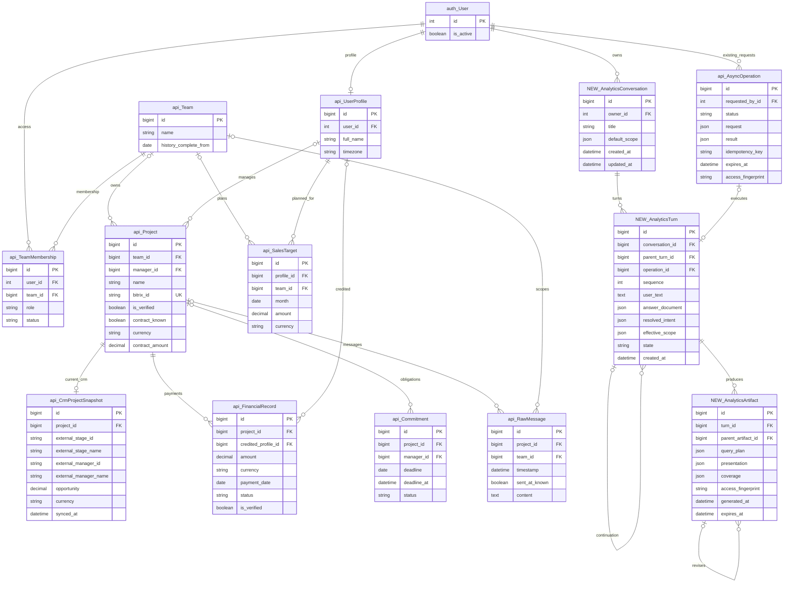
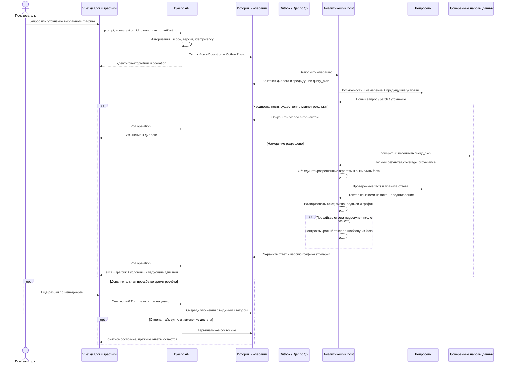

# Аналитический диалог Mazory: ответы, уточнения и графики

- Задача: ai-chat-ux, прямой запрос пользователя, без GitHub Issue.
- Ветка реализации: feature/ai-chat-ux.
- База: main, eff11d5; перед подготовкой выполнен git pull origin main.
- Создано: 2026-10-07_23-04-01 MSK (UTC+3).
- Статус: согласовано пользователем 08.10.2026 сообщением «вроде норм, реализуй»; реализация и проверки в Docker завершены, подготовлено к PR в main. Основной вариант — «Диалог и рабочая область».
- Основание: запрос пользователя и три приложенных скриншота аналитического чата.
- Проверено: актуальные модели и миграции, views.py, operations.py, analytics/{host,data,mcp,presentation,text}.py, useChat.ts, KpiDashboardView.vue и presentation/.
- Область: аналитический чат сайта; существующие тематические диалоги WhatsApp не являются историей этого чата.
- Пример интерфейса в ответе использует демонстрационные числа, а не данные компании.

Таблицы с префиксом NEW предлагаются к добавлению. Остальные уже существуют; схема бизнес-данных в этой задаче не меняется. Показаны только значимые поля. ERD проверена по models.py и существующим миграциям, включая 0045_crmprojectsnapshot. Новые связи parent/operation допускают NULL. В AnalyticsTurn хранится одна пара «запрос — ответ», а не отдельная запись на каждую роль. operation_id — nullable OneToOne с AsyncOperation. История анализа принадлежит владельцу, права на данные дополнительно проверяются при каждом чтении.

## Постановка

Пользователь видит технические названия наборов данных и полей, необработанный Markdown и общую заглушку вместо объяснения графика. Уточнения по группировке, сортировке и добавлению данных не дают устойчивого результата. Интерфейс показывает последнюю выдачу вместо полноценной переписки.

Цель: превратить экран в аналитический диалог, в котором пользователь задаёт вопрос, получает понятный ответ с данными и продолжает уточнять выбранный результат обычными репликами. График, таблица, текст и условия должны описывать один и тот же проверенный расчёт.

## Подтверждённые причины в текущем коде

1. KpiDashboardView.vue вставляет responseText через обычную интерполяцию с whitespace-pre-wrap. Звёздочки и backticks остаются видимыми. Пакеты marked и dompurify уже есть в frontend/package.json, но в текущем чате не используются.
2. analytics/host.py требует завершить ответ после build_presentation и сразу возвращает фиксированное «Результат по доступным данным.». Отдельный содержательный финальный ответ не вызывается.
3. presentation.py удаляет summary, если в нём встречается финансовое число. Это ограничивает выводы; снятие проверки без замены на проверяемые facts недопустимо.
4. useChat.ts хранит только prompt и response.text: до восьми сообщений и 12000 символов, только в памяти вкладки. Название графика, запрос, оси, наборы данных и применённые условия в этот контекст не попадают.
5. Новый запрос вызывает reset и заменяет предыдущий результат; смена периода/фильтров очищает history. Во время генерации handlePromptSubmit игнорирует следующую реплику.
6. В options.ts для единственной серии используется e.value как series.name. Поэтому project_count попадает в легенду и tooltip, хотя словарь русских названий уже существует. Этот ключ означает «Сделки» для CRM и «Проекты» для локальных проектов.
7. QUERY_SCHEMA уже поддерживает dimensions, measures и order_by. Следовательно, проблема не в полном отсутствии группировок/сортировок, а в управлении намерением, сохранении условий и представлении.
8. line/area с датами уже сортируются хронологически в presentation.py. Произвольная сортировка дат нужна в таблицах и соответствующих столбчатых представлениях; временную линию нельзя автоматически превращать в рейтинг.
9. query_dataset запрашивает один dataset; в текущем контракте нет контролируемого объединения нескольких результатов. Доступный registry очищается после операции.
10. CrmProjectSnapshot хранит текущую стадию и synced_at. Эта дата означает обновление снимка, а не дату создания сделки или перехода между стадиями. По ней нельзя восстановить историческую CRM-воронку.

## Предлагаемый интерфейс

Согласованный основной вариант — диалог слева и выбранный результат справа на широком экране; на малом экране они идут последовательно. В обоих случаях данные и поведение одинаковы; переключение вида не меняет расчёт.

- Спокойный фон в области чтения, существующий визуальный стиль Mazory и цветовой акцент. Декоративный фон можно оставить вне ленты.
- Компактная строка контекста: команда, менеджер, проект, период. Полные фильтры раскрываются по действию. Валюта показывается для денежных запросов.
- Реплики пользователя и помощника остаются в истории. Поле ввода доступно под лентой; отправленный вопрос не исчезает.
- Ответ: короткий прямой вывод, график/таблица при необходимости, применённые условия и источники, затем до трёх подходящих уточнений.
- Для приветствия достаточно «Привет! Могу помочь с поступлениями, сделками и задачами. Что посмотрим?» и примеров вопросов. Названия tools, dataset и схемы пользователю не перечисляются.
- Текст поддерживает абзацы, выделения, списки, ссылки и таблицы. Технические дампы/JSON не являются пользовательским ответом.
- У графика: ясный заголовок, единицы, полные названия категорий, русские подписи, понятный tooltip. Для длинных стадий CRM предпочтительны горизонтальные столбцы.
- У одной очевидной серии легенда может отсутствовать; при нескольких сериях — смысловые названия «Поступления», «План», имена менеджеров.
- Действия у результата: «График / Таблица», «Группировать», «Сортировать», «Добавить показатель», «Условия и источники». Показывать только применимые к данным действия.
- Даты по умолчанию идут от ранних к поздним. В таблице доступны оба направления. Порядок стадий и рейтинг по количеству — отдельные явно названные варианты.
- Настройка типа графика на уже полученных данных может выполняться локально; новая группировка, scope, мера или join создают расчёт и ответ через backend.
- Смена условий создаёт следующий шаг; прежние результаты сохраняют собственный период и фильтры. Глобальный селектор не должен выглядеть как условие всех старых ответов.
- Каждое уточнение указывает, какой результат изменяет. При нескольких графиках можно выбрать конкретный; если цель неясна, помощник уточняет.
- Ошибка, отмена и отсутствие данных оформляются как состояние конкретного запроса. Последний успешный результат остаётся доступен.
- На мобильном устройстве — одна колонка, читабельные подписи и удобные клавиатурные/сенсорные действия.

Уточнение пользователя 08.10.2026: вариант «Диалог и рабочая область» не должен сохранять две тесные колонки на промежуточной ширине. Две колонки включаются при ширине самого приложения от 960 px; ниже — переписка, результат и поле ввода последовательно. Поле ввода занимает всю доступную ширину и на большом экране. Селекты сохраняют нативную клавиатурную/сенсорную работу; декоративная стрелка имеет отступ 14 px справа, текст — отдельную свободную область 44 px. Перенос определяется доступной шириной блока, а не размером окна браузера.

## Требования к поведению нейросети

### Ответ и достоверность

Каждый успешный аналитический ответ содержит содержательный текст, в том числе при наличии графика. Нейросеть получает проверенные статистические facts: итог, максимум/минимум, сравнение, количество неизвестных значений и полноту периода. Она объясняет их, а backend подставляет точные значения через ссылки на facts.

Предлагаемый AnswerDocument содержит:
- kind: text, analysis, clarification, empty или error;
- текстовые блоки Markdown с placeholders ссылок на подтверждённые facts;
- facts с формулой/операцией, dataset/строкой/мерой, точным значением и единицей;
- ссылки на artifacts, applied_scope, coverage и sources;
- список типизированных suggested_actions.

Суммы и проценты вычисляет backend с Decimal; количество — целое число. В финальном тексте допускаются только числовые утверждения с проверенной привязкой. Свободные даты, номера/ID и цифры в обычном разговоре обрабатываются отдельно. Старое ограничение financial_values заменяется этим контрактом, а не просто удаляется.

Максимумы и итоги считаются по полному разрешённому результату до top-N/preview. Нельзя называть сумму видимых столбцов итогом всех данных. При превышении лимита анализа предлагается сузить условия; частичный результат явно помечается.

Если график рассчитан, а генерация объяснения не удалась, сохраняется график и выводится детерминированный текст из facts. Если ответу не нужны данные, нейросеть отвечает без принудительного графика. Причины роста/падения не выводятся из корреляции; их нужно подтверждать источниками.

### Продолжение диалога

Сервер хранит conversation, turns и версии artifacts. Контекст следующей реплики включает предыдущий нормализованный запрос и выбранный artifact, а не только текст «Результат по доступным данным».

Intent имеет операции new_analysis, refine, compare, add_measure, explain и clarify. Для refine применяется явный patch к query_plan. Сохраняются все не заменённые пользователем условия: период, валюта, scope, источник, меры, группировка и правила объединения.

Приоритет: права доступа -> явные условия новой реплики -> унаследованные условия выбранного результата -> defaults. Условия безопасности не могут быть расширены репликой. Однозначное изменение не требует подтверждения; существенно неоднозначные слова («по менеджерам», «объедини», «по датам») уточняются с человеческими вариантами, если источник не задаёт смысл.

Клиентская история считается недоверенной. Сервер не принимает от браузера tool-результаты как факты и не строит историю доступа по присланному JSON.

Отправка во время расчёта разрешена: новая реплика видна со статусом «Уточнение в очереди» и зависит от предыдущего turn. При сбое родительского расчёта она не исполняется молча на другом контексте: пользователь видит причину и действие для повторения. Отмена текущего turn отменяет зависимые неисполненные уточнения. Число ожидающих операций ограничено.

### Группировка, сортировка и даты

- Дни/недели/месяцы/кварталы/годы только для источников, имеющих нужную дату. Начало недели, часовой пояс и границы периода заданы контрактом.
- Менеджеры/команды/проекты/стадии — по поддерживаемым измерениям. Роль менеджера отражена в подписи: менеджер проекта, менеджер поступления или ответственный CRM.
- Хронологическая сортировка — по типизированной дате; денежная/числовая — по числу, а не отображённой строке.
- Значения NULL идут в явно обозначенную группу и не подменяются нулём. Нулевые периоды заполняются только при подтверждённой полноте; неизвестные остаются пропусками.
- Сортировка по мере применяется до top-N. Есть устойчивый дополнительный ключ для одинаковых значений.
- Для CRM-среза можно менять порядок стадий, считать количество/суммы, группировать по ответственному. Историческая динамика стадий допускается только при наличии соответствующих событий.
- При просьбе «сделки за сентябрь» помощник различает созданные сделки, переходы в стадию и текущий срез. Не использовать synced_at вместо даты события.

### Объединение данных

«Добавить показатель», «объединить категории» и «соединить источники» являются разными намерениями.

1. Несколько серий на общих датах: план и поступления в одной валюте и гранулярности, сравнение одинаковых периодов или команд.
2. Обогащение по project_id: предварительно агрегированные платежи по проекту + один CRM-снимок/договор на проект.
3. Объединение категорий: явная пользовательская группировка значений с именованной группой «Прочее».
4. Append одинаковых схем: объединение непересекающихся периодов/выборок с проверкой пересечений, без удвоения записей.

Добавить контролируемые tools для combine_datasets и derived_facts. Допустимые join: one-to-one после агрегации, разрешённые ключи project_id, team_id, profile_id и date_bucket. Тип join (left/full), единицы, период, cardinality, пропуски и lineage валидирует backend. Не предлагать нейросети произвольный SQL, код или join по похожим названиям.

Для денежных объединений требуется совпадение валюты; пересчёт возможен только как отдельный явно заданный контракт с источником курса. Один график не смешивает суммы, количество и проценты на общей оси. Для несовместимых единиц предлагаются отдельные панели или объяснённые оси.

План по менеджеру относится к владельцу SalesTarget; поступления — к credited_profile. В CRM используется внешний ответственный. Они не считаются одной сущностью по одинаковому имени; требуется подтверждённое сопоставление идентификаторов.

Сначала агрегировать каждую сторону до объявленного ключа, затем соединять. Договор проекта не умножается на число платежей или обещаний. Не складывать одни и те же деньги CRM и подтверждённого ledger; смысл показателей показывается отдельно.

Помесячный план не распределять автоматически по дням/неделям и проектам. При просьбе такого сравнения предложить месяцы или явно согласованную методику распределения. Для отсутствующего плана отображать «План не задан»; для несопоставленного проекта — «Не удалось связать», а не ноль.

## Изменения архитектуры

### Backend

- Добавить AnalyticsConversation, AnalyticsTurn, AnalyticsArtifact и миграции; целочисленные BigAutoField, владельцы и ограничения последовательности/операций.
- Сохранить текущие AsyncOperation, OutboxEvent и Django Q2. Все LLM-вызовы и экспорты выполняются воркером.
- Новый UI использует /api/chat/conversations/, /api/chat/conversations/{id}/turns/ и /api/chat/artifacts/{id}/. parent_turn_id и artifact_id — int. /api/chat/query/ сохраняется для совместимости; новый диалог использует единый динамический путь. В ответе операции возвращаются AnswerDocument и идентификаторы.
- Историю получать сервером; новый клиент не передаёт всю историю при каждом запросе. Старый формат адаптируется на границе API до удаления.
- Добавить endpoints чтения разговоров/шагов/результатов под IsAuthenticated. Чужие идентификаторы не раскрывают данные.
- Для редактирования/уточнения проверять базовую версию. Параллельные вкладки не перезаписывают ответ друг друга: новый turn привязан к явному родителю.
- Хранить нормализованный query_plan и provenance. Результат отображается как снимок с generated_at; обновление данных выполняется отдельным действием и создаёт версию.
- Уточнение повторно исполняет необходимые read-only запросы по сохранённому плану; истёкший registry не используется как доступный источник.
- При чтении сохранённого artifact заново проверять owner, scope и access_fingerprint. После изменения доступа — скрыть недоступный результат до разрешённого пересчёта, включая текстовые facts.
- Операционная выдача сохраняет текущий TTL; для истории предлагается retention 30 дней, snapshots 24 часа. После истечения snapshot остаются допустимые условия и запрос с действием «Пересчитать», числовой ответ скрывается. Эти сроки являются предлагаемой настройкой, а не существующей гарантией.
- Заменить досрочное завершение после build_presentation финализацией ответа. Выполнение tools и генерация текста имеют конечные лимиты и отдельные состояния.
- Унифицировать быстрые пресеты и динамический путь: оба возвращают одинаковые пользовательские ответы и сохраняют query_plan.

### Frontend

- useChat управляет лентой turns, выбранным artifact и операциями вместо одного activePresentation/responseText.
- Разделить визуальную ленту, содержательный ответ, renderer графиков, настройки результата и строку ввода.
- Использовать существующие marked + DOMPurify: ограниченный набор тегов, очистка HTML после Markdown, безопасные ссылки, запрет внешних картинок/iframe/scripts и обработчиков. Не вставлять непроверенный HTML из модели.
- Словарь человеческих названий вынести в общий контракт метаданных поля: label, unit, source, semantic_role. Для project_count учитывать dataset.
- Не показывать технический ключ как резервную пользовательскую подпись: неизвестный label блокирует соответствующий результат с понятной ошибкой.
- Форматировать суммы/числа/даты для locale и единиц. Оси/tooltip/таблица/легенда используют одни метаданные.
- Сохранить ECharts для динамических представлений; не добавлять третью библиотеку графиков.
- Контекстные suggested_actions — структурированные действия с artifact_id и patch, подписанные понятной фразой. Фронтенд не угадывает действие из текста кнопки.
- Изменение UI-фильтра и реплика используют один контракт планирования; результат всегда показывает фактически применённые условия.
- Поле ввода допускает отправку уточнения во время расчёта; показывает очередь и отмену. Не игнорировать запрос без объяснения.
- При выходе, смене пользователя и отзыве доступа очищать историю в памяти. Поздние ответы не возвращаются в другую сессию.
- Ошибка отдельного графика не уничтожает текстовый ответ и таблицу.

## Этапы реализации после согласования

1. Контракт AnswerDocument, безопасный Markdown, человеческие названия, финализация текста после графика, одинаковые ответы пресетов.
2. Модели истории, лента, версии результатов, сохранение query_plan, уточнения/очередь и права чтения.
3. Группировки/сортировки/управление периодом и метаданными; согласованность реплик и настроек.
4. Контролируемые объединения, derived_facts, сравнение план/факт и правил единиц/пропусков.
5. Локальные E2E через настоящий backend и qcluster; проверка точного пользовательского сценария на сайте после выпуска.

Этапы относятся к одной задаче и этой спецификации. Независимые документы не создаются. Полный набор объединений из требований не считается выполненным после одного сравнения план/факт.

## Критерии готовности и проверки

1. «Йо» даёт естественный короткий ответ без названий datasets/tools и видимых Markdown-маркеров.
2. «Покажи текущие сделки по стадиям CRM» даёт текстовое объяснение, читаемый график и подпись «Количество сделок». project_count нигде не виден в пользовательской выдаче.
3. «Сгруппируй по ответственным CRM», «Сначала самые многочисленные», «Объедини эти две стадии» сохраняют выбранный источник/scope и меняют только нужные части.
4. «Покажи поступления за июль–сентябрь», «По неделям», «От ранних дат», «Теперь по менеджерам» дают согласованные текст/таблицу/график без повторного описания исходной задачи.
5. «Добавь план» объединяет совместимые месячные агрегаты; при недельной гранулярности уточняет методику, не выдумывает распределение.
6. «Добавь поступления к суммам договоров по проектам» не умножает договор при нескольких платежах. Несопоставленные данные отмечаются.
7. Запрос исторических CRM-стадий при наличии только текущего снимка честно объясняет ограничение и предлагает доступные варианты.
8. Итоги/проценты/максимумы в тексте совпадают с полным набором данных. Top-N и preview не меняют смысл общего итога.
9. Произвольный XSS в ответе не исполняется; чужой conversation/artifact/operation не раскрывает данные. Отзыв доступа скрывает ранее рассчитанные цифры.
10. История доступна после перезагрузки и между вкладками. Ошибка/отмена не стирают прежние результаты; очередь уточнений не теряет реплики и не меняет родителя.
11. Несколько графиков можно уточнять адресно; изменение одного не подменяет остальные.
12. Локальный E2E использует реальный Django API, БД и Django Q2 с детерминированным локальным провайдером. Отдельный smoke с настоящим провайдером выполняется при его доступности; его недоступность отражается явно и не подменяется успешным mock.
13. Проверить суммы без известных дат, NULL/нулевые периоды, несколько валют, неоднозначные имена, неполный текущий месяц, слишком большой dataset, повторную отправку, таймаут и ошибки провайдера после расчёта.
14. Для реализации: frontend npm run build; backend manage.py check; makemigrations, migrate для новых моделей и повторный makemigrations --check с No changes detected; локальные E2E; Docker Compose и логи backend/qcluster/waha.
15. Для текущего предложения: diff, диаграммы, отсутствие изменений кода и makemigrations --check. Приложение и фронтенд не меняются; их сборка и запуск для документации не требуются.
16. После реализации/проверок создать PR только в main, приложить выполненные проверки, пройти обязательный review и объединить по правилам репозитория.

## Границы предложения

В этой задаче аналитический чат читает данные. Изменение CRM и автоматическая запись бизнес-фактов не входят в предложение. Файлы и прикрепления не становятся новым произвольным источником аналитики без отдельного контракта. Импорт исторических CRM-событий также не включён: текущий срез и история должны быть различимы.

Срок разработки следует оценить после review этой спецификации и выбора первого выпуска. Пример интерфейса демонстрирует взаимодействие на синтетических данных и не подтверждает работу описанного backend.

## Источники технических решений

- Текущий код и контракт Mazory в указанной базе main.
- [Marked: Usage](https://marked.js.org/#usage) — очистка HTML после Markdown.
- [DOMPurify](https://github.com/cure53/DOMPurify) — существующий sanitizer.
- [Apache ECharts: Dataset](https://echarts.apache.org/handbook/en/concepts/dataset/) — отделение данных от представления и повторное использование набора несколькими сериями.

## Проверка предложения

- Локально: USE_SQLITE=1 uv run --project backend python backend/manage.py makemigrations --check — код 0, No changes detected.
- В репозитории создана только эта спецификация; код приложения и модели не изменены.
- Интерактивный пример проверен в отдельном headless Chrome: добавление плана, уточнение недельной гранулярности, возврат к старому результату, сортировка дней по убыванию, таблица и реплика о менеджерах.
- Проверены ширины 1028, 736 и 320 px, обе компоновки; ошибок JavaScript и горизонтального переполнения нет. Числа в примере синтетические.
- Эти проверки подтверждают работоспособность примера и чистоту моделей, а не реализацию предлагаемой серверной архитектуры.
- Повторная проверка 08.10.2026 после замечаний об адаптивности: ширины 320, 360, 390, 440, 640, 736, 820, 959, 962 и 1024 px в режимах мыши/сенсорного ввода. Переполнение отсутствует; отступ стрелки каждого селекта составляет 14 px; поле ввода расположено после результата. Контейнер 650 px внутри широкого окна корректно складывает компоновку. Проверены добавление плана, сортировка, таблица и отправка реплики Enter; ошибок JavaScript нет. Повторный makemigrations --check: No changes detected.

## Изменение требований пользователя 08.10.2026

Проект, сборка и проверки выполняются только через Docker. Установка PostgreSQL и зависимостей проекта на хост запрещена. Все прежние unit/component/integration/mock-тесты удаляются; остаются только локальные E2E через браузер, реальный Django API, PostgreSQL, outbox и Q2 в отдельном Docker Compose. CI также использует контейнеры. Эти требования заменяют ранее указанные команды проверок вне Docker и перечень unit-тестов.

Уточнение пользователя: непродуктивные Docker-стенды и E2E запускаются в контексте `kk-minsk`; production — только в `mazory-remote`. Уже созданный изолированный тестовый стенд в `mazory-remote` удаляется, проверки переносятся в `kk-minsk`.

## Реализованная архитектура и эксплуатационные условия

- Миграция 0046 добавляет разговор, шаг и версию результата. Для нового чата все запросы, включая прежние быстрые подсказки, идут через единый аналитический host в Q2. Старый /api/chat/query/ сохранён для совместимости.
- API возвращает AnswerDocument с kind, Markdown, шаблоном и проверенными facts. Сервер считает итоги до top-N, минимумы/максимумы и неизвестные значения; derived_facts вычисляет разность, процент выполнения и процент изменения с Decimal. Нулевая база и несовместимые единицы отвергаются.
- combine_datasets поддерживает серии, соединение уникальных агрегатов по project_id/team_id/profile_id, категории и непересекающиеся периоды. NULL-ключи не соединяются, совпадающие имена не используются как идентификаторы, пропуски не заменяются нулём. Месячный план не превращается в недельный.
- conversation сохраняет историю на сервере. Клиент хранит только ID последнего разговора. Нормализованный план выбранного результата повторно исполняется при уточнении; факты старых ответов не передаются модели как актуальные. История LLM ограничена четырьмя родительскими шагами.
- Typed patch обслуживает селекты группировки/сортировки и кнопки у ответов; свободные реплики планируются моделью через разрешённые инструменты. У каждой новой версии явно указан родитель. Отмена исходного запроса отменяет ожидающие уточнения.
- Срок доступа к разговору — 30 дней, к снимку — 24 часа, к операции — прежний 1 час. Числовые ответы скрываются при истечении снимка или изменении доступа. Разговоры старше 30 дней удаляются при получении списка; отдельный планировщик очистки в этот выпуск не добавляется.
- При сбое модели после расчёта сохраняется график и содержательный ответ из facts. Предыдущий график остаётся доступен при уточняющем вопросе и во время очередного расчёта.
- Группировки/сортировки создают новый серверный расчёт; переключение графика/таблицы и типа графика работает на текущем снимке. Одиночная серия не показывает техническую легенду.
- Все unit/component/integration/mock-тесты и их зависимости удалены по прямому указанию пользователя. Проверки запускаются в изолированном Docker Compose на kk-minsk; CI — в собственном одноразовом Docker Engine.
- Настоящий внешний AI-провайдер и production в рамках локальной проверки не используются: E2E проходит через настоящий API, PostgreSQL, outbox, Q2 и детерминированный сетевой провайдер внутри Docker.
- Локальный PostgreSQL, установленный в начале работы, удалён вместе с созданным каталогом БД. Для подготовки проекта хостовые зависимости больше не устанавливаются.

## Результаты проверки реализации 08.10.2026

- На `kk-minsk` в изолированном стенде `mazory-ai-chat-e2e` прошли все 12 браузерных E2E через настоящий Django API, PostgreSQL, outbox и Q2. Проверены четыре режима объединения, проценты, группировка и сортировка, выбор отдельных графиков, очередь уточнений, отмена, история после перезагрузки и между вкладками, отзыв доступа и истечение снимка, безопасный Markdown и содержательный ответ при HTTP 503 провайдера после построения графика.
- Vue TypeScript/Vite собраны в Docker без ошибок. Интерфейс проверен на ширинах 320, 390, 736, 1024 и 1280 пикселей; скриншоты мобильного и настольного вариантов просмотрены. Отступ стрелки селекта — 14 пикселей.
- Миграция 0046 применена к чистой контейнерной БД. `manage.py check` завершился без ошибок, `makemigrations --check` — с `No changes detected`.
- Проверены логи backend, qcluster, outbox и локального сетевого провайдера, заменяющего внешние WAHA/CRM/AI в E2E. Очередь отработала реальные операции; ожидаемые 401/404 в сценариях доступа не являются ошибкой проверки.
- Повторная проверка доступности скрывает также предыдущий график, оставленный в рабочей области после текстового ответа: выбор нового шага без графика не продлевает доступ к старому снимку.
- Docker-проверка production-настроек прошла; остаются два прежних предупреждения HSTS. `docker compose config`, frontend security audit, backend pip-audit и сканирование исходников gitleaks прошли. `git diff --cached --check` чист.
- Настоящий внешний AI-провайдер и production не проверялись и не развёртывались. Успешный E2E подтверждает работу приложения и инструментов с детерминированным провайдером, а не качество ответов конкретной рабочей модели.

## Исправление выполнения графиков после production-развёртывания 08.10.2026

PR #66 объединён в main и развёрнут с резервной копией БД и миграцией 0046. Пользователь сообщил о пустой рабочей области. Проверен точный разговор #2, шаг #10: модель Gemma вернула JSON описания графика в Markdown, но не выполнила query_dataset/build_presentation; AnalyticsArtifact не создан. Это нарушение уже согласованных критериев 2 и 12, исправляется в рамках той же задачи, в ветке bugfix/chat-native-charts.

- Для native Ollama использовать ограниченный JSON-протокол аналитического шага: текст и типизированные вызовы разрешённых инструментов. Ответ валидируется на сервере; произвольный JSON графика из текста не исполняется.
- Превращать только валидированный протокольный вызов в существующий MCP-вызов, сохраняя проверки доступа, read-only БД, лимиты и зарегистрированные dataset IDs.
- Указать модели правила defaults: без отдельного менеджера использовать всех доступных; текущие CRM-стадии не требуют исторического периода. Ответ не должен утверждать, что график создан, без зарегистрированного результата.
- При выводе описания графика в тексте выполнять ограниченную корректировку; не сохранять техническое описание как успешную визуализацию.
- Проверить коррекцию текстового описания графика через браузер, API, PostgreSQL, outbox и Q2 в Docker E2E на kk-minsk; native-протокол — живым запросом после обновления production в mazory-remote. Локальный детерминированный провайдер использует Anthropic-протокол и не подтверждает качество конкретной Gemma. Схема БД не меняется.
- [Ollama Structured Outputs](https://docs.ollama.com/capabilities/structured-outputs) описывает JSON Schema в параметре format; этот механизм уже используется проектом для извлечения фактов.

Проверка исправления: 13/13 браузерных E2E на kk-minsk, включая вывод описания графика в тексте и последующее получение настоящего dataset/AnalyticsArtifact. Docker-сборка фронтенда, Django check и makemigrations --check прошли. Production-кандидат backend также прошёл check и makemigrations --check. Живой native-протокол проверяется при развёртывании; локальный провайдер не заменяет эту проверку.

### Уточнение native-протокола после production-проверки

- Проверка с реальной Gemma выявила HTTP 400 `Failed to initialize samplers: failed to parse grammar`: Ollama не принимает объединённую генерационную схему всех вложенных параметров MCP.
- Генерационная схема фиксирует конверт ответа, допустимые имена инструментов и объект аргументов. Полные схемы параметров сохраняются в инструкции модели и по-прежнему проверяются MCP перед любым выполнением.
- Критерий готовности остаётся прежним: реальные запросы через production API/Q2 создают график и содержательный текст; сортировка создаёт новую версию выбранного результата. Не считать прохождение Anthropic E2E подтверждением native-пути Gemma.

Проверка уточнения: 13/13 Docker E2E повторно прошли на kk-minsk; Django check и makemigrations --check production-кандидата чисты. Минимальный операционный запрос к настоящей Gemma с новой схемой получил HTTP 200 и корректный query_dataset. Проверка полного графика через API/Q2 остаётся обязательной при rollout.

### Читаемый контекст результатов инструментов

Продолжение проверки выявило `unsupported_query`. Контрольный native-запрос с безвредным маркером показал, что результат с role=tool при assistant-вызове в JSON-тексте не читается Gemma; тот же результат в user-конверте прочитан верно. Передавать tool_result как явно обозначенные недоверенные данные user-сообщения; native tools не используются. Добавить конкретную диагностику неподдерживаемых колонок и исторического периода CRM, сохраняя отказ от выполнения некорректного запроса. Проверить исправление через Docker E2E и реальные production API/Q2.

### Размер контекста и уточнения просрочек

Пользователь сообщил о «Выборка слишком велика для модели» при уточнении «построй график». Проверены точные разговоры #7/#8, шаги #15/#17: `context_budget_use_filters` возник до запроса к модели. Сравнение UTF-8 байтов с токенами завышало вход. Использовать нативный токенизатор Gemma для полного отрендеренного диалога; Anthropic — count_tokens со всеми tools/messages/system. При реальном переполнении сжимать повторные превью инструментов, оставляя исходные datasets в renderer, схему, условия, проверенные итоги и доказательства. После получения представления сохранять его и проверенный текст даже при недоступности заключительного ответа модели.

Добавить read_records.group_by для агрегации всех подтверждённых просрочек независимо от текущего месяца; группировка сохраняет исходные права доступа и фильтры. Список получает зарегистрированное количество найденных обязательств и таблицу, а уточнение графика использует тот же overdue scope. Проверить большой список с превышением прежнего байтового порога, сжатие превью при объявленном провайдером превышении окна, сохранение всех строк в таблице и полного количества на графике. Локальный count_tokens — детерминированный HTTP-провайдер, точность нативного токенизатора отдельно проверяется реальной Gemma.

Проверено 08.10.2026: 15/15 браузерных Docker E2E на kk-minsk; TypeScript/Vite, Django check и makemigrations --check чисты. Большой список содержит 50 полных строк после сжатия, график учитывает все 50 январских просрочек независимо от текущего месяца. Production-кандидат прошёл Django проверки. Операционный native-запрос с system/user/двумя соседними assistant/user дал ожидаемые и фактические 47 токенов; ответ «проверено». Полный native-сценарий графиков остаётся обязательным после rollout.
