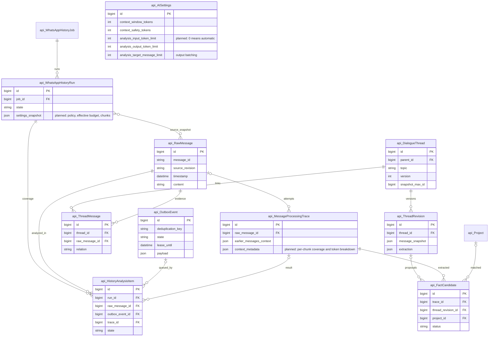
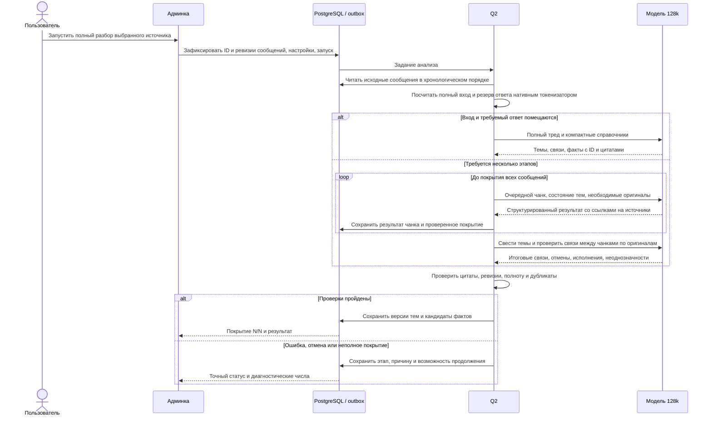

# Полный анализ треда WhatsApp в доступном окне модели

- Задача: thread-full-context; прямой запрос пользователя.
- Ветка: feature/thread-full-context; база main b4f872c после git pull origin main.
- Создано: 08.10.2026 05:11:59 MSK (UTC+3).
- Статус: согласовано пользователем 08.10.2026 сообщением «делай»; реализация разрешена.
- Область: разбор сохранённой истории WhatsApp и тематических тредов, извлечение фактов и отображение прогресса в существующей админке.

Существующие связи проверены по актуальным models.py и миграциям. Новые таблицы пока не планируются; изменяется семантика лимита AISettings и версионированных JSON-снимков запуска/попытки.

## Подтверждённая проблема

На production окно Gemma — 131 072 токена, но analysis_input_token_limit установлен в 8 192. Для сообщения #1145 сам текст занимает 1 621 токен; восстановленный обязательный вход сейчас занимает 8 901 токен без дополнительной истории. В него входят инструкции, 100 проектов и 20 тем. Запрос отклоняется до обращения к модели. Число 8 901 относится к текущей реконструкции: оригинальный отклонённый payload не сохранён.

history-packets-v1 дополнительно выбирает до 24 соседних и 24 найденных по словам сообщений, плюс связи из ограниченного набора тем. Существующий fallback сегментирует отдельное длинное сообщение, а не обеспечивает полный проход треда. Поэтому увеличение одной настройки не гарантирует полноценный разбор.

## Требования и план реализации

1. Автоматический входной бюджет: окно модели минус фактический резерв ответа и safety. analysis_input_token_limit=0 означает этот режим и становится значением по умолчанию; положительное значение — явно отображаемый пользовательский предел. Обновить валидацию и миграцию настройки. Бюджет фиксируется в снимке нового запуска; старые попытки сохраняют свою исходную конфигурацию.
2. Полный проход использует все доступные оригиналы выбранного источника/треда до фиксированного snapshot, включая более поздние ответы, актуальные ревизии и авторство. Размер справочников не должен вытеснять историю; передавать компактные релевантные сведения, сохранять возможность проверки идентичности объекта.
3. Если полный вход помещается, передавать историю целиком. Размер целевых пакетов определять также по выходному бюджету: большое число классификаций может требовать нескольких ответов даже при помещающемся входе. Ограничение целевых сообщений не является ограничением прочитанной истории.
4. Если история превышает доступное окно, последовательно покрывать её чанками по реальным токенам. Границы преимущественно между сообщениями; цитаты ответов, незавершённые обещания и нужные оригиналы переносить между этапами. Очень длинное отдельное сообщение допускает сегменты с сохранением диапазонов и перекрытий.
5. Каждый API-вызов получает собственный полный вход: сервер явно передаёт состояние и источники предыдущих этапов. Нельзя рассчитывать на скрытую постоянную память модели. Состояние включает ID, даты, участников, темы, обещания и их изменения, исполнения, противоречия и точные ссылки на цитаты.
6. Итоговый проход проверяет межчанковые связи и объединяет результаты по стабильным идентификаторам. При превышении бюджета итогового прохода использовать несколько уровней сведения. Сводка служит указателем к оригиналам; факт подтверждается проверенной цитатой исходного сообщения.
7. Переполнение ответа уменьшает целевой пакет, сохраняя прочитанную историю. Ошибка схемы не должна автоматически уменьшать весь вход до 8k/4k и терять связи. Отдельно учитывать лимиты запросов и бюджета, давать возможность продолжения без повторения успешных чанков.
8. Сохранять покрытие каждого сообщения, IDs/ревизии источников, payload hash, token breakdown, этап сведения, ошибки и курсор. При перезапуске Q2 продолжать с сохранённого состояния. Состояние «полный анализ завершён» допустимо только при N/N и успешной итоговой проверке; пустые сообщения и исключённые ревизии учитываются отдельно.
9. В существующей админке показывать «прочитано N из M», чанки, текущий этап, вход X из Y токенов и разбивку по истории/инструкциям/справочникам. Ошибка должна различать пользовательский лимит, настоящее окно модели и выходной бюджет. Не использовать общую фразу про окно 128k для превышения предела 8k.
10. Использовать существующие полномочия, immutable snapshots, защиту повторной доставки и review фактов. Повторный разбор production запускается отдельным ограниченным действием для выбранного источника; уже доставленные записи проходят существующие guards.

## Критерии готовности

- В Docker E2E на kk-minsk тред со входом больше 8 192 токенов и меньше доступного окна анализируется с исходной историей; короткая цель со справочниками не получает ложное сообщение про переполнение 128k.
- Источник больше доступного окна полностью покрывается несколькими чанками. Просьба и обещание, перенос срока, отмена и исполнение по разные стороны границ сохраняют правильные связи и доказательства.
- «Сделаешь завтра?» без обещания не становится самостоятельным обязательством; неоднозначная привязка объекта остаётся явной.
- Повтор запуска, отмена и перезапуск воркера сохраняют прогресс и не дублируют факты/доставку. Неполный разбор показывает точную причину и покрытие.
- E2E проходит через браузер, настоящий API, PostgreSQL, outbox и Q2 с локальным HTTP-провайдером. Проверка native-провайдера проводится отдельно и не подменяется результатом детерминированного E2E.
- Docker frontend TypeScript/Vite build, Django check, makemigrations --check и логи чисты; миграция применяется и повторный check сообщает No changes detected. PR в main, затем согласованный rollout через mazory-remote.

## Реализованный процесс и проверка 08.10.2026

- Новые попытки используют thread-context-v2. Настройки модели, токенизатора, окна и резервов фиксируются в попытке и запуске; смена профиля требует нового запуска. Миграция 0047 задаёт автоматический вход 0 по умолчанию. При rollout существующий активный профиль переводится с 8192 на 0 отдельным аудируемым изменением; старые попытки сохраняются.
- Полный источник читается в хронологическом порядке до snapshot_max_id. Хеш включает текст, ревизию, авторство и время. Перед продвижением курсора и публикацией источники перепроверяются. Длинные оригиналы читаются непрерывными диапазонами без пропуска остатка.
- Состояние хранится в outbox и trace: проверенные цитаты, темы, факты, диапазоны, курсор и успешно завершённые этапы. Большое состояние делится на страницы по темам и обещаниям с сохранением родительских тем; каждая страница получает те же новые оригиналы. Итоги страниц сводятся по идентичности темы и исходного обещания. Резерв страницы ограничивает также размер генерации.
- Каждая часть проходит проверку точных цитат в прочитанном диапазоне. Пересказ в redundant evidence привязывается только к собственной проверенной цитате обещания модели. Поздний подтверждённый перенос срока заменяет ранний. Роли связей согласуются с проверенными evidence_messages. До N/N и завершающей сверки кандидаты фактов не публикуются.
- Ошибка схемы не уменьшает вход. Повтор ограничен и привязан к конкретному этапу, чтобы ошибки разных чанков не использовали старую попытку. Переполнение ответа сначала уменьшает пакет целей; для одной цели увеличивает резерв в пределах настроенного max_completion_tokens. Сохранённое покрытие остаётся при разделении пакета, перезапуске Q2 и отмене.
- Админка показывает проверенное покрытие, этап, страницы сведения, фактический вход и эффективный бюджет. Разбивка показывает добавленный вход истории и совместный фиксированный вклад инструкций, цели, справочников и состояния; эти части не объявляются независимо измеренными токенами.
- Локальный Docker E2E использует настоящий браузер, Django, PostgreSQL, outbox и Q2. Проверены полный вход свыше 8192, разбор 53 оригиналов по частям, поздние переносы/исполнения/отмена, отмена запуска без публикации, физический перезапуск Q2 после сохранённого этапа и многостраничное сведение 83 оригиналов с параллельными обещаниями. Дополнительно проверяются ошибки схемы на разных этапах, обрезанный ответ и повтор POST без дубликата факта.
- Отдельный операционный запрос к настоящей Gemma принял 20530 токенов: preflight равен фактическому prompt_eval_count. Получены точные ссылки на обещание, перенос и исполнение. Это синтетическая проверка провайдера без записи бизнес-фактов; она не является переанализом production-истории. Ранние пробы выявили ошибки статуса/цитат и использованы для усиления валидации и запроса исправления.
- Массовый переанализ прежних ошибок и доставленных записей в этот rollout не входит. Существующие исторические ошибки остаются видимыми; новый полный запуск выбирается отдельно в админке.

Проверка перед PR: полный прогон 23/23 E2E на kk-minsk (2,6 минуты), дополнительный прогон чанков с двумя ошибками схемы на разных этапах прошёл (7,1 секунды). TypeScript/Vite собраны в Docker, Django check чист, makemigrations --check сообщает No changes detected. Миграция 0047 применена к контейнерной БД; физический перезапуск Q2 выполнен скриптом. Логи подтверждают реальные задания outbox/Q2. Production rollout и повторная проверка native-пути остаются последующим этапом.
