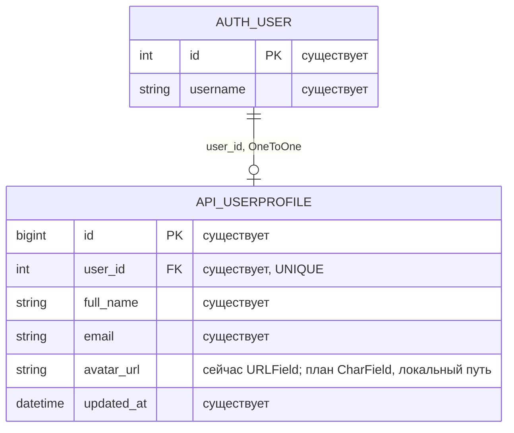

# Аватар пользователя в личном кабинете

- Задача: `profile-avatar`, прямой запрос пользователя.
- Ветка: `feature/profile-avatar`.
- Создано: 2026-10-08 05:50:06 MSK (UTC+3).
- Статус: подтверждена пользователем («делай») 2026-10-08; реализована и проверена на kk-minsk.
- Основание: в разделе «Профиль и контакты» должна быть возможность добавить аватарку.



Связь и данные профилей сохраняются. Планируется миграция только типа Django-поля
`avatar_url` из `URLField` в `CharField` с прежними длиной, пустым значением и
значением по умолчанию: поле хранит относительный путь, а не внешний URL.
Добавлять таблицы или отдельную модель изображений не требуется.

```mermaid
sequenceDiagram
    actor User as Пользователь
    participant UI as Личный кабинет Vue
    participant API as Django ProfileView
    participant DB as PostgreSQL
    participant Files as Том avatar_media
    participant Nginx as Nginx
    User->>UI: Выбрать фото
    UI->>UI: Проверка формата и размера, предпросмотр
    User->>UI: Сохранить изменения
    UI->>API: PUT /api/profile/ (multipart, JWT)
    API->>API: Проверка полей и содержимого изображения
    alt Данные неверны или доступ отсутствует
        API-->>UI: 400 / 401; профиль не изменён
        UI-->>User: Понятная ошибка; выбор можно исправить
    else Данные корректны
        API->>Files: Записать нормализованный WebP с уникальным именем
        API->>DB: Атомарно сохранить поля своего профиля и avatar_url
        alt Ошибка сохранения
            API->>Files: Удалить новый несвязанный файл
            API-->>UI: Ошибка; прежний аватар сохранён
        else Успех
            API->>Files: После commit удалить заменённый файл
            API-->>UI: 200, актуальный профиль
            UI->>Nginx: GET /avatars/unique.webp
            Nginx->>Files: Прочитать только публичный аватар
            Nginx-->>UI: Изображение
            UI-->>User: Фото в карточке и шапке, изменения сохранены
        end
    end
    User->>UI: Удалить фото и сохранить
    UI->>API: PUT /api/profile/ (remove_avatar=true, JWT)
    API->>DB: Очистить avatar_url только своего профиля
    API->>Files: После commit удалить прежний файл
    API-->>UI: Профиль без аватара
    UI-->>User: Заглушка с инициалами
```

## Постановка и текущее состояние

В личном кабинете нет поля выбора изображения. `UserProfile.avatar_url` уже
возвращается API и используется карточкой профиля, шапкой и KPI-представлением.
При пустом значении карточка профиля не показывает заглушку: остаётся только
индикатор статуса. Backend принимает строку `avatar_url`, но не загружает файл;
локальные пути не соответствуют стандартной валидации `URLField`.
Nginx не раздаёт `/avatars/`, а существующие медиа являются приватными.

## Требования

1. В «Профиль и контакты» добавить блок «Фото профиля» с предпросмотром,
   кнопкой «Добавить фото» / «Изменить фото», выбором файла и удалением.
   До сохранения показывать выбранное фото в редакторе; в карточке и шапке
   показывать только сохранённое состояние.
2. Поддерживать JPEG, PNG и WebP до 5 МиБ и до 20 миллионов пикселей.
   Показать эти ограничения рядом с выбором файла. Отклонять SVG, GIF,
   повреждённые файлы, неверный формат и превышение лимитов понятным сообщением.
   Backend проверяет декодированное содержимое, а не только расширение или MIME.
3. Сохранение ФИО, email и выбранного аватара выполняется кнопкой
   «Сохранить изменения» одним запросом. Отмена выбора файла не меняет профиль.
   До сохранения пользователь может отменить выбор или удаление.
   При ошибке данные формы и выбранный файл сохраняются для повторной попытки.
4. Загруженное изображение учитывать с EXIF-ориентацией, обрезать по центру
   до квадрата и уменьшать максимум до 512 × 512. Сохранять один статичный WebP
   без исходных метаданных с уникальным именем, которое генерирует сервер.
5. При отсутствии аватара показывать полноценную заглушку с инициалами в карточке
   и шапке. Управление доступно с клавиатуры; у поля, кнопок, изображения,
   ошибки и результата сохранения есть понятные подписи.
6. После сохранения обновлять общий профиль: фото отображается в карточке,
   шапке и существующих местах, использующих `avatar_url`; переживает
   перезагрузку страницы и пересоздание контейнеров.
7. Изменять можно только профиль авторизованного пользователя.
   `avatar_url` становится полем только для чтения в API: клиент не задаёт путь,
   внешнюю ссылку или профиль другого человека.
8. Использовать отдельный постоянный Docker volume `avatar_media`.
   Nginx получает доступ только к этому тому в режиме чтения и раздаёт
   нормализованные файлы через `/avatars/` как публичные статические изображения.
   Приватные вложения и TXT-экспорты остаются закрыты.
   Уникальный путь меняется при замене; удалённый файл возвращает 404.
9. При замене или удалении очищать только прежний серверный файл данного профиля
   после успешной транзакции; при ошибке БД удалять новый несвязанный файл.
   Параллельные изменения одного профиля сериализовать блокировкой строки.
10. Все изменения и проверки приложения выполняются в Docker. Для изолированного
    стенда использовать только `kk-minsk`; рабочие аккаунты и данные не использовать.

## Планируемые изменения

- `backend/api/models.py` и одна миграция: корректный тип поля локального пути
  без изменения существующих значений.
- `backend/api/profile_views.py` и небольшой модуль обработки изображений:
  поддержка JSON и multipart в существующих PUT/PATCH `/api/profile/`,
  write-only поля `avatar` и `remove_avatar`, валидация, транзакция и
  управление файлами. Одновременное указание файла и удаления отклонять.
  Обычные JSON-обновления остальных настроек профиля продолжат работать.
- Конфигурация backend и зависимости: путь хранения аватаров и Pillow
  с зафиксированной версией; обновить lockfile и requirements через Docker.
  Обработка небольшого локального изображения не требует внешнего вызова
  или задачи Q2.
  В `backend/api/security.py` разрешить multipart профиля до 5 МиБ
  плюс ограниченный запас на поля формы; общий лимит остальных запросов сохранить.
- `frontend/src/types/`, `useProfile.ts` и `ProfileGeneralTab.vue`:
  типизированные данные редактирования, FormData при изменении аватара,
  предпросмотр, отмена выбора, удаление, состояния загрузки и ошибки.
  Не сбрасывать введённые поля поздним ответом первоначальной загрузки профиля.
  Предпросмотр использовать как data URL, совместимый с действующей CSP.
- `UserProfileView.vue` и `AppHeader.vue`: заглушка с инициалами и
  отображение сохранённого фото.
- `backend/Dockerfile`, `docker-compose.yml`, `compose.e2e.yml` и
  конфигурация Nginx: отдельный общий том аватаров с правами записи backend
  и чтения nginx; корректный content type, 404 и запрет просмотра каталога.
  Сохранить закрытые маршруты приватных медиа.
- Добавить только браузерный E2E в существующий изолированный Docker-стенд
  с настоящим API, PostgreSQL и действующими Q2/outbox и локальным провайдером.
  Использовать отдельные тестовые сессии и изображения; в существующем
  `ops/run_local_e2e.sh` после основного прогона пересоздать backend/nginx
  и проверить сохранённое фото дополнительным браузерным сценарием.

## Проверки и критерии готовности

- В браузере пользователь без фото видит заглушку, выбирает PNG/JPEG/WebP,
  получает предпросмотр, сохраняет и видит фото в карточке и шапке.
- После перезагрузки страницы фото сохраняется; замена меняет URL и изображение.
  После пересоздания backend/nginx с тем же томом файл доступен.
- Удаление с последующим сохранением возвращает заглушку; отмена выбора или
  удаления оставляет сохранённое состояние.
- Неверный формат, повреждённое изображение и превышение размера отклоняются
  UI/API; прежний профиль и изображение сохраняются. Проверить ограничения
  серверной валидации, запрос без JWT и запрет записи `avatar_url`.
- Убедиться через настоящий API и чтение БД в контейнере, что фото связано
  с текущим профилем; публичный маршрут отдаёт WebP, прежний удалённый URL — 404,
  приватные медиа недоступны. Проверить очистку заменённых файлов.
- Применить миграции в изолированном стенде; `manage.py check` проходит,
  `manage.py makemigrations --check` завершается кодом 0 и `No changes detected`.
- `docker compose build nginx` проходит с проверкой TypeScript и сборкой Vite.
- Запустить браузерный E2E на `kk-minsk`, просмотреть логи backend, qcluster
  и локального провайдера WAHA/outbox. Unit/component/integration/mock-тесты
  не создавать.
- Перед коммитом проверить diff. Создать PR только в `main`, приложить перечень
  выполненных проверок; объединить после прохождения CI и обязательного review.

## Выполненная проверка

- Изолированный Compose-проект `mazory-avatar-e2e` на `kk-minsk`:
  24 основных браузерных E2E прошли; отдельный сценарий сохранности аватара
  после реального пересоздания backend/nginx также прошёл (1 E2E).
- Проверены JPEG/PNG/WebP, файл больше 1 МиБ, предпросмотр, отмена, ошибки,
  замена, удаление, перезагрузка страницы, запрет записи чужого ID и пути.
  Фото видно в карточке и шапке, включая свежую загрузку страницы.
- Прямое чтение БД и тома подтвердило связь со своим профилем, неизменность
  другого профиля и отсутствие заменённых файлов. Остался ровно один текущий
  аватар. Нормализованный файл — WebP 512 × 512 без EXIF/ICC/XMP.
- Миграция `0048_userprofile_avatar_path` создана Django внутри Docker и применена.
  `manage.py check` — без ошибок; `makemigrations --check` — `No changes detected`.
- Сборка nginx и браузерного образа с `vue-tsc -b` / Vite, `nginx -t`,
  конфигурации Compose, `bash -n` и проверка diff прошли.
- Production settings check внутри отдельного Docker-контейнера — без ошибок.
  Проверки gitleaks и pip-audit — без утечек и известных уязвимостей.
- Логи backend, Q2, outbox и локального провайдера просмотрены.
  Снимки интерфейса на desktop и mobile проверены визуально.
