# Временная модель данных и SQL-витрины аналитики Mazory

- Задача: `temporal-analytics-marts`, прямое поручение пользователя, без GitHub Issue.
- Ветка: `feature/temporal-analytics-marts` от синхронизированного `main` (`edf707a`).
- Создано: 2026-10-08 15:19:52 MSK (UTC+3).
- Статус: подтверждено пользователем 2026-10-08; реализация и локальные проверки завершены, ожидаются GitHub checks/review и production deployment.
- Область: все 65 собственных моделей приложения `api` для технических дат; бизнес-сущности, источники, история изменений, PostgreSQL-витрины, аналитический MCP, чат, KPI и Docker E2E для аналитического поведения.

## ERD: текущее состояние и планируемые изменения

Диаграмма показывает основные затронутые таблицы. `existing` — существующее поле, `new` — планируемое. Все существующие модели `api` имеют целочисленный PK. Отдельной локальной таблицы сделок сейчас нет: сделка представлена `Project` и связанным `CrmProjectSnapshot`. Добавление timestamps распространяется также на модели, не помещённые в эту диаграмму.

```mermaid
erDiagram
    Team ||--o{ Project : owns
    Company o|--o{ Project : counterparty
    Project ||--o| CrmProjectSnapshot : current_crm
    Project o|--o{ Commitment : obligations
    Project ||--o{ FinancialRecord : payments
    Project ||--o{ PaymentScheduleItem : schedule
    FinancialRecord ||--o{ PaymentAllocation : allocates
    PaymentScheduleItem ||--o{ PaymentAllocation : receives
    Team o|--o{ SalesTarget : targets
    UserProfile ||--o{ SalesTarget : responsible
    Project ||--o{ ProjectRevision : approved_versions
    ProjectRevision ||--o| StageTransition : accepted_stage_change
    RawMessage o|--o{ Commitment : evidence
    WhatsAppHistoryRun ||--o{ WhatsAppHistoryRunMessage : retained_links
    RawMessage ||--o{ WhatsAppHistoryRunMessage : imported_messages
    FactCandidate o|--o| Commitment : accepted
    FactCandidate o|--o| FinancialRecord : accepted
    Team ||--o{ FactEvent : accepted_facts
    Project o|--o{ FactEvent : evidence
    Project o|--o{ TemporalEntityRevision : history_new
    Team o|--o{ TemporalEntityRevision : scope_new
    RawMessage o|--o{ TemporalEntityRevision : source_new
    FactEvent o|--o{ TemporalEntityRevision : fact_new
    AnalyticsConversation ||--o{ AnalyticsTurn : dialogue
    AnalyticsTurn ||--o{ AnalyticsArtifact : results

    Team {
        bigint id PK
        datetime created_at "new"
        datetime updated_at "new"
        date history_complete_from "existing"
    }
    Company {
        bigint id PK
        datetime created_at "existing"
        datetime updated_at "new"
    }
    Project {
        bigint id PK
        bigint team_id FK
        bigint company_id FK
        bigint manager_id FK
        string bitrix_id "existing external string ID"
        int version "existing"
        datetime created_at "existing local insertion"
        datetime updated_at "existing local change"
        datetime source_created_at "new nullable business origin"
        datetime source_updated_at "new nullable source change"
        string source_time_precision "new"
    }
    CrmProjectSnapshot {
        bigint id PK
        bigint project_id FK "existing unique"
        string external_stage_id "existing"
        datetime synced_at "existing observation"
        datetime created_at "new local insertion"
        datetime updated_at "new local change"
        datetime source_created_at "new DATE_CREATE"
        datetime source_updated_at "new DATE_MODIFY"
        datetime source_stage_changed_at "new MOVED_TIME"
        date source_begin_date "new BEGINDATE"
        date source_close_date "new CLOSEDATE"
        boolean source_closed "new CLOSED"
    }
    Commitment {
        bigint id PK
        bigint project_id FK
        bigint source_message_id FK
        bigint candidate_id FK
        int version "existing"
        datetime created_at "new local insertion"
        datetime updated_at "new local change"
        datetime promised_at "existing semantics to repair"
        datetime deadline_at "existing"
        date deadline "existing"
        datetime fulfilled_at "existing"
    }
    FinancialRecord {
        bigint id PK
        bigint project_id FK
        bigint candidate_id FK
        datetime created_at "existing"
        datetime updated_at "new"
        date payment_date "existing business event"
        decimal amount "existing signed money"
    }
    PaymentScheduleItem {
        bigint id PK
        bigint project_id FK
        bigint fact_event_id FK
        date due_date "existing"
        datetime created_at "new"
        datetime updated_at "new"
    }
    PaymentAllocation {
        bigint id PK
        bigint financial_record_id FK
        bigint schedule_item_id FK
        decimal amount "existing"
        datetime created_at "new"
        datetime updated_at "new"
    }
    SalesTarget {
        bigint id PK
        bigint team_id FK
        bigint profile_id FK
        date month "existing business month"
        int version "existing"
        datetime approved_at "existing"
        datetime created_at "new"
        datetime updated_at "new"
    }
    UserProfile {
        bigint id PK
        datetime created_at "new"
        datetime updated_at "existing"
    }
    RawMessage {
        bigint id PK
        datetime timestamp "existing source time"
        datetime received_at "existing ingestion time"
        datetime created_at "existing"
        datetime updated_at "new"
    }
    FactCandidate {
        bigint id PK
        datetime created_at "existing"
        datetime updated_at "new"
        datetime reviewed_at "existing"
    }
    ProjectRevision {
        bigint id PK
        bigint project_id FK
        int version "existing unique per project"
        datetime approved_at "existing"
        json snapshot "existing"
        datetime created_at "new"
        datetime updated_at "new"
    }
    StageTransition {
        bigint id PK
        bigint project_id FK
        bigint project_revision_id FK "existing unique"
        datetime effective_at "existing approval time unless proven otherwise"
        datetime created_at "new"
        datetime updated_at "new"
    }
    FactEvent {
        bigint id PK
        bigint team_id FK
        bigint project_id FK
        datetime occurred_at "existing business evidence nullable"
        datetime created_at "existing recording time"
        datetime updated_at "new"
    }
    WhatsAppHistoryRunMessage {
        bigint id PK "existing implicit table PK preserved"
        bigint whatsapphistoryrun_id FK "existing"
        bigint rawmessage_id FK "existing"
        datetime created_at "new nullable"
        datetime updated_at "new nullable"
    }
    TemporalEntityRevision {
        bigint id PK "new table"
        string entity_type "new registered entity kind"
        bigint entity_id "new local integer ID"
        bigint team_id FK "new nullable scope"
        bigint project_id FK "new nullable context"
        bigint raw_message_id FK "new nullable provenance"
        bigint fact_event_id FK "new nullable provenance"
        bigint actor_id FK "new nullable auth_user"
        int revision "new unique with entity_type and entity_id"
        datetime effective_at "new nullable source event time"
        datetime recorded_at "new observation time"
        string event_kind "new"
        string time_precision "new exact date observed unknown"
        string source_key "new unique idempotency key"
        json changes "new allowed fields only"
        json snapshot "new allowed fields only"
        datetime created_at "new"
        datetime updated_at "new immutable row normally equal creation"
    }
    AnalyticsConversation {
        bigint id PK
        json default_scope "existing"
        datetime last_activity_at "new durable dialogue activity"
        datetime created_at "existing"
        datetime updated_at "existing"
    }
    AnalyticsTurn {
        bigint id PK
        bigint conversation_id FK
        json resolved_intent "existing extended normalized contract"
        datetime created_at "existing"
        datetime updated_at "new"
    }
    AnalyticsArtifact {
        bigint id PK
        bigint turn_id FK
        json query_plan "existing extended catalog version"
        json presentation "existing"
        datetime generated_at "existing"
        datetime created_at "new"
        datetime updated_at "new"
    }
```



`TemporalEntityRevision.entity_type/entity_id` — типизированный адрес зарегистрированной сущности, а не универсальный SQL join. Реестр допускает только заданные собственные модели с `id: int`. Целостность адреса проверяется при атомарной записи; FK `project/team` задают контекст доступа, а не заменяют адрес целевой сущности. Существующие бизнес-сущности сохраняют историю при архивировании; удаление связанного контекста защищается `PROTECT`. При физическом удалении допустимой сущности сохраняется tombstone с разрешёнными атрибутами и датой наблюдения.

## Последовательность записи и аналитического запроса

```mermaid
sequenceDiagram
    participant Source as CRM / WhatsApp / ручная операция
    participant Worker as Q2 и сервис бизнес-изменений
    participant DB as PostgreSQL таблицы и триггеры
    participant Views as analytics SQL views
    participant Chat as API диалога и outbox
    participant Model as Модель и каталог MCP
    participant Compiler as Проверка намерения и SQL-компилятор
    participant UI as Vue график / таблица
    Source->>Worker: Исходные данные и исходные даты
    Worker->>DB: Транзакция: сохранить сущность и происхождение
    DB->>DB: Технические timestamps; журнал значимых изменений
    Note over DB: Rollback отменяет и сущность, и историю
    DB-->>Views: Новое состояние видно сразу после commit
    UI->>Chat: Вопрос, выбранные условия и предыдущий результат
    Chat->>Worker: Outbox и async_task; HTTP возвращает operation_id
    Worker->>Model: Исходный вопрос, компактный каталог, defaults
    Model->>Compiler: Нормализованное намерение и подходящие витрины
    Compiler->>Compiler: Проверить сущность, показатель, даты, grain и явные условия
    alt Возможность действительно не поддерживается или дата неоднозначна
        Compiler-->>UI: Конкретное ограничение / необходимое уточнение
    else План соответствует вопросу
        Compiler->>DB: Readonly-транзакция; текущие ACL до агрегации
        DB->>Views: Параметризованные SELECT; фильтры и агрегации SQL
        Views-->>Compiler: Dataset, календарь, качество дат, источники
        Compiler->>Compiler: Совместимые joins; Decimal и cardinality checks
        Compiler-->>Model: Dataset ID и проверенные факты
        Model->>Compiler: build_presentation с зарегистрированными колонками
        Compiler->>Compiler: Сверить результат с намерением и фактическими условиями
        alt Подмена сущности или периода
            Compiler-->>Model: Ограниченная коррекция с точным расхождением
            Note over Compiler: При повторном расхождении успех не публикуется
        else Результат соответствует запросу
            Compiler-->>Chat: Сохранить контракт, трассу, график и coverage
            Chat-->>UI: График / честное пустое состояние / неизвестные интервалы
        end
    end
```

## Постановка и подтверждённое текущее состояние

Пользователь ожидает построение разных витрин по проектам, сделкам, обязательствам, платежам и другим сущностям с произвольным выбором даты, периода, группировки и показателей. Требуется системное развитие проекта, а не исправление одной фразы или одного графика.

Проверка production 2026-10-08 выполнена read-only:

- PostgreSQL 16.15; в схемах `public` и `analytics` нет обычных или материализованных представлений.
- `DataMartService` и инструменты `api.analytics` собирают данные программно; имя сервиса не означает наличие SQL-витрин.
- Из 65 моделей `api` только `Project`, `WhatsAppHistoryRun` и `AnalyticsConversation` имеют одновременно `created_at` и `updated_at`; у 62 моделей хотя бы одно поле отсутствует.
- `Project` имеет обе технические даты, но аналитический каталог не предоставляет их как оси. `projects` и `crm_projects` запрещают `date_range`.
- `Commitment` не имеет технических timestamps; `promised_at=auto_now_add` сейчас фиксирует вставку в Mazory. `FinancialRecord` имеет только `created_at`.
- `CrmProjectSnapshot` хранит только `synced_at`. Синхронизация каталога сейчас не запрашивает `DATE_CREATE`, `DATE_MODIFY`, `MOVED_TIME`, `BEGINDATE`, `CLOSEDATE`, `CLOSED`.
- Уже существуют `ProjectRevision`, `StageTransition`, `FactEvent`, `FieldAssertion`, `AuditEvent` и исходные сообщения. Это частичная история, которую нужно сохранить и использовать, а не объявлять полностью отсутствующей.
- Исходный запрос пользователя сохранён как conversation 12, turn 29, operation 77, artifact 8. Вместо проектов за весь 2026 год выполнены `payments/payment_count/payment_month` за 2026-10-01 — 2026-11-01; `rows=[]`, операция `succeeded`. Модель `gemma4:e4b` завершила четыре вызова без транспортной ошибки. Для пользователя при проверке доступны 641 проект, что не устанавливает их распределение по датам.

## Требования к техническим датам всех моделей

1. У каждой собственной конкретной модели `api`, включая связующие таблицы, конфигурации, очереди, журналы и аналитические артефакты, должны быть `created_at` и `updated_at`. На встроенные таблицы Django/auth/sessions правило этой задачи не распространяется. Для новых моделей использовать общий абстрактный timestamp-контракт.
2. `created_at` означает первоначальную вставку записи в Mazory; `updated_at` — последнее реальное изменение её сохранённых полей. Обе даты timezone-aware, хранятся как `timestamptz` в UTC и отображаются в выбранной часовой зоне.
3. Существующие достоверные даты сохранить. Не переименовывать технический `created_at` в дату появления бизнеса и не переписывать его датой из CRM.
4. Поддержать `save(update_fields=...)`, `QuerySet.update`, `bulk_create/bulk_update`, admin, фоновые задачи, upsert и SQL-запись. Одних Django `auto_now`/signals недостаточно. Timestamp-триггеры PostgreSQL устанавливают даты при вставке, сохраняют исходный `created_at` и обновляют `updated_at` при изменении данных. Запись идентичных значений не должна искусственно сдвигать `updated_at`.
5. Общий timestamp-триггер не копирует содержимое строки в журнал. Ключи, токены, зашифрованные credentials, session payload, OTP и приватные тексты не поступают в аналитические витрины и события.
6. Для старых строк отсутствующие timestamps заполняются только из доказанной технической истории вставки/последнего изменения. Недоказанная дата остаётся `NULL`, с явной статистикой неизвестных дат. Дата выполнения миграции не становится датой создания старого бизнеса или старой строки. Для новых вставок триггер обеспечивает обе даты.
7. Имеющиеся `auto_now`/`auto_now_add` и новые поля привести к согласованному контракту так, чтобы `makemigrations --check` был чистым. Старые nullable даты отражаются в API как `string | null`; ID остаются `number`.
8. Для неизменяемых журнальных строк обе технические даты присутствуют, но само наличие `updated_at` не разрешает редактирование утверждённого факта. Коррекции финансовых фактов остаются отдельными событиями/реверсами.

## Исходные даты и бизнес-семантика

| Сущность | Оси времени и их смысл |
|---|---|
| Проект | `created_at`, `updated_at` — запись Mazory; `source_created_at`, `source_updated_at` — доказанное создание/изменение в исходной системе; принятые события и версии — полная известная история |
| Сделка CRM | `DATE_CREATE` / `DATE_MODIFY` → отдельные исходные datetime; `MOVED_TIME` — время последнего известного перехода; `BEGINDATE` / `CLOSEDATE` — отдельные даты начала/планового окончания; `CLOSED` не превращает плановое окончание автоматически в подтверждённую дату выигрыша |
| Обязательство | Технические timestamps; `promised_at` из подтверждённого исходного сообщения; исходный/текущий дедлайн; исполнение; отмена/перенос из истории |
| Платёж | Создание/изменение записи и `payment_date`; неизвестная исходная дата не заменяется импортом; отрицательные корректировки и их происхождение сохраняются |
| График оплат | Создание/изменение строки, `due_date`, история утверждения/коррекции; остаток с учётом распределённых платежей |
| План | Создание/изменение/утверждение и business-month; недельное распределение месячного плана требует явного метода |
| Компания, участники и связи | Технические даты доступны; исходные бизнес-даты только при наличии доказанного источника |
| Сообщение | `timestamp` — известное время отправки; `received_at` — доставка; timestamps — локальная запись; сохранённые версии/aliases не считаются независимыми сообщениями |
| Факт/предложение | Создание записи, проверка/решение, `FactEvent.occurred_at` и время регистрации; принятый факт и предложение не смешиваются |

Исходные поля сделки сверены с официальным контрактом [полей CRM Bitrix24](https://apidocs.bitrix24.com/api-reference/crm/main-entities-fields.html) и [crm.deal.list](https://apidocs.bitrix24.com/api-reference/crm/deals/crm-deal-list.html). Даты источника запрашиваются вместе с текущим каталогом, а не выводятся из времени синхронизации.

Для «новые проекты / пришло проектов» по умолчанию используется доказанное создание сущности в источнике, а не импорт в Mazory. Для «созданы в Mazory», `created_at` и `updated_at` — явно технические оси. Если несколько разных источников утверждают противоречащие даты, система сохраняет происхождение и объясняет неоднозначность. Повторное упоминание старого проекта в переписке не означает новый проект.

`promised_at` исправляется с сохранением технической даты вставки: новые обязательства берут время доказательства постановки, старые восстанавливаются из подтверждённых источников. Когда доказательства не позволяют установить дату, бизнес-время остаётся неизвестным. Нет автоматического выбора наиболее раннего любого сообщения в качестве даты создания проекта.

Источник каждой бизнес-даты имеет `source`, `precision/state` (`exact`, `date`, `observed`, `unknown`) и доступный пользователю reference. Отдельно сохраняются наблюдение `synced_at/recorded_at` и время события `effective_at`; один timestamp не подменяет другой.

## История изменений

- Добавить `TemporalEntityRevision` для версий основных бизнес-сущностей: компании, проекта, CRM-снимка, обязательства, платежа, графика оплат, распределения и плана. Набор расширяется через явный типизированный реестр, а не по произвольному имени таблицы от модели.
- Сущность, технические timestamps и журнал обновляются в одной транзакции. Значимые изменения из массовых обновлений тоже фиксируются; использовать DB-trigger для whitelisted domain полей и согласованный транзакционный контекст actor/source. Нет журнала каждого heartbeat очереди или каждой проверки lease.
- Записывать create, change, archive/restore, stage_change, postpone, fulfill/cancel, correction и delete/tombstone, если соответствующее событие действительно произошло. Повторный импорт неизменного снимка не создаёт новое бизнес-событие.
- Уникальные `source_key` и `(entity_type, entity_id, revision)` защищают повтор Q2/CRM-пагинации от дублей. Конкурирующие версии сериализуются; порядок наблюдения определяется `recorded_at` и revision, порядок доказанных событий — `effective_at`.
- Использовать имеющиеся принятые версии/факты/аудит и новые наблюдения CRM. Историю до начала наблюдения восстанавливать только по доказательствам. Первый снимок CRM — baseline; он не подтверждает все прежние стадии и не означает переход из пустой стадии.
- `MOVED_TIME` позволяет сохранить последний известный переход, но не полную цепочку пропущенных стадий. Показывать этот предел покрытия явно.
- Запрос по `updated_at` считает сущности по последнему изменению; запрос «сколько изменений/переносов произошло» считает события. Это разные зарегистрированные показатели.
- Исторические counts не теряют архивированные/проигранные сущности только потому, что текущий рабочий список их скрывает. Текущие права применяются и к историческим строкам; старые имена/ответственные берутся из версии, текущие — только для явно текущего разреза.

## SQL-витрины в PostgreSQL

Создать через обратимые Django migrations отдельную схему `analytics`. Минимальный обязательный каталог — следующие 20 настоящих SQL views. У каждой витрины зафиксированы grain, ключи доступа, временные оси, measures, provenance и правила полноты. SQL выполняет фильтрацию и агрегацию; выгрузка всех строк в Python и дальнейший подсчёт не является реализацией этих витрин.

| SQL view | Grain / назначение |
|---|---|
| `analytics.projects` | Один канонический проект; даты записи/источника, контрагент, ответственный, статус, известные договорные суммы |
| `analytics.crm_deals` | Один текущий CRM-снимок на проект; исходные даты, стадия, CRM-ответственный, opportunity, currency |
| `analytics.companies` | Одна компания; technical dates; показатели проектов только после отдельной агрегации |
| `analytics.commitments` | Одно подтверждённое обязательство; создание/постановка, дедлайны, исполнение, состояние и SLA |
| `analytics.payments` | Одна подтверждённая финансовая запись; бизнес-дата, technical dates, signed amount, currency, credited manager |
| `analytics.payment_schedule` | Один подтверждённый пункт графика; срок, сумма и остаток с предварительной агрегацией allocations |
| `analytics.sales_targets` | Один активный утверждённый план на team/profile/month/currency; version и даты |
| `analytics.messages` | Одна каноническая актуальная версия исходного сообщения; время отправки/приёма/записи, доступный контекст без текста |
| `analytics.fact_review` | Одно предложение на проверку; type/status, технические даты и review, без credentials/private extraction payload |
| `analytics.business_events` | Одно разрешённое бизнес-событие; тип, severity, дата и контекст |
| `analytics.entity_revisions` | Одна известная версия бизнес-сущности, с business/recorded time и доступным происхождением |
| `analytics.entity_events` | Одно нормализованное событие зарегистрированного вида; создание/изменение/архивирование и др.; ключ дедупликации |
| `analytics.project_stage_events` | Один доказанный принятый или наблюдённый переход проекта/сделки; различимы CRM и утверждённые факты |
| `analytics.commitment_events` | Одно изменение обязательства; перенос, выполнение, отмена, исходное и новое состояние |
| `analytics.financial_events` | Одно финансовое событие/коррекция; ссылки на исходную запись и утверждение |
| `analytics.project_activity` | Одна аналитическая активность проекта с event time/type; происхождение и технические изменения различимы |
| `analytics.cashflow` | Финансовые факты после агрегации на устойчивых project/team/credited-profile/currency/business-date ключах |
| `analytics.commitment_performance` | Одна обязанность с измеримыми длительностями/просрочкой/SLA, неизвестные времена дают NULL |
| `analytics.plan_fact_monthly` | План и факт по team/profile/month/currency после раздельной агрегации; NULL для неутверждённого плана |
| `analytics.source_coverage` | Известные границы/пробелы истории по team/source/scope; качества дат и счётчики неизвестных значений |

Обычные views читают актуальные данные сразу после commit; это соответствует модели PostgreSQL [CREATE VIEW](https://www.postgresql.org/docs/16/sql-createview.html). Материализация не требуется для самого наличия витрины. Сначала выполнить SQL pushdown и индексацию. Если измерения выявят необходимость материализовать тяжёлый агрегат, добавить его в эту же спецификацию: ключи ACL до агрегации, watermark, TTL, очередь Q2, дедупликация refresh и принудительный пересчёт после отзыва доступа обязательны. Устаревший materialized результат не выдаётся как актуальный. PostgreSQL накладывает отдельные требования на [concurrent refresh](https://www.postgresql.org/docs/16/sql-refreshmaterializedview.html).

Витрины хранят исходный timestamp, а date buckets вычисляются SQL-компилятором в часовой зоне запроса. Нельзя использовать фиксированные UTC daily buckets для месячного/дневного графика другой зоны без корректного пересчёта границ. Денежные значения остаются Decimal; валюты не складываются без явного источника курсов.

Индексы выбирать по зарегистрированным predicates: entity+revision, event/business dates, team/project/manager, status и source-key. Создание/замена views и триггеров, grants и индексов должны быть воспроизводимы на новой БД и старом volume. Django state для views — unmanaged-модели или единый typed catalog с RunSQL; `makemigrations --check` не должен предлагать создать обычные таблицы для views.

## Каталог и возможности аналитического MCP

1. Сохранить совместимость существующих dataset aliases и артефактов. У новой схемы каталога есть version; старый query_plan мигрирует через определённый адаптер либо получает конкретное объяснение несовместимости, не произвольную повторную интерпретацию.
2. Компактный каталог даёт модели список доступных бизнес-витрин, русские labels и короткие определения. Подробную schema отдельной выбранной витрины выдавать по запросу (`describe_dataset`/уточнённый `describe_schema`); не вставлять все поля 65 моделей в каждый LLM-вызов.
3. У каждой витрины есть `entity`, grain, стабильные ID, dimension/measure types, date axes и их семантика, доступные фильтры/агрегации, coverage и совместимые joins. Конфигурации и credentials не становятся аналитическими datasets из-за появления timestamps.
4. Универсальный typed `query_dataset` принимает выбранную временную ось (`created_at`, `updated_at`, source/business date), диапазон `[start,end_exclusive)`, grouping day/week/month/quarter/year, фильтры и зарегистрированные меры. Для текущего среза без дат date axis не требуется. Для явной временной выборки по проектам запрет `date_range` снимается только после реализации этой семантики.
5. Поддержать count distinct entities, event count, суммы, min/max/average зарегистрированных числовых полей, длительности, проверенные ratios и сравнение периодов. Неаддитивные меры имеют правила агрегации: средние, остатки/as-of counts и percentages нельзя просто суммировать.
6. Объединять витрины по стабильным typed keys, после агрегации до согласованного grain. Пример: проекты и платежи по project_id; план и факт по team/profile/month/currency. Запрещены joins по именам и fan-out «проекты × платежи × обязательства», умножающий суммы/counts.
7. Нормализованный календарь содержит весь запрошенный диапазон, в том числе 12 месяцев явно указанного года. Полный известный прошлый интервал без записей может быть нулём; неизвестный/будущий интервал — NULL с coverage, а не выдуманный ноль. Неизвестные даты имеют отдельное количество и объяснение исключения.
8. Бизнес-витрины используют принятые факты. Непроверенные предложения можно читать только в отдельной `fact_review`; opportunity CRM, contract amount и реальные поступления остаются разными measures.
9. Ограничения времени/размера результата сохраняются. Детали источников читаются по мере необходимости и с проверкой текущих прав. Сервис не предлагает модели SQL, Python, filesystem или произвольный URL.

## Проверка намерения и результата

До получения данных сохранить в `AnalyticsTurn.resolved_intent` нормализованный контракт: тип сущности, показатели, source/date semantics, axis, grain, диапазон, timezone, filters, comparison и вид представления. Явные условия пользователя имеют приоритет над defaults и предыдущим артефактом. Ссылки на точные фрагменты исходного запроса позволяют проверить извлечённый год, сущность и показатель; повторная модельная интерпретация не является единственной проверкой.

Backend проверяет план и финальный dataset/presentation на соответствие этому контракту. Запрос «количество проектов» не может завершиться `payment_count`; «2026 год» не может превратиться в `this_month`; новая группировка не меняет показатель или период; техническая дата не заменяется бизнес-датой без явного выбора. Если коррекция не помогает, вернуть конкретное расхождение/ограничение, а не `succeeded` с посторонним графиком. При невозможности установить важное значение требуется короткое предметное уточнение.

Название, период, подписи осей и описание результата строятся или проверяются по фактически нормализованной выборке. Предложенный моделью заголовок не может противоречить dataset. Пустая корректная выборка допустима как отдельное честное состояние, но отсутствие нужной функции, неизвестная дата и ошибка инструмента имеют другие причины.

Сохранить компактную диагностическую трассу в данных операции/turn: version каталога, resolved intent, имена инструментов, проверенные параметры и normalized queries, validation codes, dataset counts/coverage, длительности и ссылки на источники. Не сохранять секреты и неограниченные сырые LLM prompts/responses. В существующей админке и деталях результата должно быть видно, что именно посчитано и почему запрос не исполнен.

## UI и KPI

- В рабочей области выбранная дата имеет русскую подпись: «создание в Mazory», «последнее изменение в Mazory», «создание в CRM», «постановка обязательства», «срок», «оплата» и т. п.
- Пользователь меняет ось, период, группировку, показатели и совместимые серии; пересчёт сохраняет явно неизменённые условия и корректно обрабатывает гонки запросов.
- График показывает запрошенный календарь, известные точки, NULL/gaps, ненаступившие интервалы и объяснение неизвестных дат. Таблица и раскрываемые условия соответствуют тому же dataset.
- Добавить созданные/обновлённые сущности и историю бизнес-событий к существующей аналитике; общие определения показателей для чата и KPI брать из одного каталога. Не переписывать расчёты финансового KPI на неподтверждённую opportunity.
- Клиенты, менеджеры, руководители и finance сохраняют действующую модель доступа. Метрики очередей/провайдеров и конфигураций доступны только соответствующим администраторам, не всем аналитикам.

## Миграции, backfill и доступ

- Миграции сначала добавляют nullable поля, затем доказанный backfill, триггеры/индексы и SQL views. Новые вставки сразу получают технические timestamps. Большой backfill выполняется ограниченными идемпотентными Q2-этапами с прогрессом в existing AsyncOperation/outbox/admin; не в HTTP и не одной безразмерной транзакцией.
- Backfill не создаёт ложные новые события и не превращает дату запуска в `created_at/updated_at` старых строк. Для недоказанных старых технических дат сохраняется NULL; baseline истории получает `recorded_at` с отдельным observed/unknown quality.
- CRM backfill читает исходные даты штатным фоновым каталогом, с generation/cursor, проверкой схемы ответа, явной ошибкой timezone/parse и повторяемостью. Он не создаёт/меняет сделки внешней CRM и не включает новую автоматическую доставку.
- Все views содержат достаточно стабильных ключей для ограничения строк по текущим `access.py` правилам до агрегации. Общая readonly DB-role не кодирует персональные права пользователя: обязательная проверка Django/compiler сохраняется.
- Views используют PostgreSQL `security_invoker` и явно необходимые SELECT grants; привилегии владельца view не должны незаметно расширять чтение. Детали проверены по [документации PostgreSQL 16](https://www.postgresql.org/docs/16/sql-createview.html). Аналитической роли запрещены write/DDL/trigger-function calls. Триггерные функции используют фиксированный search_path и минимальные права.
- Источники, joins, cached datasets и сохранённые результаты повторно проверяют fingerprint доступа. Отзыв членства/смена роли/архивирование прав не оставляет доступной старую числовую сводку.
- Production изменения и чтение после deployment — только `mazory-remote`; E2E, временные volume и проверочные контейнеры — только `kk-minsk`. Никакие проверки не используют рабочие CRM/WhatsApp аккаунты и production-данные.

Дополнение реализации: неявная связующая таблица `api_whatsapphistoryrun_messages` переводится в явную `WhatsAppHistoryRunMessage` с сохранением таблицы, PK/FK, уникальности и всех строк. Добавляются только nullable технические даты и штатный timestamp-триггер. `AnalyticsConversation.last_activity_at` хранит активность диалога отдельным полем, чтобы общий запрет искусственного изменения `updated_at` не ломал сортировку и срок хранения диалогов.

## Планируемые изменения в проекте

1. `backend/api/models.py` и migrations: общий timestamp-контракт всех 65 моделей, исходные даты CRM/проекта, корректная семантика обязательств, TemporalEntityRevision, timestamp/history триггеры и индексы. SQL timestamp-поддержка основана на механизме [CREATE TRIGGER](https://www.postgresql.org/docs/16/sql-createtrigger.html).
2. `crm_catalog.py`, сервисы принятия/коррекции фактов, финансовые/обязательственные/admin writes: исходные даты, атомарная история, идемпотентный backfill, actor/source context для массовых операций.
3. SQL migrations и `api.analytics`: 20 views, typed реестр и SQL-компилятор; разрешённые оси/measure semantics; lazy catalog; joins, календарь и coverage.
4. `provision_analytics_role.py`, `access.py`: минимальные grants и повторное ограничение datasets до агрегации; сохранить существующие роли.
5. `analytics/host.py`, dialogue/answers/presentation, operation persistence: нормализованное намерение, проверка подмены, совместимость старых query plans, диагностическая трасса.
6. `frontend/src/types`, useChat/workspace/presentation и существующая админка: typed date axis, фактические подписи/условия, различимые причины пустоты и видимый progress backfill.
7. `backend/e2e`, `frontend/e2e`, изолированный Compose: только настоящие browser/API/PostgreSQL/Q2/outbox сценарии. Нет unit/component/integration/mock suites и `page.route`.
8. Реализовать последовательно базовые даты → бизнес-источники и история → SQL-каталог → семантические проверки → UI → локальные E2E → PR в `main` и required review/checks. Все изменения постановки и проверки остаются в этом файле.

## Критерии готовности и проверки

- Все собственные модели `api` имеют обе технические даты; проверены create/save(update_fields)/bulk/update/upsert, повтор идентичной записи и известный/неизвестный legacy backfill через сценарии реального API/worker и readback БД.
- Все 20 views существуют в `analytics` после миграций новой и существующей БД; SQL definitions, grants и grains совпадают с каталогом, повторный запуск/backfill не дублирует сущности или события.
- Исходная формулировка пользователя про проекты по месяцам 2026 строит график именно project count с январём–декабрём, выбранной семантикой даты, видимыми неизвестными интервалами и объяснением неполноты. Возврат payments/October отклоняется.
- Отдельно проходят запросы по `created_at` и `updated_at` проектов, сделок, обязательств, платежей, компаний и остальных разрешённых бизнес-сущностей; вопрос о всех изменениях использует журнал, а не последнее updated_at.
- E2E покрывает импорт старой сделки сегодня при исходном DATE_CREATE прошлого года, одинаковый повтор CRM sync, реальный переход стадии, rollback, перенос/исполнение обязательства, финансовый reversal, архивирование проекта, timezone на границе месяца/года и конкурентный replay Q2.
- Сравнение «проекты + платежи + обязательства», план/факт и top-N не умножает суммы/counts; показатели сверяются с реальными строками SQL и доступными исходными доказательствами.
- Отзыв доступа и чужой проект исключаются из исходных/объединённых/исторических datasets и сохранённых артефактов. Unknown dates, full empty period, future period и tool failure различимы в UI.
- Сценарии с детерминированным внешним E2E-провайдером проверяют транзакции/валидацию/повторы. Для качества понимания добавляется отдельный Docker E2E профиль с настоящей выбранной моделью на kk-minsk и только синтетическими данными; scripted-provider pass не объявляется проверкой понимания production-модели. Запрещены рабочие аккаунты/данные, подмена API и произвольные обходы readonly/ACL.
- Размер подробного каталога не загружает все 65 моделей в контекст Gemma. SQL фильтруется до группировки; на синтетическом наборе 100 тыс. событий типичные месячные и manager/project выборки укладываются в 2 с без учёта LLM. Если замер не проходит, исправить запрос/индексы и повторить; materialization вводить только с проверенным freshness-контрактом.
- После изменений выполнить `manage.py check`, `makemigrations --check` с `No changes detected`, применение миграций и повторную проверку; frontend `docker compose build nginx` с vue-tsc/Vite; запуск изолированного стенда и E2E через браузер/API/DB/outbox/Q2; логи backend/qcluster/WAHA (WAHA в E2E заменён локальным провайдером).
- После успешных локальных проверок создать PR только в `main`, attach к чату, пройти required review/checks и объединить согласно AGENTS.md. Production deployment и read-only проверка того же пользовательского сценария показывают реально установленную версию, каталог, исходные даты и результаты; не запускать тестовый стенд в production.

## Проверки этапа спецификации

- Production-инвентаризация выполнена read-only; бизнес-данные и конфигурация приложения не менялись.
- Существующие модели и основные связи сопоставлены с `models.py`, migrations 0018/0045/0046 и текущим процессом CRM/принятия фактов.
- `makemigrations --check --dry-run` выполнен на текущем `HEAD` в одноразовом Docker-контейнере `kk-minsk`, изолированном от сети: exit 0, `No changes detected`. Проверена согласованность моделей и файлов миграций; история применения в конкретной БД этим запуском не проверена, поскольку соединение с PostgreSQL отключено. Django выдал соответствующий connection warning.
- `git diff --check` пройден; спецификация передана в панель Codex и доступна по пути этого файла. Сборка приложения, изменение моделей/миграций, E2E и deployment ещё не выполнялись.


Совместимость выпуска: проверено сравнение main с ранее развёрнутой feature/thread-full-context. Исправления 24d70c7, 67c368f, 7868553 уже вошли в main через squash PR70; повторный перенос не требуется. Изменения аналитики сохраняют эту обработку истории и текущий функционал аватаров PR71.


## Реализация и фактические проверки 2026-10-08

- Все 67 собственных моделей (65 исходных и 2 новых) имеют технические даты; 67 PostgreSQL timestamp-триггеров сохраняют created_at, обновляют updated_at только при реальном изменении и обслуживают bulk/SQL writes. Журнал восьми бизнес-доменов атомарен и защищён от изменения.
- Созданы 20 security_invoker SQL views и типизированный каталог. Фильтры доступа применяются до агрегации, query работает только через readonly-role; календарь, неизвестные даты и будущие интервалы различимы. История импортируется ограниченными этапами Q2/outbox с повторяемостью и состоянием AsyncOperation.
- Явные сущность, count, год, временная ось и группировка проверяются сервером. Несоответствующий payments/October query отклоняется. Некорректное модельное presentation исправляется серверным графиком только из одного соответствующего проверенного dataset; причина сохраняется в трассе.
- `kk-minsk`: frontend Docker build (vue-tsc/Vite), `manage.py check`, `makemigrations --check` → No changes detected; миграции 0049–0052 применены на чистой БД. Production-settings check прошёл с двумя существующими опциональными HSTS предупреждениями W005/W021.
- Upgrade существующей синтетической PostgreSQL БД с состоянием 0048 проверен отдельно: исходные даты сохранены, неизвестные старые даты NULL, promised_at восстановлен из доказанного сообщения, связующая таблица WhatsAppHistoryRun.messages сохраняет старые PK/FK/строки. Исправлено выполнение DDL после отложенных FK constraints.
- Полный настоящий browser/API/PostgreSQL/Q2/outbox E2E: 25 passed, 1 отложенный avatar-сценарий; затем после настоящего пересоздания backend/nginx avatar-сценарий 1 passed. Реальный перезапуск Q2 между этапами истории выполнен. Нет unit/mock suites и подмены frontend API.
- Отдельный синтетический Docker профиль с настоящей Gemma4:e4b: 1 passed (8.4 с), исходный пользовательский запрос строит project_count за январь–декабрь 2026; смена на updated_at сохраняет весь год и отображается в UI. Скриншоты проверены визуально: русские месяцы, целочисленная шкала, объяснение пробелов и завершённый пересчёт.
- Проверены CRM repeat/stage/source-time, перенос/исполнение обязательства, reversal, rollback, архивирование, append-only, чужая область доступа, временная граница года и повторная доставка backfill без дубля legacy revision.
- На 100 тыс. событий 20 измеренных SQL запросов: максимум 140.85 мс, p95 138.43 мс, каждый ниже 2 с. Это замер синтетического Docker стенда, не обещание производительности любой production выборки.
- Логи backend/Q2/outbox и локального провайдера просмотрены; ошибки детерминированного внешнего провайдера в сценариях восстановления не подменяют успешное terminal состояние. `git diff --check` пройден.
- GitHub CI/review/merge и проверка точного production запроса выполняются после этих локальных проверок; данные production не использовались для E2E.

Дополнение финального review: запрет ложного суммирования средних/min/max и агрегирования таких категорий; пустые месяцы этих показателей NULL. Явный SUM денежных/count мер использует зарегистрированное выражение с правилами неизвестных компонентов. Проверены настоящим SQL в Q2 и browser readback три отдельных свойства average_no_false_sum, average_category_guard, average_empty_unknown. После правки повторно прошли 7 затронутых аналитических browser сценариев, temporal browser 1 passed (5.3 с) и настоящий Gemma temporal browser 1 passed (8.8 с); Django check и makemigrations --check чистые. Ошибки подготовки повторного стенда (порядок fingerprint после создания фикстур и кеш адреса backend в nginx) устранены; успешные результаты получены на актуальном образе. Первая версия PR72 прошла GitHub CI; новая ревизия должна пройти его заново.
