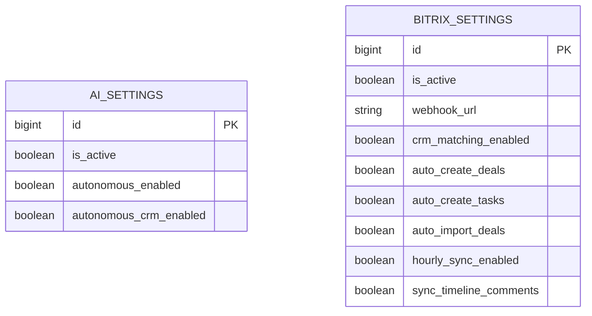

# Однозначные статусы интеграции Bitrix и автоматической записи WhatsApp

- Задача: `crm-write-status`.
- Ветка: `bugfix/crm-write-status`.
- Создано: 09.10.2026, 16:06:17 MSK (UTC+3).
- Статус: согласована пользователем; реализация выполнена, локальные проверки пройдены.
- Основание: кабинет показывает «Запись в CRM выключена», а список настроек Bitrix в админке — «Запись: включена».

Диаграмма отражает существующие таблицы `api_aisettings` и `api_bitrixsettings`: между ними нет внешнего ключа. Структура проверена по `backend/api/models.py`, миграциям `0003`, `0034` и текущему коду production. Планируется только совместное чтение настроек для отображения статусов; изменения моделей, схемы и миграции не требуются.

## Постановка и подтвержденная причина

На production `ai.mazory.best` 09.10.2026 в 16:06 MSK выполнено чтение активных настроек и настоящий HTTP GET `/api/autonomous/overview/` для пользователя Антон (`user_id=2`). Ответ: HTTP 200, `enabled=false`, `crm_enabled=false`.

Текущие настройки:

| Настройка | Значение | Значение для пользователя |
| --- | --- | --- |
| `BitrixSettings.is_active` | `true` | Интеграция Bitrix активна |
| Webhook Bitrix | задан | Адрес интеграции сохранен; это не проверка доступности Bitrix |
| `crm_matching_enabled` | `true` | Read-only сопоставление разрешено |
| `auto_create_deals` | `true` | Создание сделок разрешено соответствующему процессу |
| `auto_create_tasks` | `true` | Создание задач разрешено соответствующему процессу |
| `auto_import_deals` | `true` | Импорт сделок включен |
| `hourly_sync_enabled` | `true` | Ежечасная синхронизация включена |
| `AISettings.autonomous_enabled` | `false` | Автономный учет WhatsApp выключен |
| `AISettings.autonomous_crm_enabled` | `false` | Автоматическая запись результатов учета WhatsApp в CRM выключена |

В production и локальном коде `BitrixSettingsAdmin.sync_summary` подписывает `BitrixSettings.is_active` как «Запись: включена». Кабинет отображает другое поле — `AISettings.autonomous_crm_enabled`, полученное из `/api/autonomous/overview/`. Причина — двусмысленные подписи двух независимых режимов. Обновление страницы возвращает те же значения из API.

Выполнение автоматических доставок в `autonomous_crm.py` действительно проверяет `autonomous_crm_enabled` и активность интеграции. `BitrixService.call` дополнительно требует заданный webhook. Разрешения создания сделок и задач являются отдельными ограничениями конкретных операций и не определяют общий статус интеграции.

## Требования

1. Одинаково различать в кабинете и админке активность интеграции Bitrix и автоматическую запись результатов WhatsApp.
2. Кабинет должен отдельно показывать:
   - «Автоматическая обработка WhatsApp включена/выключена»;
   - «Интеграция Bitrix включена/выключена»;
   - «Автоматическая запись из WhatsApp в CRM включена/выключена».
3. Надпись об автоматической записи должна учитывать разрешение `autonomous_crm_enabled`, активность интеграции и наличие webhook. При отключении показывать конкретную причину.
4. Сохранить независимость обработки WhatsApp и доставки уже принятых результатов: `autonomous_enabled=false` не является дополнительным запретом доставки, если текущая логика воркера допускает доставку и `autonomous_crm_enabled=true`.
5. В списке Bitrix заменить двусмысленное «Запись: включена» на «Интеграция: включена» и показать отдельный статус автоматической записи WhatsApp. Добавить к перечню режимов существующее разрешение создания сделок.
6. Статус является описанием настроек, а не подтверждением сетевой доступности Bitrix или завершенной синхронизации. Для его получения не выполнять внешние запросы, не создавать outbox-события и фоновые задачи.
7. Сохранить текущие значения production, поведение автоматизации и ограничения записей в CRM. Задача исправляет отображение; включение автоматизации не входит в объем этой спецификации.
8. Сохранить аутентификацию API, числовые идентификаторы и существующий контракт `enabled`/`crm_enabled`; новые данные типизировать без `any`.

## Планируемые изменения

1. Добавить общий расчет статуса для двух текущих конфигураций. Он возвращает:
   - `integration_enabled: boolean` — активна ли интеграция;
   - `webhook_configured: boolean` — задан ли webhook после удаления пробелов;
   - `autonomous_write_allowed: boolean` — значение `autonomous_crm_enabled`;
   - `effective_autonomous_write_enabled: boolean` — совокупное разрешение доставки при активной интеграции и заданном webhook;
   - `disabled_reason` — `integration_disabled`, `webhook_missing`, `autonomous_crm_disabled` либо `null` при включенной доставке. Порядок перечисления определяет приоритет причины.
2. В `backend/api/autonomous_reports.py` добавить объект `crm_status` в существующий ответ `/api/autonomous/overview/`. Существующие `enabled` и `crm_enabled` оставить с прежним смыслом для совместимости.
3. В `backend/api/admin.py` использовать тот же расчет для списка Bitrix; явно подписать отдельные режимы. Дать ссылку на существующую активную конфигурацию ИИ для настройки автоматической записи, если она сохранена и пользователь имеет право её просматривать. При отсутствии активной конфигурации статус записи выключен.
4. В `frontend/src/types/autonomous.ts` описать контракт `crm_status`, включая ограниченное множество причин отключения.
5. В `frontend/src/components/AutonomousReports.vue` отобразить три понятных статуса и русскоязычную причину отключения записи.
6. Проверить реальные состояния через браузер, API и БД в изолированном Docker Compose на `kk-minsk`, используя существующие E2E средства и детерминированного локального провайдера. Не создавать unit/component/integration/mock-тесты и не подменять API браузера.
7. Для выполнения обязательной проверки секретов в CI использовать официальный образ Gitleaks `v8.24.3` в GitHub Container Registry: два запуска PR остановились до сборки из-за отказа Docker Hub при скачивании образа. Версия сканера и параметры проверки сохраняются.

## Критерии готовности

- При текущей комбинации настроек оба интерфейса сообщают: интеграция включена, автоматическая запись WhatsApp выключена. Кабинет дополнительно показывает выключенную обработку WhatsApp.
- В изолированном стенде проверены комбинации: интеграция активна, запись выключена; интеграция и запись включены с заданным webhook; интеграция выключена при разрешенной записи; webhook отсутствует; активная конфигурация ИИ отсутствует.
- При отключенной интеграции или отсутствии webhook интерфейс не сообщает, что автоматическая запись включена.
- Проверена независимость доставки от флага обработки WhatsApp: при разрешенной доставке, активной интеграции и заданном webhook статус доставки включен, даже если обработка новых сообщений выключена.
- Существующие `enabled` и `crm_enabled` сохраняют смысл и типы. GET остается доступным только аутентифицированному пользователю.
- Получение статусов не меняет настройки, данные бизнес-сущностей, очередь или outbox и не вызывает рабочий Bitrix.
- В Docker на `kk-minsk` проходят сборка `nginx` с `vue-tsc -b`/Vite, `manage.py check` и `manage.py makemigrations --check` с `No changes detected`; просмотрены логи backend, qcluster и провайдера WAHA.
- После реализации и проверок создан PR в `main`, пройдены обязательные CI/review и выполнено объединение согласно `AGENTS.md`.

## Проверки на этапе диагностики

- `git pull origin main`: актуальная `main`, затем создана отдельная ветка задачи.
- Прочитан фактический код отчета и отображения админки внутри production-контейнера.
- Прочитаны только необходимые настройки production; выполнен настоящий HTTP GET отчета для Антона, HTTP 200.
- В существующем backend-контейнере `kk-minsk` команда `manage.py makemigrations --check` завершилась с кодом 0 и `No changes detected`. Это предварительная проверка существующего окружения; проверки итоговой реализации выполняются отдельно на ее версии кода.
- Изменения кода приложения и настроек production до согласования спецификации не выполнялись.

## Результаты реализации и проверки

- Добавлен общий расчет `autonomous_crm_status`; API читает единственную сохраненную конфигурацию Bitrix, включая выключенную, поэтому наличие webhook описывается одинаково с админкой.
- В API добавлен `crm_status`; прежние поля `enabled` и `crm_enabled` сохраняют смысл. В кабинете показаны три отдельных режима и причина отключения записи. В админке переименован статус интеграции, добавлены статус записи WhatsApp, разрешение создания сделок и ссылка на настройки ИИ с проверкой прав.
- Изменения моделей, миграций, логики доставки и значений настроек production не выполнялись.
- На `kk-minsk` сборка Docker `nginx` прошла с проверкой TypeScript и сборкой Vite. `manage.py check`: `System check identified no issues (0 silenced)`. `manage.py makemigrations --check`: `No changes detected`.
- Проверка production-конфигурации через `ops/check_deployment.py` внутри изолированного Docker image завершилась с кодом 0; остались существующие предупреждения о HSTS для поддоменов и preload.
- Существующие 25 E2E прошли в общем прогоне. Новый сценарий после исправления ожидания состояния завершения импорта (`succeeded`) отдельно прошел за 12,4 секунды: все шесть комбинаций настроек, обновление страницы, отсутствие побочных записей/CRM-вызовов, отказ без JWT и отсутствие ссылки для администратора интеграции без права просмотра настроек ИИ.
- Новый сценарий использует отдельную JWT-сессию и завершает настоящий первичный импорт справочника через Q2 до измерения побочных эффектов чтения статусов.
- Проверка сохранения фото после реального пересоздания backend и nginx также прошла: `1 passed (1.5s)`.
- Снимки кабинета и админки визуально проверены: подписи и причины читаются полностью. Просмотрены логи backend, Q2 и локального провайдера WAHA/Bitrix.
- Полный E2E-прогон точной версии PR и обязательные проверки GitHub выполняются перед объединением в `main`.
- В PR #74 проверено ограничение CI: два runner получили `toomanyrequests` при загрузке Gitleaks из Docker Hub. Источник того же официального образа изменен на `ghcr.io/gitleaks/gitleaks:v8.24.3`; его загрузка на `kk-minsk` прошла.
- В Docker проверены версия сканера (`v8.24.3`) и снимок всех закоммиченных файлов (`git archive HEAD`): `no leaks found`. Повторная проверка миграций завершилась с `No changes detected`.
